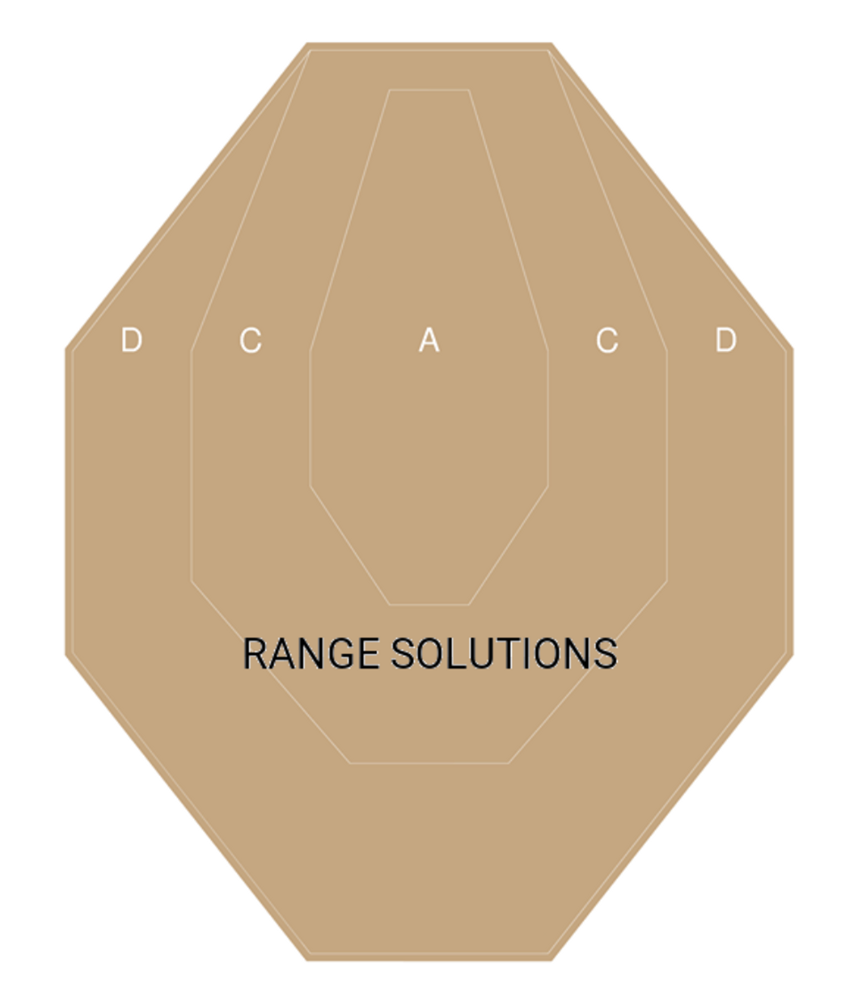
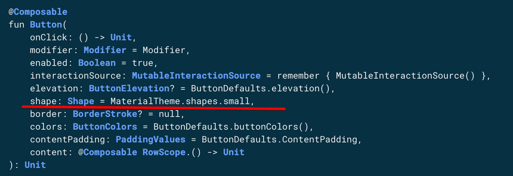
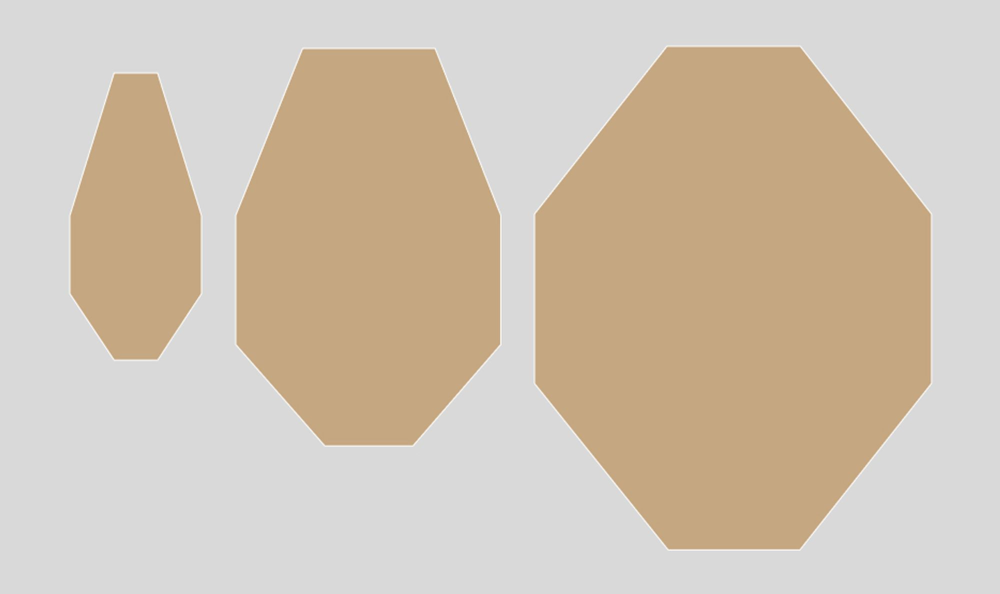

# Making a Custom Shape Widget on Jetpack Compose Using Figma and AndroidVectors

<a target="_blank" 
href="https://pavlovskiiilia.medium.com/making-a-custom-shape-widget-on-jetpack-compose-using-figma-and-androidvectors-ef264fc3e3de">
    
</a>

I recently shared my thoughts on my new hobby - shooting sport. After some practice, I became interested in tracking and saving my results. I started looking for an application that close my problem and… found a few applications that can’t fully close all my requirements. And another problem - bad UX. All applications can track IPSC points by manually entering them manually by EditText or clicking on the plus/minus buttons. Why can’t it be an IPSC shield? I decided to close this problem and write my own application for [calculating the hit factor in IPSC competitions.](https://play.google.com/store/apps/details?id=by.bulba.ipsc.calculator)

## Problem

Create an IPSC shield widget with a clickable area by sectors alpha, charlie, and delta. Calculate total points by clicking on the widget (click on alpha gives 5 points, charlie - 3, and delta - 1).



## Solution

I decided to write this project on modern practices and choose [jetpack compose](https://developer.android.com/jetpack/compose?gclid=Cj0KCQjw2v-gBhC1ARIsAOQdKY1DTNgfsQS9vlnHLapHgj5DMfiaQ23qYEiiYL9NVcbv4RS-v130_iUaAlW2EALw_wcB&gclsrc=aw.ds) as a primary UI framework. Such a problem could be solved with the help of custom drawings on canvas. Ok, what does jetpack compose have?

Framework has the same solution - [drawings on canvas](https://developer.android.com/jetpack/compose/graphics/draw/overview). Yes, it is possible, but if we research a little bit more, we might find a better solution. What if it is possible to create 3 different buttons with a custom shape and overlay it? And yes, [compose has it](https://developer.android.com/reference/kotlin/androidx/compose/material/package-summary#Button(kotlin.Function0,androidx.compose.ui.Modifier,kotlin.Boolean,androidx.compose.foundation.interaction.MutableInteractionSource,androidx.compose.material.ButtonElevation,androidx.compose.ui.graphics.Shape,androidx.compose.foundation.BorderStroke,androidx.compose.material.ButtonColors,androidx.compose.foundation.layout.PaddingValues,kotlin.Function1)).



All that we need - just put a custom shape as an argument to the button.

Let’s look again and try to split all layers of the shield.



The `Shape` has a lot of implementation variation. In my case, I have to use `GenericShape`:

```kotlin
class GenericShape(
    private val builder: Path.(size: Size, layoutDirection: LayoutDirection) -> Unit
) : Shape {

    override fun createOutline(
        size: Size,
        layoutDirection: LayoutDirection,
        density: Density
    ): Outline {
        val path = Path().apply {
            builder(size, layoutDirection)
            close()
        }
        return Outline.Generic(path)
    }
}
```

Implementation requires to know target size - it’s not a problem, we have a design and can resize it. The next step - find a way how to implement `path`.

We have to set coordinates on a layer and close it in a path… it’s a [vector array](https://en.wikipedia.org/wiki/Vector_space) or [polygone](https://en.wikipedia.org/wiki/Polygon). Of course, I can create another “new unique solution” to store vectors and pass it to create my path. Instead of writing a hardcode solution, I decided to research again and reuse the vector image format - SVG or AndroidVector. Android already has such format in human-readable format. And this way will be more effective: download SVG from Figma → convert to AndroidVector → pass this vector to black-box that creates the target path. Now, I have to understand how to parse AndroidVector and create the path.

## Android vector

I think each android developer had an experience with vector usage. But not all know, what is the magic letters and numbers inside the `pathData`:

```kotlin
<!-- Sector D vector -->
<path
      android:pathData="M260.28,4H131.18L4,163.74V323.49L131.18,484H260.28L384.4,323.49V163.74L260.28,4Z"
      android:strokeWidth="8"
      android:fillColor="#C5A781"
      android:strokeColor="#C5A781"/>
```

In fact, there is no great magic here. There are 2 main commands:

- moveTo - move cursor to a target point
- lineTo - move cursor and draw a line

This is the main, other cases it’s only a variation of that commands. If you want to deep dive into that topic - I want to recommend [this topic](https://medium.com/@ali.muzaffar/understanding-vectordrawable-pathdata-commands-in-android-d56a6054610e). 

- M - move to and X,Y as an argument
- L - line to and X,Y as an argument
- V - line to with a single argument X - movement on the vertical asix
- H - line to with a single argument Y - movement on the horizontal asix
- Z - terminator

It’s needed to compress vector on the protocol layer. All that we need now - writing a parser)

And don’t forget about screen scalability. We have an etalon widget size from Figma, but different screen sizes for users. Remember again vector mathematics, recalculate the screen scale factor, and put its value to the target screen parser:

```kotlin
internal fun Size.scaleToEtalon(etalonVectorSize: Size): ScaleFactor {
    return if (this.width < height) {
        (this.width / etalonVectorSize.width)
            .let { scale -> ScaleFactor(scale, scale) }
    } else {
        (this.height / etalonVectorSize.height)
            .let { scale -> ScaleFactor(scale, scale) }
    }
}
```

Next, we pass the scale factor in our parser and get the result:

```kotlin
internal fun drawPathFromPathData(
    path: Path =Path(),
    scaleFactor: ScaleFactor,
    pathData: String,
    offsetSize: Size =Size(0f, 0f),
): Path {
    val list = pathData.split(PATH_DATA_PARSER_REGEX)
    var lastKnownOffset =Offset(0f, 0f)
    list.forEach{pathPart->
val startChar = try {
            pathPart.toCharArray()[0]
        } catch (aioobe: ArrayIndexOutOfBoundsException) {
            return@forEach
        }
        val drawPathPattern = DrawPathPattern.parseKey(startChar) ?: return@forEach
        when (drawPathPattern) {
            DrawPathPattern.MOVE_TO-> {
                val values = drawPathPattern.pattern.find(pathPart)?.groupValues ?: return@forEach
                val x = values[3].toFloat()
                val y = values[5].toFloat()
                path.moveTo(scaleFactor = scaleFactor, x = x, y = y, offsetSize = offsetSize)
                lastKnownOffset =Offset(x, y)
            }

            DrawPathPattern.LINE_TO-> {
                val values = drawPathPattern.pattern.find(pathPart)?.groupValues ?: return@forEach
                val x = values[3].toFloat()
                val y = values[5].toFloat()
                path.lineTo(scaleFactor = scaleFactor, x = x, y = y, offsetSize = offsetSize)
                lastKnownOffset =Offset(x, y)
            }
            DrawPathPattern.HORIZONTAL_LINE_TO-> {
                val values = drawPathPattern.pattern.find(pathPart)?.groupValues ?: return@forEach
                val x = values[3].toFloat()
                path.lineTo(scaleFactor = scaleFactor, x = x, y = lastKnownOffset.y, offsetSize = offsetSize)
                lastKnownOffset = lastKnownOffset.copy(x = x)
            }
            DrawPathPattern.VERTICAL_LINE_TO-> {
                val values = drawPathPattern.pattern.find(pathPart)?.groupValues ?: return@forEach
                val y = values[3].toFloat()
                path.lineTo(scaleFactor = scaleFactor, x = lastKnownOffset.x, y = y, offsetSize = offsetSize)
                lastKnownOffset = lastKnownOffset.copy(y = y)
            }
        }
}
return path
}

private enum class DrawPathPattern(
    val key: Char,
    val pattern: Regex,
) {
MOVE_TO(
        key = 'M',
        pattern = "([A-Z](\\s)*)(\\d+(\\.\\d+)*),(\\d+(\\.\\d+)*)".toRegex(),
    ),
LINE_TO(
        key = 'L',
        pattern = "([A-Z](\\s)*)(\\d+(\\.\\d+)*),(\\d+(\\.\\d+)*)".toRegex(),
    ),
HORIZONTAL_LINE_TO(
        key = 'H',
        pattern = "([A-Z](\\s)*)(\\d+(\\.\\d+)*)".toRegex(),
    ),
VERTICAL_LINE_TO(
        key = 'V',
        pattern = "([A-Z](\\s)*)(\\d+(\\.\\d+)*)".toRegex(),
    ),
    ;

    companion object {
        fun parseKey(key: Char): DrawPathPattern? = values().firstOrNull{ it.key == key}
}
}
```

Full [gist here](https://gist.github.com/IlyaPavlovskii/4bee00442263622e6250a60ae03491a3). 


## Conclusions

With the help of compose, already now, you can safely draw a non-standard design for production, thereby saving time. I think, after my research, the article will be very useful for implementing specific widgets that go beyond the standard materiał design. All you have to do is get the design, download the vector, pass it to the parser and get a unique button.

P.S. I did not wrap these developments in a library, well, I'm sure that there is a need for this. If, nevertheless, the conversion from vector XML to custom shape seems necessary, write in the comments, I will definitely make a solution in [my repository](https://github.com/IlyaPavlovskii).