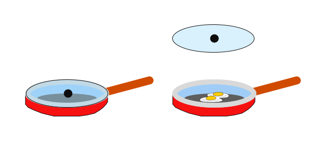
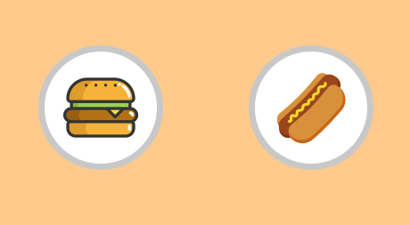
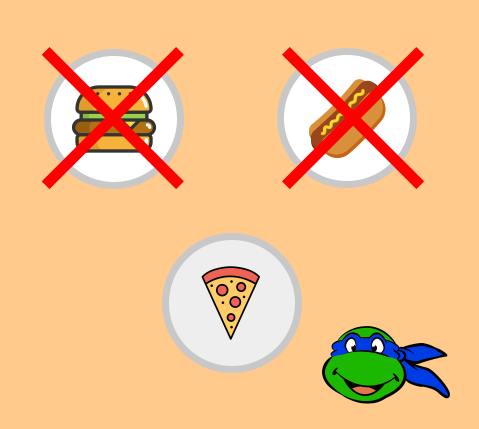
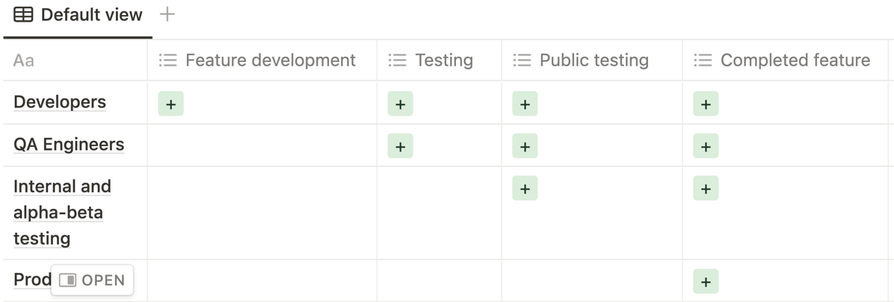
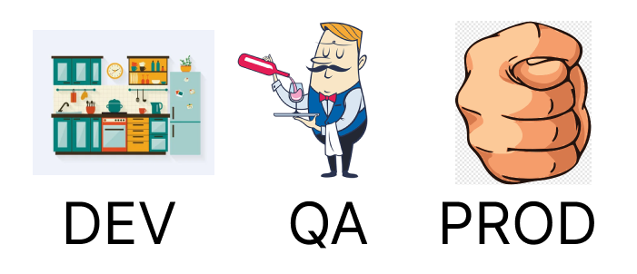
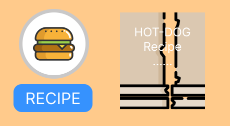
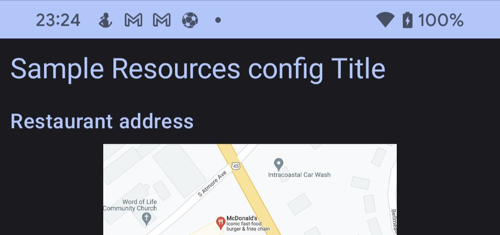
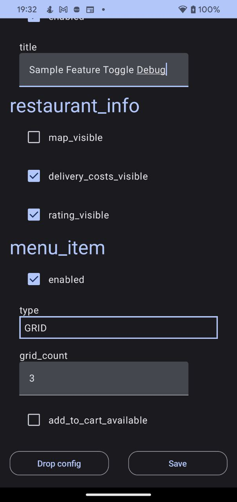

# FeatureToggle recipe for Android

<a target="_blank" href="https://medium.com/star-gazers/featuretoggle-recipe-for-android-dd27b2ee97f9">

</a>

Hello, my name is Ilia, I’m Android Engineer. Almost three years ago, we started [our fintech project](https://play.google.com/store/apps/details?id=net.humans.fintech_uz). MVP deadline was very optimistic. A week before the release, our team realized that no one was going to postpone the start date, and one feature was unlikely to be completed on time. We didn’t want to take risks and it was decided to cover this part with a stub. By blocking part of the non-working functionality, we had hopes that the MVP scope would be closed. We planned to disable non-working code so that at the click of the CI / Web button, the screen became available to the user.

Step by step, our team increased. Many developers didn’t understand what the system was. The guide was required for the in-house team too. For this reason, we decided to create a separate library. But it wasn't enough… And the development process was modified too.

To be honest, the talks about FeatureToggle integration was a very long time. That story was a trigger.

## What is it?

FeatureToggle - is a development instrument that gives the possibility to disable/enable some features depending on the configuration. 

### Where applicable:

- **Enable/disable features:**
Feature toggle basis - possibility to switch features according to the condition. That means - you might share your non-completed features with developers before finishing them. Also, the possibility is open to preparing any configurations for different build types. For example: feature `A` is available for developers, enabled for QA team, but disabled for Users.
With this tool, you can switch from [GitFlow](https://www.atlassian.com/git/tutorials/comparing-workflows/gitflow-workflow) to [TBD](https://trunkbaseddevelopment.com/)(IMO, without FeatureToggle it is impossible)

<p align="center">
    
</p>

- **[A/B testing](https://en.wikipedia.org/wiki/A/B_testing)**
Let’s suppose that we have a hypothesis, that all users love to eat burgers. But, our manager doesn’t think so. In his opinion, all users love hot-dogs. And only the target user will help us to resolve this dispute. Ok, we might create a questionnaire on the main page or open a [marketing company](https://firebase.google.com/docs/projects/iam/overview). But it will be so distracting to user and it will be impossible to create and manage many hypotheses. A/B testing it’s a solution that might solve that problem invisibly to user.
Just split our users into 2 groups: burger lovers and hot-dog lovers. All clicks to the food banner have to be marked with analytics events. In advance with the manager the criteria for the success of the experiment and the conditions under which the experiment should be stopped. Then all clicks to the burger banner are put into the burger-analytics-event bucket, and the same story with hot-dog.
<p align="center">
    
</p> 
It is not necessary to have only 2 conditions for the experiment. A hypothesis can contain multiple inputs and outcomes.
<p align="center">
    
</p> 
Usually, data analysis is performed on the side that is responsible for issuing them. In our case, this will be the **backend**, and the client developers paint the buttons. It is only an example. The more realistic picture for the client story - is how that banner will be represented: vertical list, horizontal list, grid layout or custom big banner. 
    
- **Remote control**
Let’s continue to talk about our hypothesis. Just imagine, that we created 10th variations for an experiment. One of them have an incorrect implementation and all users with that variation crashed. To solve that problem, usually, we have to create a bugfix ticket and wait until these users update our application. Of course, [in-app update](https://developer.android.com/guide/playcore/in-app-updates) must help to solve it faster. But solving that problem might spend more than one week. One week of downtime for 10th percent of users - too much. 
There is no need to immediately interrupt the rollout for all users and solve problems. All that we want is to disable failed configuration remotely and continue bugfixing in state mode. The new config will be downloaded as soon as possible and the application will not be crashed anymore. Let us leave this condition as obligatory for the formation of our system.
- **Testing**
If we have a possibility to disable one part of the code by feature flag, we might to hide some part of the functionality from other eyes. The same assembly will contain several implementation variations. By that reason, when we pass the build to the QA team, we will write a guide on how to switch feature toggles. To make a possibility to check all variations.
The same behavior awaits the next chain - internal,alpha, beta, release.

<p align="center">
    
    
</p>

## How to cook?

Now we know everything that we need to start cooking the FeatureToggle. Let’s form all necessary requirements to determine what we have to receive as a result. The system must have the possibility to force functionality, set flexible configurations, override values for different build types and have a remote control. In addition, add required system scalability and protection from unnecessary configuration falling into the wrong hands.

Feature flags can be toggled in the following ways:  

- **configuration**
We want to have unique configurations on [different flavors](https://developer.android.com/studio/build/build-variants). Of course, it is possible to override programmatically on each flavor codebase. But it's not elegant. Just imagine, that you have 5 flavors(internal/alpha/beta/testing and production) and you have to put one developer to set up all flavors. Is it not expensive? What about creating a system with self-validation via a configuration file: JSON/XML/YAML or Excell. Doesn’t matter, just prepare the system with human-readable format and adaptive for the non-engineering team. Then, we have to parse that file, validate it and override `FeatureToggle` values. That solution will be more elegant than hardcoded values.

```kotlin
data class FoodFeatureToggle(
    val foodType: FoodType = FoodType.BURGER,
) {
    enum class FoodType {
        BURGER,
        HOTDOG,
        ;
    }
    companion object {
        val DEFAULT = FoodFeatureToggle()
    }
}
//....
fun showFood() {
    val featureToggle: FoodFeatureToggle = FoodFeatureToggle.DEFAULT
    when(featureToggle.foodType) {
        FoodFeatureToggle.FoodType.BURGER -> showBurger()
        FoodFeatureToggle.FoodType.HOTDOG -> showHotdog()
    }
}
```

- **file system**
Based on the previous work with configuration files, we have to add a new data source. Data source not for a compiled build, for runtime. Let’s put this file onto device storage and make it editable. Then we need to parse that file on application startup and set overridden values. There is doesn’t matter how the file will be passed onto a device(CLI, file manager, remote repository, or [3rd party service](https://firebase.google.com/docs/remote-config)).
- **debug panel**
That type of switching will be convenient for internal testing. You wrote a guide for toggle configurations, and pass it QA.File system configuration it’s ok on the workplace, but difficulties in the setup, for example, in the subway.
To solve that problem, write additional activity with custom edit-type block: string → EditText, boolean → checkbox/switcher, enum - popup/RadioButton e.t.c. Don’t forget that this screen should not reach the end user.
The previously described methods fit perfectly into the structure when your flags are up to date at the time your application process starts. The target `FeatureToggle` configuration collects BEFORE IoC(DependencyIjection or ServiceLocator) framework initialization. Otherwise, we have to solve the problem with dynamic feature switching.

<p align="center">
    
</p>

Pictured is a burger but got a hot dog menu

The burger on the plate is based on the `FeatureToggle` config that was received on application start. After that, we receive remote updates and have a hot-date instead of a burger. What kind of receip will be shown when clicking on the “RECIPE” button?

There is not possible to determine live FeatureToggle lifecycle, because it might be changed at any time. That is the major initialization and providing problem. That is another story about how to solve it, but the first question what you have to ask - “For what?”. I’ve seen that type of solution only once and didn’t find a good answer to that question. Just highlight, that we have 2 different ways to solve feature toggle providing and initialization.
Lasagna

## Lasagna recipe
<p align="center">
    
</p>

1 **FeatureToggleContainer** 
The main registration point of any `FeatureToggle`. Anything that doesn't get into the Registrar will be ignored. Just declare the container and list all FeatureToggles. That is necessary to correct configuration IoC framework and setup protection. The container contains object instances, not class definitions. Uses for cheapest fallback. If there are no settings in further layers, the default setting will be accepted. Remember it so that unfinished functionality does not get into the work area. As a general rule, container declarations should be as if all features are disabled.
```kotlin
private val featureToggleContainer: FeatureToggleContainer = SimpleFeatureToggleContainer(
        featureToggles = setOf(
            SampleTitleFeatureToggle(
                enabled = false,
                title = "Sample FeatureToggle",
            ),
            RestaurantInfoFeatureToggle(
                mapVisible = false,
                deliveryCostsVisible = false,
                ratingVisible = false,
            ),
            MenuItemFeatureToggle(
                enabled = false,
                gridCount = 3,
                type = MenuItemFeatureToggle.PreviewType.HORIZONTAL_LIST,
                addToCartAvailable = true,
            )
        )
    )
FeatureToggleContainerHolder.init(featureToggleContainer)
```
2 **Default config**
It’s a build configuration that might be passed via resources. We might do it by: `raw`, `xml`,`asset` or another way. Or create a custom compile time solution that will extract and override `FeatureToggle` values.
Looking ahead, the remote config is based on `Firebase`. It has a default config setting from a resource file. Since the remote type may not be available for the dev build, we build the `ResourcesFeatureToggleReader` on the structure of the same file so as not to relearn:
```xml
<?xml version="1.0" encoding="utf-8"?>
<defaultsMap>
    <entry>
        <key>sample_title</key>
        <value>{
            "enabled":true,
            "title":"Sample Resources config Title"
            }
        </value>
    </entry>
</defaultsMap>
```
Overriding title key with a value `Sample Resources config Title` and open our build:
<p align="center">
    
</p>
3 **Remote config**
Remote type of flag delivery. Designed for emergency control on rollouted builds. The main idea is to control, when exchanging the flag with rollout a new version is very expensive and need to additional developers, QA and manager team, you have to use that type of control. Or, for A/B testing)
Solve that type of config possible by the next ways: 3rd party solution or custom. The most popular 3rd party solution in mobile development - [Firebase Remote Config](https://firebase.google.com/products/remote-config). There is a lot of examples how to use it for A/B testing. I just want to emphasize that this is not a completely best example of his issuance. It is only remote control to rollout of user percentage(yes, with a cache under the hood) with fallback to default resources. The really honest system has to have the possibility to setup it up on all layers(container, config, remote e.t.c). But, it’s just details, and we have to start with this system too.
```kotlin
FirebaseFeatureToggleReader(
    fetchTimeout = 60.seconds,
    minimumFetchInterval = 12.hours,
    json = json,
    defaultConfigRes = defaultXmlConfigResource,
)
```
Set the settings for `FirebaseFeatureToggleReader` - timeout and minimum interval for downloading a new file, deserializer and default config (see point 2). Then, started to play with Web interface:
<p align="center">
    
</p>
4 **Debug file config**
The first three layers are necessary as an MVP set for target users. Then we have to prepare set for developers and QA team. Let’s prepare a backdoor to force it via a configuration file. And don’t forget to hide it by a `flavor` type, for Dev and QA(not for production).
```kotlin
XmlFileFeatureToggleReader(
    json = json,
    xmlConfigReader = XmlFileConfigReader(),
    xmlConfigFileProvider = DefaultConfigFileProvider(
        applicationContext = context,
    ),
)
```
It is necessary, cause not all features might be ready for production/ payable features/ broken or something else. All responsibility for application stability is declared in your [terms of conditions](https://en.wikipedia.org/wiki/Terms_of_service). Now, to force the `FeatureToggle` you have to edit your file on a device by adb, clie, put it manually or e.t.c.
5 **Debug panel**
The last is candy. An editable file is good, but to edit it faster we need to have a laptop. To solve that problem we prepared a debug panel activity. It’s an additional activity that is hidden under the hood as a launcher(if you want to see another way of representation, please let me now or create a separate issue on the github).
<p align="center">
    
</p>
Add 2 buttons: drop config and save, to have the possibility to rollback to the native setup at any time. We make a remark that the whole system works with a static config. Therefore, to apply it, you will need to restart the main application.
```kotlin
devImplementation("io.github.ilyapavlovskii:debug.panel:X.X.X")
``` 
To apply that launcher, just add the dependency to your application module. Be sure that `FeatureToggleReaderHolder` and `FeatureToggleContainerHolder` are initialized. And the rest will be launched automatically.
    
## Bon appetit
    
At the output we get the priority list: first - debug panel and file, remote control as second, next deal for default config, and hardcode in the end. As I said before, we have to have a scalable system. We prepared the system based on [chain of responsibility pattern](https://en.wikipedia.org/wiki/Chain-of-responsibility_pattern), and any additional config reader must be added. Feel free.
    
```kotlin
val featureToggleReader = ChainFeatureToggleReader(
      featureReaders = arrayOf(
					// Debug file config reader
          XmlFileFeatureToggleReader(
              json = json,
              xmlConfigReader = XmlFileConfigReader(),
              xmlConfigFileProvider = DefaultConfigFileProvider(
                  applicationContext = context,
              ),
          ),
					// Remote feature toggle reader
          FirebaseFeatureToggleReader(
              fetchTimeout = 60.toDuration(DurationUnit.SECONDS),
              minimumFetchInterval = 12.toDuration(DurationUnit.HOURS),
              json = json,
              defaultConfigRes = defaultXmlConfigResource,
          ),
					// Default config reader
          ResourcesFeatureToggleReader(
              json = json,
              configReader = xmlConfigReader,
          ),
      )
  )
  FeatureToggleReaderHolder.init(featureToggleReader)
```
    
And all this with a connection diagram and an example is stored [here](https://github.com/IlyaPavlovskii/FeatureToggle). Bone appetit.
    
## P.S.
    
And a little practice story about FeatureToggle and A/B testing. Once upon a time on a project ouк managers decided to place a button scroll to top which will be shown on 1/4 of the web page. Cool and pretty feature for user. But, after analysis, we understood that the feature decreases our monthly ad income. The problem was that all the main ads started in the middle of the page and a user simply bypassed it or accidentally pressed the button. If you want to see more history about how to save money on the development process, please, give me feedback with сlaps and subscriptions.