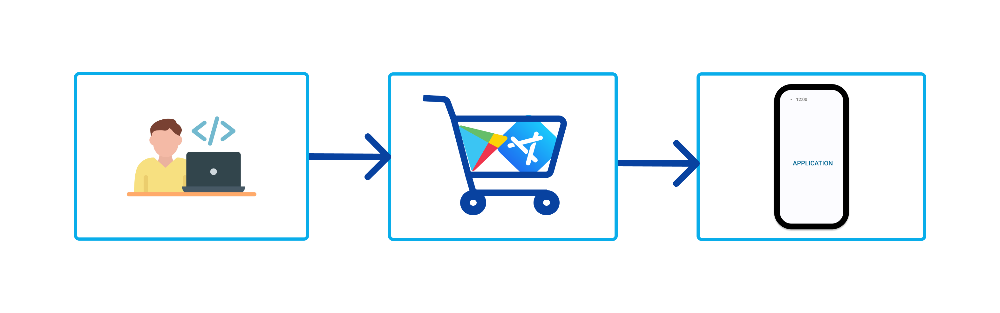
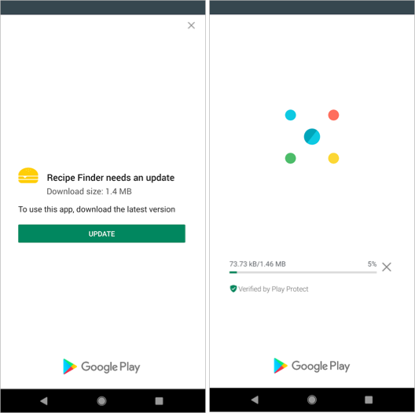
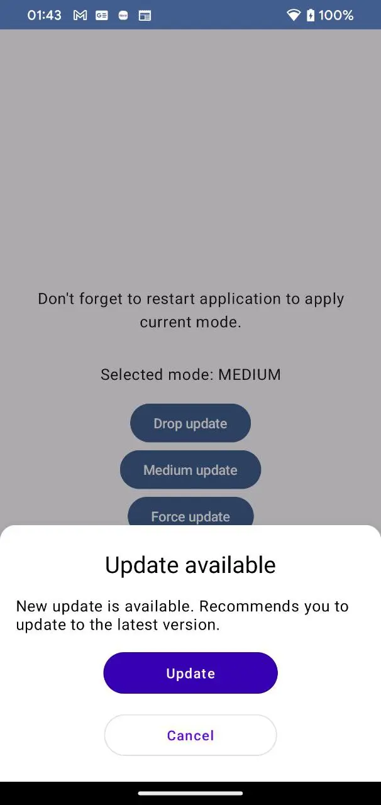
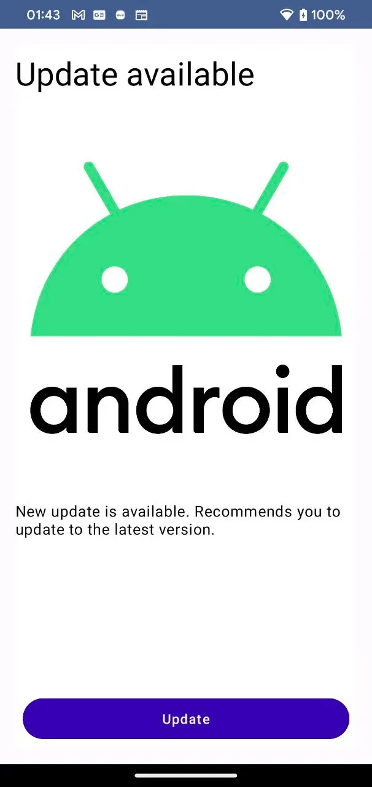

# ForceUpdate Feature

<a target="_blank" href="https://medium.com/dev-genius/forceupdate-feature-e99ab6b031a2">

</a>

Friday. Sunny spring day. There's half an hour left until the end of the workday... The manager bursts into the room and exclaims, "URGENT! The backend deployment has been completed, we need to release the mobile build now!!! So that everything is available to all users by tomorrow!!!" Sounds familiar? I want to discuss that problem - what is the reason and how to treat that sickness.

## Root cause

No matter how quickly progress leaps forward, not everyone can keep up with it. The reason for that “urgent” request is simple - management has been involved in web projects for a long time, where releasing a new version means pushing a code onto the main server, and the fresh version is instantly available to users with a CMD+R press. Mobile development has been around for over 15 years, and understanding of the delivery process is not always the most necessary and important part of project management. That’s why developers facepalms when heard “urgent release now”…


Ok, what is the difference? What’s new? And of the innovations, only one additional term - application store, for the main mobile platforms as iOS and Android. The algorithm looks like this - you publish a new application version in a store, then a client device sees that a store has a new version and is ready to download. But, not always might do it immediately:

- updates disabled for cellular networks(possible to download when you will connect to a WiFi network)
- updates fully disabled
- the device version and the application are incompatible
- new version/store is forbidden in your region
- you are using an extravagant way of delivering an application when the operating system cannot take on the responsibilities of updating and can only do so with the help of user intervention.



So, what we should do to increase delivery speed? Waiting? We can't sit back and wait for the user to guess to upgrade to the latest version, can we? Honestly, there is a lot of reasons to increase delivery speed:

- new release without backward compatibility with old versions
- legal justifications
- platform features
- marketing, etc.

## Solution

**ForceUpdate** - it’s a feature, that might block a user until he updates to the latest version.



Honestly, It doesn't have to be a blocking screen. Update request might be splitted by the next priorities:

- low - this type of priority will be shown every N days by the GUI with an update request, until a user update the application.
- medium - GUI with an update request will be shown each time after application run.
- high - blocked screen. The application cannot be used until the update.

Platforms have their own internal libraries with [solutions](https://developer.android.com/guide/playcore/in-app-updates). I’ve tried to integrate Google solution, but I encountered difficulties in setting up and using it. The main disadvantage - the trigger mechanism is located on the Google side and it can only be called by filling in a new version priority before release in a gradle config.

```kotlin
{
  "releases": [{
      "versionCodes": ["88"],
      "inAppUpdatePriority": 5,
      "status": "completed"
  }]
}
```

This means that when a new version is released, you should **always** specify the priority of this release. Logical, strict, and convenient. You don't need to write a GUI, the library provides it all. You do not need to thinking about what kind of a centralized triggering mechanism you should use to initiate update notifications - own backend, [BAAS](https://en.wikipedia.org/wiki/Backend_as_a_service_(computing)), and so on.

I don't like the fact that with this approach we are very rigidly hooked on the needle of the store platform. And as we mentioned earlier, there can be a lot of stores and we want to be published on all of them. And with such conditions, we are obliged to change the process in publishing for one of the platforms...
Changing the process is always difficult - difficult = expensive. And it's also expensive because given such nuances, we need to be sure that the management from above took this into account, and does not ask to press “the urgent release button” again. In addition, a request for updates to a newer version can be initiated before the version is published. This may be due to the same issue of backward compatibility support.


As you can see on the diagram above, the backend is so hurrying and 2 client’s trying to catch up with him. iOS is ready to promote new version and waiting for Android. When all clients will be ready to release, it’s possible to start promotion company and force all users to update. But, who stopped us to release iOS without awaiting the second platform? Nobody, and release mustn’t be delayed. We will start our promo as soon as possible by synchronization.

## Library

Since I had more than one project in my plans, I decided to make a [library for that feature](https://github.com/IlyaPavlovskii/force-update).  To do this, the implementation and updates should be as simple as possible and invisible to developers. Therefore, we have the call behind the composable function for root activity, and then we pass all decisions for the domain layer.

```kotlin
interface GetForceUpdateEventFlowUseCase {
	val event: StateFlow<ForceUpdateType>
}

enum class ForceUpdateType {
    ABSENT,
		// LOW, not implemented yet
    MEDIUM,
    FORCE,
    ;
}
```

Everything else is flexible and easily replaceable. The basic implementation is based on [FirebaseRemoteConfig](https://firebase.google.com/products/remote-config?gad=1&gclid=CjwKCAjw04yjBhApEiwAJcvNoeM7mwtWSI7HN4y6yi8WsmJ0EZUfKI4oxr4ab4nSUwibOZpsUSANCBoCkYYQAvD_BwE&gclsrc=aw.ds). It has the flaw that we do not have a guarantee of instant download of the config on earlier versions and, the user may have a delay of several days. For a safer option - your own solution. Your backend, for example. The issue of solving the problem rests on your budget and internal conditions.

<p align="center">
    
    
</p> 

## Conclusion

With this small example, I wanted to indicate how important it is to have and implement such a mechanism at an early stage, so that there is less to mess with later. Add it as early as possible so that you can be sure that all users will receive windows with an update request. Otherwise, you will have to wait or look for more extravagant ways to solve your problem without covering the application with airbags.