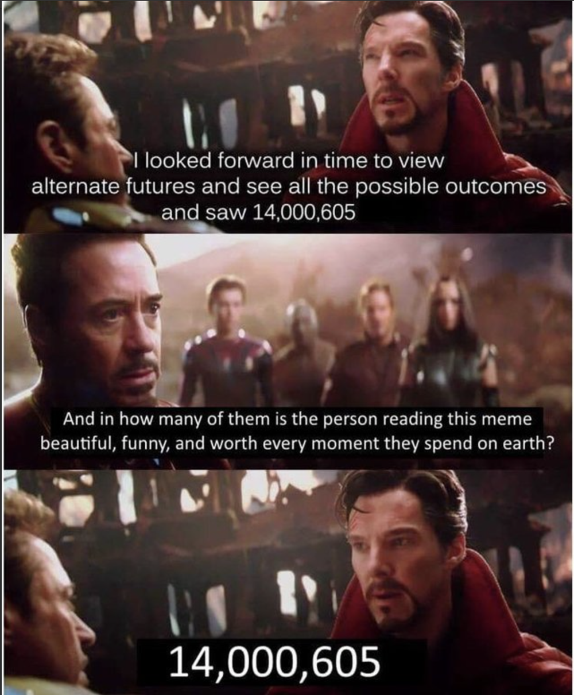

# Mobile MVP - minimum viable Features EN

# Primary goals

Hi everyone, my name is Ilia. I am an Android engineer with 10 years of experience. During this time, I have had the opportunity to participate in projects of various types - freelance, large product, outsourcing, and startup. And today I would like to share my thoughts on my favorite type of employment - startups and their MVPs. Specifically, what features your MVP project should have before pressing the Publish button.

**[Minimum Viable Product](https://en.wikipedia.org/wiki/Minimum_viable_product)** - in simple terms, it is a product that is ready to be released to the market with minimal functionality in order to achieve certain goals. These goals can be marketing, attracting new customers, or testing your own PoCs. The goals can be different. I will skip this point because the set of features, which will be discussed later, covers 90 percent of the needs of all goals and allows for maneuver. It is very important to do this at the very beginning in order not to get stuck in the active development phase, to give you the opportunity to test your hypotheses and not to slow down the business in making money.

Before starting a project, define its purpose, audience, platforms, and what end result you want to see ideally. Conduct a [PoC](https://en.wikipedia.org/wiki/Proof_of_concept). This is a very important question, because the ideal code for business is its absence. Writing code is always expensive. And in most cases, business problems are solved not with the help of programs.

Also, I want to skip the moment of choosing a programming language, platform, architecture, and so on. We are all professionals and have long found the answer to this question, each for himself. This is too controversial - what is better, Kotlin or Swift, when there is Flutter? Today we will only talk about features, what, and why they are needed. I don't give a shit what language they will be written in. I care about PRICE and TIME (we will close our eyes to quality for MVP). Let's go!

### Authorization

No matter how much you hate it, it's the foundation. The foundation is to gather real users of the system, which should be from the start! Even if your product is terrible, BUT if you have 100,500 active users daily, then investors will throw money there themselves.

As a result, you must be able to provide **numbers** of your [ActiveUsers](https://en.wikipedia.org/wiki/Active_users), from which you can calculate [ROI](https://en.wikipedia.org/wiki/Return_on_investment) to become attractive.

This can be done in different ways - self-written or using frameworks. For my pet projects, I found [FirebaseUI](https://github.com/firebase/firebaseui-web), which in a few clicks implements a full-fledged authorization feature and provides the ability to provide such a result. What is worth remembering is that email and phone auth are a super minimal set that should be present everywhere. This is important both for further advertising mailings, and for the ability to return the user to the application. Next comes a set of social networks. I would like to remind you that if you are writing a product for the Apple factory, and you are implementing authorization through social networks, you are obliged to support the ability to [log in through their gateway](https://developer.apple.com/app-store/review/guidelines/).

A lot of hypothesis testing and idea validation exists on [Kickstarter](https://www.kickstarter.com/), where the trigger for a potential customer is a subscription or [a landing page](https://en.wikipedia.org/wiki/Landing_page). After launching and validating your idea, you get relatively reasonable numbers of who needs your product (on the landing page, only one button is added - send an email when this mega-idea works and then, maybe, I will buy it).

### Feature toggle

I already wrote an ~~unsuccessful~~ article about [feature toggles](https://medium.com/star-gazers/featuretoggle-recipe-for-android-dd27b2ee97f9). In short, it is the ability of your product to force (enable/disable) any functional part of the application.

So, at the start, you have the ability to cover some holes with stubs. And when some node becomes available, you can enable it through BE.

You can immediately launch your hypotheses (A/B tests).

In my [pet project](https://play.google.com/store/apps/details?id=by.bulba.ipsc.calculator), I implemented Google ads and, due to my inexperience with this SDK, I got banned literally in 2 weeks. I got banned because I clicked on my own ad twice in production. AdMob has a zero-tolerance policy and I was blocked from using monetization for a month. Thank God for my paranoia and I managed to implement feature toggles and a second ad framework. As a result, I didn't sit for a month without money, but simply switched the ad targeting in production through firebase remote control and did nothing. Downtime - 5 minutes, not a month or the next app update.

### ForceUpdate

You are in the phase of super-active development at the start. Your client and backend are going out of sync in terms of speeds, but you want to go to production now and ask all old users to update to the latest version to start ordering new shawarma. We are obliged to maintain backward compatibility because we have a handful of cheapskates who are saving internet. You cannot release a new version of the application with the guarantee that all users will be friends with your backend.

The management looks as follows - you released a minor update, you ask users to update to a newer version every 2 weeks in the form of a loyal pop-up; a serious update - ask once a day; supper-update - insist on updating, because you will not deal with it further! More details [here](https://blog.devgenius.io/forceupdate-feature-e99ab6b031a2).

[https://youtu.be/k899IiwP-iw](https://youtu.be/k899IiwP-iw)

### Crashlytics

Programming topic - you are required to respond to all crashes in the application to increase user retention ASAP. No one likes to see an application that crashes when initiating any action. In some companies, there is a [ZeroBugPolicy](https://en.wikipedia.org/wiki/Zero_Defects). The less you crash: the more users you will have left + the more users will return to you = the more money you will make.

### Privacy policy, terms of conditions, about e.t.c

On the day of publication, Google required me to have a web page with a privacy policy. Naturally, it's not cool to write such documents yourself. We open [ChatGPT](https://chat.openai.com/) and go on.

In total, instead of ~4 hours of drafting a document through integration into GitHub Pages for the first project, I spent 45 minutes uploading it via [notion.so](https://www.notion.so/invite/c48b0dbf02fb4fe9ef17a897508dfc1d74c95ec7) and clicking the publish button.

Every time you see an opportunity to use a cloud solution that you can migrate to your own solution in the future, take it and save your time. If security policies or internal doubts are in your way, discuss them with your teammates.

# Depending on the goals

As soon as the MVP is ready, we can press the production button to collect feedback/crashes and any feedback from users. Depending on the original goals, we decide what to do next. You can even not sell the main product, but leave a mark there - coming soon.

### Push notifications

And [push notifications](https://firebase.google.com/docs/cloud-messaging) will help you bring back those new users who did not click on the purchase button. This is a borderline feature between MVP and production. To each their own. With its help, you can attract the attention of a user who has not visited it on his phone for a long time. It is important to be able to send them remotely through your BE. You can also set up the display of notifications by calendar, this is already a purely client-side topic. But do not overdo it, remember how many channels in Telegram are muted forever? In order not to get a similar story with your source of return to the application - keep yourself in check.

### Advertisement

I already mentioned the example with advertising above. This is also one of the important points for generating revenue.

If you are thinking on advertising to be one of your main sources of revenue, connect at least two providers. After that, you will have the option of an emergency switch. You will be able to check the conversion and choose the right provider for you. Alternatives: Facebook, [Start.io](https://portal.start.io/#/signup?referredby=5960fd6a-33d4-d1ed-79a1-51998a7c78ad&preferredsite=pub&source=directURL), [Appodeal](https://appodeal.com/), [AppLovin](https://www.applovin.com/), etc.

### Billing

If you are launching a product and want to generate revenue from sales, launch billing. Build into your MVP the sale of even a minimum PREMIUM or something else in the future, to start collecting margin now.

In this section, there are no details about the available services. It is definitely a separate article. There are many of them and it depends on the answer to the questions: 
- in which region are you distributing? 
- which currency? 
- will inAppPurchases work?
 - sales model - subscription, donation, one-time purchase? 
- fiat/crypto or both at once? and so on...

[https://youtu.be/BzAdXyPYKQo](https://youtu.be/BzAdXyPYKQo)

### Invite user

If you need to quickly reach a large user base, launch a benefit campaign at the start so that each activated user can invite a friend for a reward. What kind of reward - A/B testing is here to help!)

What this feature does is it gives users the ability to enter your system via a referral link with small conveniences in the form of a premium account for a certain period of time (or crystals). At the price of selling one crystal per user. [Consider this when calculating the cost per acquired user.](https://en.wikipedia.org/wiki/Customer_acquisition_cost)

### Analytics

And at that very moment, when you are ready to press the "create first release" button - STOP! Don't do this without implementing analytics. Yes, you can hit the user's heart right away, but why? Be sure to check all the places of the flow up to the buy button. This way you can understand where and why the user breaks off and try to build a new flow. Or even shorten it.

And again, a real story. In one company, they tested a hypothesis - how is it convenient for the user to enter credit card data and purchase verification, on one screen or two? The test result showed a decline of one million dollars per month in favor of the first option.

Next, we call a marketer, analyst, and astrologer who will analyze our data. They will adjust the forecast and give it to the product manager to work on, to improve this place. If you can do all this yourself, I bow to you.

### Rate us

The essence of the feature is to encourage users to leave positive feedback in the market, and direct negative feedback to internal support.

The recipe is simple - after each update, we show the user a non-intrusive pop-up at startup with the question - rate us, brother. And as ratings, 5 stars. 4 or 5 - go to the store. 1-3 - leave a review to internal support. The feature is only bad if there is a support mechanism.

### Support

User feedback. A borderline situation for a feature, depending on the type of your business. The criterion for its introduction is simple - determine the user's reaction time to a critical remark and your role in the market.

If you are just entering a competitive market, you need to establish a reputation, leave a positive customer experience, and attract some customers - it seems you need to create a 24/7 window with a specially trained chatbot, or at least a human. If you are a monopolist and there are no analogues - they will wait).

# Conclusion

The set listed above is found in 95% of applications. If you are involved in streaming application development, then you should take this set into service and make it reusable. We wrote the authorization feature, wrapped it in a binary and supplied it to all applications. We prepared in advance for the fact that the UI may be unique in the future - we divide such a package into 2 parts: presentation + domain.
After the start, you will take a short break to collect metrics, analyze behavior, and fix bugs. It is at this point that you will be able to integrate the parts that I do not recommend spending time on from the very beginning.
