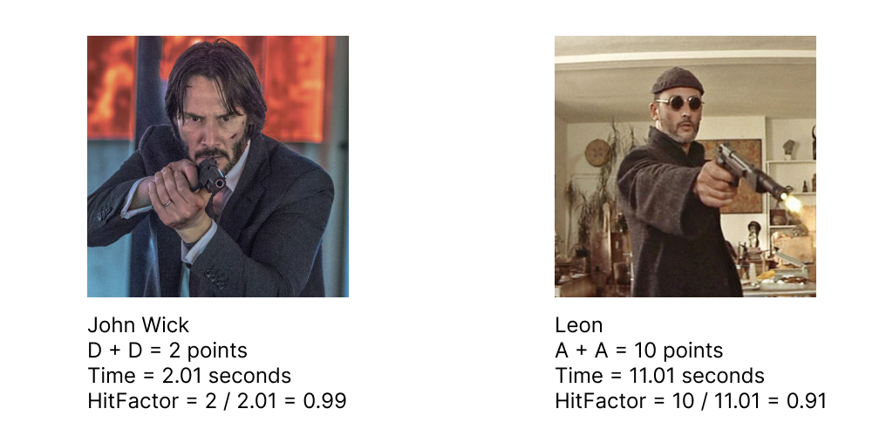
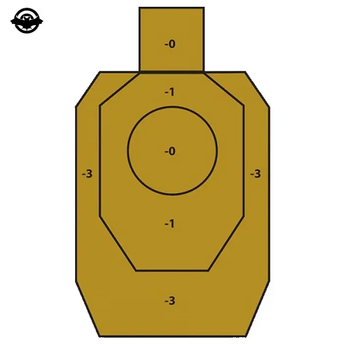

# Shooting sport or a new hobby

Hi everyone, my name is Ilya, and I want to talk about my new interesting hobby - shooting sports. The appetite comes with eating. That's how it happened with this hobby. I got introduced to it quite unexpectedly. Once upon a time, I suggested going to a shooting range, and we started talking with the instructor and he suggested going for dynamic shooting, then...

## Beginning

I was introduced to this sport in Poland. Before that, I thought that owning a rifle was only possible in America, that shooting from a pistol, carbine, or shotgun was only for professionals (or people who had received a permit). But I was very wrong... It turns out you can legally shoot with REAL GUN (not imitation, not training, real lethal riffle) in a shooting range. Yes, with those that can kill!

Everything that is not prohibited is allowed, but there are restrictions. To enter a shooting range, you need a document (passport, permanent residency, driver's license) and the ability to read. Then an instructor greets you and closely supervises you. Before entering the shooting area, you always sign a document stating that you are familiar with the safety rules and will not engage in nonsense in the high-risk area. Otherwise, you are entitled to receive a shot in the head (actually in the chest, about that later) from the instructor without warning.

## Static line

A shooting range is a static lane. You are standing in a static position, next to a tough instructor, and you shoot at a depth of 10 to 25 meters. The fun is that you have a limited number of bullets from each weapon, and then you check your accuracy. Hit all the bullets in the target - well done, no - loser.


If you're not bored and want to try, take a package at shooting ranges. They are not created for nothing - it's like a one-time gym permit. Everything progressively, if it doesn't work out, you'll figure it out in the middle, or tomorrow. If you're still in doubt the next day, you definitely need to go to a dynamic line.

## Dynamic line

The second level of weapon knowledge is shooting with a pistol from a holster, like a real [cowboy](https://youtu.be/WYfljBCpmE4). They will put a holster belt on you (with a loaded pistol) and 1-N pouches (for clips). You move through the shooting range, shooting at static/moving targets.

[](https://www.youtube.com/watch?v=USbDuTGBRJ0 "")

The transfer of a weapon from one target to another is an element of dynamic shooting that must be studied and practiced separately.
Dynamic shooting disciplines include pistols, rifles, and shotguns, but the focus here will be only on pistols- the basics and foundation of safety techniques for all, where everyone starts and takes exams.

## Safety rules

```markdown
1. I will always treat firearms as if they are loaded.
2. I will never point my firearm in a direction that I do not intend to shoot.
3. Before shooting, I will always check what is in front of and behind the target.
4. I will never touch the trigger until my firearm is aimed at the target.
```

Learn this by heart, and repeat these 4 rules before each entrance to the lane.

Never put a weapon at a person or in their direction. Never check what's in the barrel. Never put your fingers in front of the muzzle. It may sound like common sense, but believe it or not, these mistakes can be made by anyone. I have shot ~5,000 bullets. But at the last exit to the polygon, checking the carbine, I forgot about the bullet in the barrel and fired at the ground.
Learn to correct them immediately. Even experienced shooters can make these mistakes in fast-paced, high-pressure situations. Always keep them in mind, and your trainer will help you identify what you did wrong. At the [Scutum](https://scutum.life/) center, we reached the condition:
-What went wrong?
-I jerked the trigger, then twisted my stance, and jerked again.
-Correct it, let's repeat.
(That's what I like about individual sports, where you can only find mistakes in yourself and immediately correct them.)

## IPSC vs IDPA

These are 2 popular classifications of shooting range certification. By obtaining a certificate, you are entitled to participate in tournaments, outings, parties, and discounts under the auspices of the organization. Cool, funny, interesting but... I haven't found any benefits of obtaining or obtaining such a card for myself yet. For me, it's just a fun sport. Tournaments are held even without IPSC/IDPA, but when you have reached the level where local tournaments are no longer enough for you - it's time. The exam is not super difficult - you have to prove your theoretical knowledge and practical skills. Livehacks - go to the club where your examiners will be sitting. Essentially, it's the same as getting a driver's license.

Honestly, I don't want to delve into this topic because I haven't reached IDPA and I cannot competently answer for this qualification. But that does not give me the right not to talk about it, since something is better than nothing.
These are the two main categories of sport shooting. The difference is that in IPSC, you compete for accuracy/speed with any props and accessories, while in IDPA, without accessories for accuracy/speed, BUT from cover. That's why it's D - defense.

## IPSC

I went to [Wikipedia](https://en.wikipedia.org/wiki/International_Practical_Shooting_Confederation) to read about this topic and...well, in short, we shoot safely, fast, and accurately. That's it!


The target is divided into three main zones:
**A - Alpha** - 5 points
**C - Charley** - 3 points
**D - Delta** - 1 point
**Miss** - a penalty of 10 points.

Time is recorded for each checkpoint. Then we add up all the points and divide by time to get the hit factor. The one with a higher hit factor wins. This immediately introduces a competitive element where one can calibrate their tactics. Usually, two attempts are given to complete a checkpoint, meaning you can try different methods of firing.

E.g:



Mr. John Wick hit the target as quickly as possible, but with poor accuracy, and Leon, who took aim at the target for a long time, received the maximum number of points, but lost because he spent too much time on it.

## IDPA

Everything in general is similar, but there is a nuance ... There are no incentive points here - there are punitive balls. The difference is - in IPSC - you shoot as you want, in IDPA - from cover.



Scoring is a bit simpler here. Penalty points are added to the final time, and the one with the lower score wins. Although, there are many variations and there is a good short book with details. The difference between these disciplines is quite big - in IDPA there are cover positions (you are not allowed to expose more than 50% of your body, your feet must be behind cover when standing), penalty plates (floor plates you can't step on), etc. Penalties are added for each violation. You can't modify your weapon - no modifications, such as compensators, muzzle brakes, etc. I haven't reached IDPA yet because I don't shoot accurately and fast enough from my main weapon. Once I learn the nuances of pistol shooting (I think I'm ready), shotgun (a couple of trainings and I'll be ready), and carbine (I consider myself a complete beginner with no meaningful accuracy, although it's considered the easiest weapon), I'll get there.

## Units

There are quite a few of them, let me remind you that we are only concentrating on the pistol, but there is also a smooth barrel and a carbine. All useful information is collected in this playlist, some of them you will perform with the trainer in the classroom, the rest you can request for yourself.

[]( https://www.youtube.com/watch?v=guxSc0o6lAU&list=PLYqiOqBy2WM8FNCocZnQCXwUuUMuqqyTE "")

## Ammunition and price

### Buying weapons

I predict the most “important” question. The answer is different in every country. Are you really want it?

For example, I lost all desire to have weapons at home - because. this is a very big responsibility, a threat to life, etc. If you want to protect yourself on the street - run - this is the best option. Fight - 2nd. Gas bottle - 3rd. Batons - 4th. Knife - 5th.

I raise this question because I myself was interested in him, but I realized that I don’t need it. If for sports - yes! You may need it, but not immediately, but later. For defense... God forbid you to use it. This is such a last resort that:

- In all countries, you will be severely jerked off by the courts
- You can kill a person (this is prison)
- And why the hell do you need it on the street?

For me personally, this is a sport, nothing more. Yes, there is a presence of military affairs, but between killing people and scoring the similarity ... 0.

Shooting at a person and at a paper target are completely different things. Remember, sports and military affairs are two things that stand on 2 sides of the equator! Similar to them is a tool - i.e. weapon. Just having gear at home doesn't make you a locksmith or a porn star.

Therefore, (I want to believe that for many people), the freedom of weapons is good (like any freedom), you understand the responsibility. Safety precautions - at the training ground the instructor can easily throw you into the ground if you reduce your messing with the need. Yes, he will not need to fire a warning shot, because you have signed a security document and he can be found guilty of shooting an animal (as I mentioned above speed is accuracy, he won't waste time looking for hands/legs/little fingers - he will quickly shoot at a large part of the body - belly )

But if you decide to buy it, then in Poland it can be done by the holders of a passport or a permanent residence card. Pass a medical examination, if you have a problem with alcohol or drugs, you will not be given one. Get permission from the police. Buy at the gun store. Naturally, it is stored at home in a safe with limited access, it can even be in an extension near the house if it has an alarm. Then you will be expected to check (once a quarter). There are still various variations when registering for a company, but this is already lyrics - there is an opportunity, the rest is bureaucracy.

## Prices in a shooting range

As I said at the beginning, if you just want to try it, go to the shooting range and buy a package. The price of the package includes the rental of weapons, the cartridges themselves, the rental of the premises, and the work of the instructor. At package prices - from 40 bucks to infinity (take a machine gun and lower it to 10 bucks per second).

Rent in the dynamic zone includes the cost of renting a dynamic lane, instructor fee, weapon, and ammo rental. See dynamic band prices here.

## Myths

The more I began to study, watching action films became a separate pleasure for me. When a woman in heels grabs a gun and shoots right at the head)))

I can assume that the majority of the audience was familiar with weapons only within the framework of militants. So… it’s all so beautiful that I started to pay attention to the scenes and… “Yes, you’ll shoot yourself!”)

For example, here everything is true:

[](https://www.youtube.com/watch?v=qHuK1UGbkA8 "")

The guys shoot at the armored door and wait for the ricochet. It's like that. When I first shot at skeet from 10 meters, fragments flew at me, I am very grateful to my coach that he is a tough safety fetishist, and we did not risk shooting from a closer distance. It's not very pleasant to get injured on such nonsense.

And here, for example, Giovanni Jovanovic fulfills the mixed IPSC + IDPA standard:

[](https://www.youtube.com/watch?v=xSM_nz6gKOI "")

Just remove the possibility of a reverse fight - an ideal candidate for a certificate. Pay attention to the recharge element - it runs flawlessly. There are questions - why does his adamantium-vibranium tights pierce a knife (mb. is it from kryptonite?). No yelling, this is a movie and the choreography elements are done very effectively!

And here, in fact, an example of how Keanu Reeves turned into John Wick.

[](https://www.youtube.com/watch?v=csNtj77Nmps "")

## Conclusions

Shooting is a very specific hobby that may not appeal to everyone. If it hooks, it is unlikely that you will be able to throw it just like that. He is shocked by the fact that he is purely individual. Listening to my coaches, this is not at all like the army, where there is only one correct movement according to GOST and nothing else, I get a lot of advice and at the end the most important one is “Try everything that is told, but do it as you feel comfortable” . It is very complex, there are a lot of nuances and elements, so each lesson is also a lecture. Almost everyone can do it, even a child. Even girls with a height of 40 kilograms and a weight of 150 centimeters come, grab a smooth one and manage to hit the bull's-eye. Yes, it is not cheap, but after a hard working week, replacing a gathering in a bar with leisure time in a shooting range - it will bring more buzz.

And at the end, a little video as a motivator.

[](https://www.youtube.com/watch?v=boN65zpsn6Y "")

[](https://www.youtube.com/watch?v=3xwSDxdF_os "")

[](https://www.youtube.com/watch?v=qu0WkuvhIYU "")

[](https://www.youtube.com/watch?v=cZcEspowF80 "")