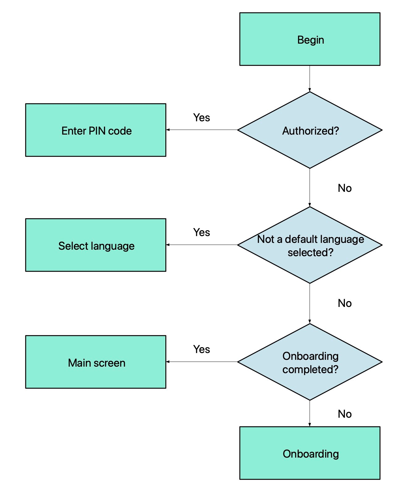

# Stop refactoring. Kotlin. Android.

## Intro

<a target="_blank" href="https://medium.com/star-gazers/stop-refactoring-kotlin-android-581bb05f005">

</a>

<p align="center">
  
</p>
When I was working on one project for a long time, I noticed how I had to refactor the code that seemed good three
months ago. Engineers receive new requirements, add new classes and run forward. But the very moment comes when the cost
of changes is catastrophic and there is only one rational solution - rewrite everything … So, is it possible to write a
code without refactoring or, at least, put it off for a long period? I want to tell you about practices that help me on
projects.

### Replace IF-ELSE to WHEN where it needed

Java was the primary language of the Android platform for a long time. Then Kotlin came to the arena, but… habits remain
old.

```kotlin
fun getNumberSign(num: Int): String = if (num < 0) {
    "negative"
} else if (num > 0) {
    "positive"
} else {
    "zero"
}
```

Cool! Seven pretty lines and we get the result. It may be simpler:

```kotlin
fun getNumberSign(num: Int): String = when {
    num < 0 -> "negative"
    num > 0 -> "positive"
    else -> "zero"
}
```

The same result, but now we use 5 lines.

Don't forget about a cascade `if-else` and its unreadability when it comes bigger. When your project doesn't need to
support two languages(Kotlin+Java) at the same time, I recommend you to use that operator. The popular reason to ignore
it - "It's not typical"...

The problem is not about the preferences of the style of writing. Kotlin doesn't support operator `else-if` and so very
easy to shoot yourself in the foot. More about it here.

I do not recommend to use `when` everywhere where is possible. Kotlin
doesn't ([and wouldn't be](https://discuss.kotlinlang.org/t/ternary-operator/2116/11)) support ternary operator.
You have to use the classic conditional operator. When there are more than two conditions, take a closer look and make
the code more elegant.

### Boolean flag squads

Let's look at the following example of the incoming technical tasks in dynamics:

> 1. The user should be able to see that his message has been received.

```kotlin
data class Message(
        // ...
        val isDelivered: Boolean
)
   ```

Is everything right? Is the message model stable to changes? Do we have a hypothetical ability that the `Message` might
be changed in the near future? Can we have the right to believe that the initial requirements are final?

> 2. The user must have a possibility to see that his message has been read.

```kotlin
data class Message(
        // ...
        val isDelivered: Boolean,
        val isRead: Boolean
)
```   

Now a ProductOwner changed his mind and added a new state to user possibility. Suddenly? The simplest solution is to
add a new field and close the task. Unfortunately, that not true. It's not a solution - it's a deal to delay the
inevitable. Problem-solving skills - a tool that should have each engineer. Predict changes and make your system
stable for it - patterns, experience, skills. By the term "to delay the inevitable" I mean the next fact: when your
structure will be unstable and you will have no choice instead of refactoring it. Refactoring -> additional
development time -> extra expenses -> unhappy customer -> firing -> depression -> impossibility to fix financial
problems -> hunger -> death. All because of the Boolean flag?!!!

What's wrong? The fact of changeable requirements - it's not a folly of a PO. The business must develop. Not
everything that is obvious now was obvious earlier. The less time to maneuver, the more valuable and competitive you
are. Let's enable imagination and try to predict what kind of new requirements might be?

> 3. The user must have a possibility to see that his message has been sent.
> 4. The user must have a possibility to see that his message has been shown in notifications

If we concatenate all new requirements we can see that the Message instance might have only one active state: sent,
delivered, shown in notifications, read. The set of states
is [determined](https://en.wikipedia.org/wiki/Deterministic_algorithm). Try to define it:

```kotlin
data class Message(
        // ...
        val state: State
) {
    enum class State {
        SENT,
        DELIVERED,
        SHOWN_IN_NOTIFICATION,
        READ
    }
}
```

The set is defined. Now we can definitely assume that if a message is read, then it has been sent and delivered. To
be sure of the correct order we can use states priority(run ahead, the best practice is to do it explicitly - you
have to make a separate comparator, don't rely on `ordinal`).

Could we say the message has been shown in notifications? The user might disable notifications in system preferences.
In that case, we mustn't have only one state. A good way to solve the problem - use binary flags.

```kotlin
data class Message(
// ...
        val states: Set<State>
) {
    fun hasState(state: State): Boolean = states.contains(state)
}

// or
data class Message(
// ...
        val states: States
) {
    enum class State(internal val flag: Int) {
        SENT(1),
        DELIVERED(1 shl 1),
        READ(1 shl 2),
        SHOWN_IN_NOTIFICATION(1 shl 3)
    }
    data class States internal constructor(internal val flags: Int) {
        init {
            check(flags and (flags + 1)) { "Expected value: flags=2^n-1" }
        }

        constructor(vararg states: State) : this(
                states.map(State::flag).reduce { acc, flag -> acc or flag }
        )

        fun hasState(state: State): Boolean = (flags and state.flag) == state.flag
    }
}
```

Before starting a system design, ask necessary questions which might help to find the best solution. Can a set of
conditions be considered finite? Will it change in the future? When answers to questions are YES-YES - use binary
states. If you have at least one NO answer - use an enumeration value. When the object might be more than one state
in a single time - use set.

Look at the solution with boolean variables:

```kotlin
data class Message(
//..
        val isSent: Boolean,
        val isDelivered: Boolean
        val isRead: Boolean,
        val isShownInNotification: Boolean
)

//...
fun drawStatusIcon(message: Message) {
    when {
        message.isSent && message.isDelivered && message.isRead && message.isShownInNotification ->
            drawNotificationStatusIcon()
        message.isSent && message.isDelivered && message.isRead -> drawReadStatusIcon()
        message.isSent && message.isDelivered -> drawDeliviredStatusIcon()
        else -> drawSentStatus()
    }
}
```

Try to add a new state(error state) at the end or in the middle of the list of priorities. It will be terrible to it
without reading the documentation and deep dive into the code.

### Single state

It's a rare problem that appears when development focus loses. The single state defines with several independent
variables.

```kotlin
data class User(
        val username: String?,
        val hasUsername: Boolean
)
```

By the definition of the contract, we have the option not to fill out the username. On the GUI we have to highlight
an input field with an error message. The `hasUsername` field is responsible for that. Try to define all possible
combinations:

```kotlin
// OK
val user1 = User(username = null, hasUsername = false)
// Error, user already has a name
val user2 = User(username = "user", hasUsername = false)
// OK
val user3 = User(username = "user", hasUsername = true)
// Error, username is null, but has an incorrect state
val user4 = User(username = null, hasUsername = true)
// Error, username is empty, but has an incorrect state
val user5 = User(username = "", hasUsername = true)
// Error, username is blank, but has an incorrect state
val user6 = User(username = " ", hasUsername = true)
```

Contract bottlenecks open doors to error. The source of truth - username field, only that field must be responsible
for states.

```kotlin
data class User(
        val username: String?
) {
    fun hasUsername(): Boolean = !username.isNullOrBlank()
}
```

When the state might be calculated on demand - do it calculable. Don't duplicate terms. Of course, you might have an
exception to cache states. In that case, use another practice to define state:

* calculate immediately or make it lazy

```kotlin
data class User(
        val username: String?
) {
    val hasUsername: Boolean = !username.isNullOrBlank()
    val hasUsernameLazy: Boolean by lazy {
        !username.isNullOrBlank()
    }
}
```

* move to a utility class

```kotlin
class UsernameHelper {
    private val cache: MutableMap<User, Boolean> = WeakHashMap()
    fun hasUsername(user: User): Boolean = cache.getOrPut(user) {
        !user.username.isNullOrBlank()
    }
}
```

### Abstraction is not superfluous

I often see when developers avoid abstractions. We take requirements, an engineer makes a decision that his solutions
are optimal and… fill with concrete. After a while, we come to the conclusion that we have to change the solution. But
the old class has been injected into a lot of components already. And we have no choice but to go to each component and
fix it.

> The key of third-party services receives from a backend. The client must save keys to a temporary storage for use it
> later.

```kotlin
// ...
val result = remoteService.getConfig()
if (result is Result.Success) {
    val remoteConfig = result.value.clientConfig?.keys
    for (localConfigKey: ConfigKey in configKeyProvider.getConfigKeys()) {
        sharedPreferences.edit { putString(localConfigKey.key, remoteConfig[localConfigKey.key]) }
    }
}
//...
enum class ConfigKey(val key: String) {
    FACEBOOK("facebook"),
    MAPBOX("mapbox"),
    THIRD_PARTY("some_service")
}
```

After N weeks we receive a notice from the security department `THIRD_PARTY` keys can not be saved to disk storage. No
problem, we can store it InMemory. And by the same strategy, we have to fix it in 20 places of the application. So, how
abstraction can help us?

<p align="center">
  
</p>

What if we wrap configuration keys to abstraction and create implementation:
InMemory/SharedPreferences/Database/WeakInMemory… With that solution, we will not violate **SO**LID principle. Actor -
data
collection algorithm, but not a storage method. The open-closed principle will be achieved with an encapsulation.

```kotlin
// ...
val result = remoteService.getConfig()
if (result is Result.Success) {
    val remoteConfig = result.value.clientConfig?.keys
    for (localConfigKey: ConfigKey in configKeyProvider.getConfigKeys()) {
        configurationStorage.put(
                configKey = localConfigKey,
                keyValue = remoteConfig[localConfigKey.key]
        )
    }
}
//....
interface ConfigKeyStorage {
    fun put(configKey: ConfigKey, keyValue: String?)
    fun get(configKey: ConfigKey): String
    fun getOrNull(configKey: ConfigKey): String?
}
internal class InMemoryConfigKeyStorage : ConfigKeyStorage {
    private val storageMap: MutableMap<ConfigKey, String?> = mutableMapOf()
    override fun put(
            configKey: ConfigKey,
            keyValue: String?
    ) {
        storageMap[configKey] = keyValue
    }
    override fun get(configKey: ConfigKey): String =
            requireNotNull(storageMap[configKey])
    override fun getOrNull(configKey: ConfigKey): String? =
            storageMap[configKey]
}
```

If you remember, in the requirements we don't have concretization of the type of storage. Prepare the system to changes,
where implementation might be different and does not in any way affect the details of the data collection algorithm.
Even if the primary requirements would contain clarifications on the type of storage, this is a reason to doubt and play
it safe. Instead of modification N components, just replace an implementation.

### Define states explicitly

Developers are lazy people. Professional deformation allows you to make relaxed decisions that will be clear to
everyone. Often, the first and fast solution - the best solution. But, please don't take it literally.

<p align="center">
  
</p>

> Prepare a repository to provide a username to the display.

Let's create a repo that will provide a username. In case we can't return a name, return null.

```kotlin
interface UsernameRepository {
    suspend fun getUsername(): String?
}
class RemoteUsernameRepository(
        private val remoteAPI: RemoteAPI
) : UsernameRepository {
    override suspend fun getUsername(): String? = try {
        remoteAPI.getUsername()
    } catch (throwable: Throwable) {
        null
    }
}
```

The contract(and naive implementation) has been created. As a successful result, we receive a `String?` and as a failure
result, we receive `String?` too. We can define the failure result state as a `getUsername() == null`. But, by the
contract
`SuccessState === FailState`.

> Prepare a repository to provide a username to the display. When it is impossible to fetch data from a remote,
> do it from a cache.

After the technical task clarification we must create a fork:

```kotlin
interface UsernameRepository {
    suspend fun getUsername(): String?
}
class CommonUsernameRepository(
        private val remoteRepository: UsernameRepository,
        private val localRepository: UsernameRepository
) : UsernameRepository {
    suspend fun getUsername(): String? {
        return remoteRepository.getUsername()
                ?: localRepository.getUsername()
    }
}
```

Unhappy moment. By the contract, we have 4 different states with the same result.

* the result is `null` - is it a username?
* the result is `null` - is it a result from the cache?
* the result is `null` - is it a remote error state?
* the result is `null` - is it a cache error state?

There is no definite answer. The contract doesn't support it. And we have no requirements of the "imagine" states. So,
what is the goal to declare the state explicitly when the major only the result? Adjacent states with the same results -
the beginning of the instability. Avoid ambiguity. New conditionals that might affect, at least one, old state - will
birth refactoring to the whole root model. Changes in the root abstraction - scary. It's a trigger to rewrite
implementations and consumers.

> When you receive an error - highlight the username on the display.

Use `enum`/`sealed classes`/`interfaces`/`abstract classes`. The abstraction definition forms by the source requirements
of the
project. If you need to use a strict contract without extra extensions - use `enum`/`sealed classes`. Otherwise -
`interface`/`abstract classes`.

```kotlin
sealed class UsernameState {
    data class Success(
            val username: CharSequence?
    ) : UsernameState()
    object Failed : UsernameState()
}
```

### When it may not be enough

Let's see the next example. Start of the application depending on the state, you need to go to the next screen.

<p align="center">
  
</p>

```kotlin
enum class NavigationFlow {
    PIN_CODE,
    MAIN_SCREEN,
    ONBOARDING,
    CHOOSE_LANGUAGE
}

fun detectNavigationFlow(): NavigationFlow {
    return when {
        authRepo.isAuthorized() -> NavigationFlow.PIN_CODE
        languageRepo.defaultLanguage != null ->
            NavigationFlow.CHOOSE_LANGUAGE
        onboardingStorage.isCompleted() ->
            NavigationFlow.MAIN_SCREEN
        else -> NavigationFlow.ONBOARDING
    }
}
```

Possible navigation flows are defined. Now it's much easier to implement the navigator. But the `detectNavigationFlow`
became like a [god function](https://en.wikipedia.org/wiki/God_object). The function might be broken if: add a new
state, change priority, when some of a repository
will be deprecated... Let's make a function where the main flow is immutable and substeps are ready to extend.

```kotlin
enum class NavigationFlow {
    PIN_CODE,
    MAIN_SCREEN,
    ONBOARDING,
    CHOOSE_LANGUAGE
}
sealed class State {
    data class Found(val flow: NavigationFlow) : State()
    object NotFound : State()
}
interface NavigationFlowProvider {
    fun getNavigation(): NavigationFlow
}

// Search navigation flow resolver
interface NavigationFlowResolver {
    fun resolveNavigation(): State
}
internal class SplashScreenNavigationFlowProvider(
        private val resolvers: Sequence<NavigationFlowResolver>
) : NavigationFlowProvider {
    override fun getNavigation(): NavigationFlow = resolvers
            .map(NavigationFlowResolver::resolveNavigation)
            .filterIsInstance<State.Found>()
            .firstOrNull()?.flow
// Default fallback
            ?: NavigationFlow.MAIN_SCREEN
}
```

Got rid of the god function. The method replaced with
a [ChainOfResponsibility pattern](https://en.wikipedia.org/wiki/Chain-of-responsibility_pattern).
Looks complicated at first: there is more code and the algorithm is more difficult.
Now let's list the advantages:

1. Popular OOP pattern
2. SOLID match
3. Scalability
4. Easy to test
5. Independent components

The main thing in this approach is independence and scalability. We can add a lot of resolvers and don't worry about the
main process function. Each of a `NavigationFlowResolver` might be replaced anytime. That's easy to insert a new
resolver
into the provider. All you need to do is be careful of the sequence. Independent components improve your life in the
future.

### Inheritance vs composition

The question on this topic has been raised
[a million times](https://en.wikipedia.org/wiki/Composition_over_inheritance).
In that chapter, I want to tell you about practices in the Android platform. Where the reason for overuse is the
platform.

**BaseActivity**. When I look at old projects, I see the most popular mistake - inheritance overuse. By the mask of
reusing
component, we added special cases to the **BaseActivity**. As the weeks passed, activations were overgrown with general
progress bars, handlers, etc. Then we got the task - to add the new progress bar to the N screen and the new progress
bar must be different from the old one. We can't refuse from the **BaseActivity**, because it knows too much. We can add
the
new progress bar as a special case with an old progress bar as a rudiment. But that solution is violating an
inheritance. We can add a new variation to the **BaseActivity** - will offend other heirs. After some time you will
birth the monster with more than 1000 lines of code in basic class and the price to add new changes is very expensive.

> OK. We have to create some components that will be displayed on all screens except two.

No problem. Android SDK has prepared the solution since 14 SDK. `Application.ActivityLifecycleCallbacks` opens the
possibility to override activity's lifecycle elements. Now we can move common cases to a separate handler.

```kotlin
class App : Application(), KoinComponent {
    override fun onCreate() {
        super.onCreate()
        // ...
        registerActivityLifecycleCallbacks(
                SetupKoinFragmentFactoryCallbacks()
        )
    }

    // Attach Koin FragmentFactory to initialize fragment
    // with a Koin
    private class SetupKoinFragmentFactoryCallbacks :
            EmptyActivityLifecycleCallbacks {

        override fun onActivityCreated(
                activity: Activity,
                savedInstanceState: Bundle?
        ) {
            if (activity is FragmentActivity) {
                // or your custom marker interface
                activity.setupKoinFragmentFactory()
            }
        }
    }

}
```

Unfortunately, we can't completely abandon the base activity. Not all parts of the activity are opened to override.

```kotlin
abstract class BaseActivity(
        @LayoutRes contentLayoutId: Int = 0
) : AppCompatActivity(contentLayoutId) {
    // attachBaseContext protected by default
    override fun attachBaseContext(newBase: Context) {
// add extension to hot override Locale settings on context
        super.attachBaseContext(newBase.applySelectedAppLanguage())
    }
}
```

**BaseFragment**. The same solution with a fragment. You have to
learn [FragmentManager API](https://developer.android.com/reference/androidx/fragment/app/FragmentManager),
just
add [registerFragmentLifecycleCallbacks](https://developer.android.com/reference/androidx/fragment/app/FragmentManager.FragmentLifecycleCallbacks)

- profit.

Composition and fragment. To pass some objects to a fragment you can use injections from DIP frameworks - Dagger, Koin,
custom solution, e.t.c. Or, we might pass it to the constructor. WHAT?! That's a typical question from the interview -
Why can't pass arguments to a fragment constructor? Don't worry -
it's [legal](https://developer.android.com/jetpack/androidx/releases/fragment#1.1.0-alpha01).

**BaseApplication**. For a different `Flavors` and `BuildType` you have to use base `Application` to open a possibility
to override some components loading for a different build type. As a rule, `Application` gets big, because we have to
initialize a lot of 3rd party libraries at the start.

```kotlin
interface Bootstrapper {
    // KoinComponent - entry point DIP to have
    // a possibility to call a function injection
    fun init(component: KoinComponent)
}
interface BootstrapperProvider {
    fun provide(): Set<Bootstrapper>
}
class BootstrapperLauncher(val provider: BootstrapperProvider) {
    fun launch(component: KoinComponent) {
        provider.provide().onEach { it.init(component) }
    }
}
class App : Application() {
    override fun onCreate() {
        super.onCreate()
        // Call a bootstrapper after Koin initialization
        this.get<BootstrapperLauncher>().launch(component = this)
    }
}
```

As a result, we offload a killocode of functions to a separate Bootstrapper. We have made our code cleaner. Or you might
use a native solution from [the green robot](https://developer.android.com/topic/libraries/app-startup).

### Decrease visibility scope

Encapsulation - the major part of the OOP paradigm. For a reason, modern programming languages contain access modifiers
that limit the scope of signatures. This is supported at the compiler level. It's good protection. You are writing the
code which can't be modified. Otherwise, it will not be compiled. In the practice, I often meet the encapsulation that
related to an internal state of objects or functions. And what about implementation?

Let's select a separate module that will contain state validation objects.

```kotlin
interface Validator {
    fun validate(contact: CharSequence): ValidationResult
}
sealed class ValidationResult {
    object Valid : ValidationResult()
    data class Invalid(
            @StringRes val errorRes: Int
    ) : ValidationResult()
}
class PhoneNumberValidator : Validator {
    override fun validate(
            contact: CharSequence
    ): ValidationResult =
            if (REGEX.matches(contact)) ValidationResult.Valid
            else ValidationResult.Invalid(R.string.error)

    companion object {
        private val REGEX = "[0-9]{16}".toRegex()
    }
}
```

Is it bad to have a public class that everyone can access? Overuse of public entities by default means that an object of
this class can be used by anyone. There is a desire to make changes for personal needs, without thinking about the
consequences. If you don't protect before that will not let the "broken" code to the production environment - wait for a
bug.
We have received updates of requirements when we have to use [E.164](https://en.wikipedia.org/wiki/E.164) instead
of [MISSDN](https://en.wikipedia.org/wiki/MSISDN).

```kotlin
class PhoneNumberValidator : Validator {
    override fun validate(contact: CharSequence): ValidationResult =
            if (REGEX.matches(contact)) ValidationResult.Valid
            else ValidationResult.Invalid(R.string.error)

    companion object {
        private val REGEX = "+[0-9]{16}".toRegex()
    }
}
```

Well, here we have a problem now. We just edited old PhoneNumberValidator and broke old behavior. Of course, we might
just add documentation, but not all developers read the documentation. It does not give strictness of use.

We might solve it by:

* create a new validator
* create a new validator with a regex by default and pass special case where it needed
* inheritance and override
* another way

Now, let's look at the code if we initially concreted the MSISDN validator and brought it to the binary.

```kotlin
interface Validator {
    fun validate(contact: CharSequence): ValidationResult
}
sealed class ValidationResult {
    object Valid : ValidationResult()
    data class Invalid(
            @StringRes val errorRes: Int
    ) : ValidationResult()
}
internal class MSISDNNumberValidator : Validator {
//...
}
internal class E164NumberValidator : Validator {
//...
}
```

In that solution, you might see it's hard to edit the solution because it's closed. It remains to solve the problem of
creating validators and the possibility of their extension:

```kotlin
interface ValidatorFactory {
    fun create(type: ValidatorType): Validator?
    interface ValidatorType
    companion object {
        fun create(): ValidatorFactory {
            return DefaultValidatorFactory()
        }
    }
}
object MSISDN : ValidatorFactory.ValidatorType
object E164 : ValidatorFactory.ValidatorType
private class DefaultValidatorFactory : ValidatorFactory {
    override fun create(
            type: ValidatorFactory.ValidatorType
    ): Validator? = when (type) {
        is MSISDN -> MSISDNValidator()
        is E164 -> E164Validator()
        else -> null
    }
}
```

Collecting the cube and pack it to a binary. The code is open for an extension as needed, but closed for modification.
If you want to add a custom validation just create a ValidationFactory with a fallback to a DefaultValidatorFactory. Or
rollout a new patch.

### Conclusion

When I design a system, I usually use SOLID rules. These principles have been spoken about for more than a dozen years,
but they are still relevant. Sometimes the system might look redundant. Is it worth bothering about the complexity and
stability of the code design? There is no definite answer. You can make a choice at some moment. If you are sure that
your project will be alive from the 6 months - write a flexible code. Don't be fooled that this is overengineering.
Mobile applications with 2–3 screens are long gone. Mobile development has been an enterprise for a long time. Be
flexible it's a gold skill. Your business will not stall in place and the flow of scheduled tasks will be less likely to
remain off schedule.