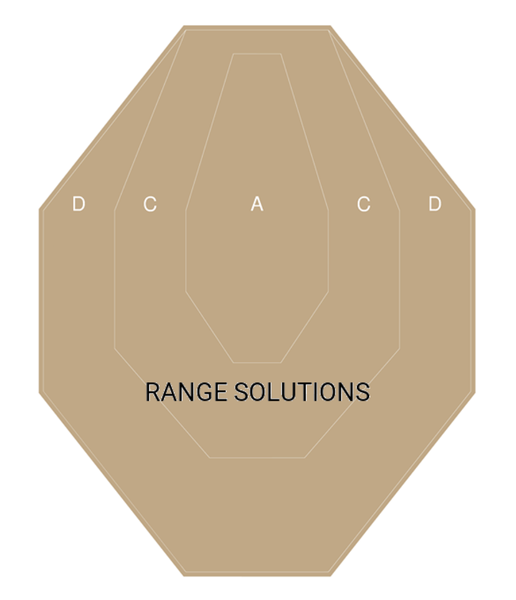
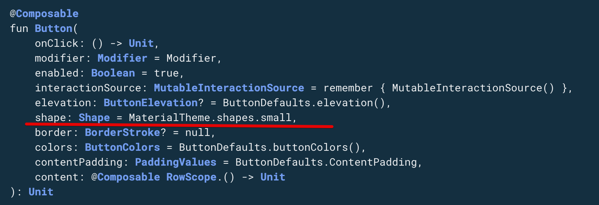
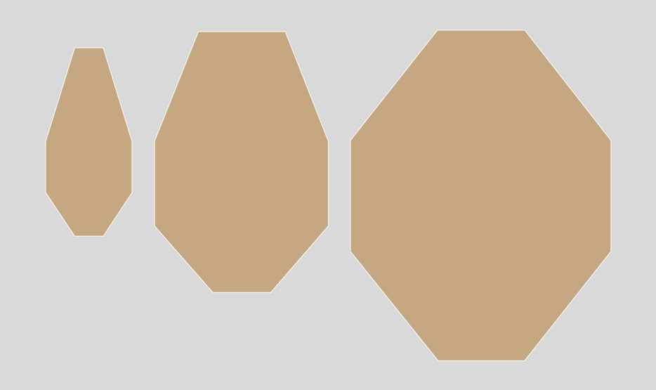
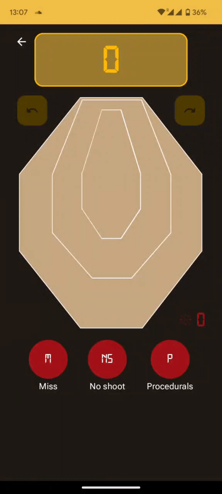

# Делаем виджет с кастомной формой на Jetpack Compose с помощью Figma и AndroidVectors.

Недавно я делился своими мыслями о своем новом увлечении - [стрелковый спорт](https://vas3k.club/post/16996/). Погружаясь в дело, стало интересно отслеживать свой результат. Изучая тему, я столкнулся с тем, что приложений для трекинга не так уж много и они не покрывают необходимую мне функциональность. А самое главное - у них очень плохой UX. Все приложения предлагают вбивать очки вручную через input field, либо через кнопочки. А почему бы не сделать приложение, где в качестве input widget будет выступать сама мишень? Именно с решением такой проблемы я решил закрыть тему удобства для себя и написать приложение для подсчета [hit factor в IPSC соревнованиях](https://play.google.com/store/apps/details?id=by.bulba.ipsc.calculator).

## Задача

Создать виджет IPSC мишени с кликабельными зонами в альфа, чарли и дельта зонах, по клику на которые будут зачисляться очки - 5,3,1 соответственно. Штрафные баллы отличаются только классификацией, так что их можно оставить просто кнопками.



## Решения

Начиная новый проект, я твердо решил идти по современным тенденциям и в параллели изучить “новый” фреймворк - [jetpack compose](https://developer.android.com/jetpack/compose?gclid=Cj0KCQjw2v-gBhC1ARIsAOQdKY1DTNgfsQS9vlnHLapHgj5DMfiaQ23qYEiiYL9NVcbv4RS-v130_iUaAlW2EALw_wcB&gclsrc=aw.ds). До него, решить такую проблему можно было бы с помощью кастомного рисования через canvas. А что же может предложить compose?

Да, у него тоже есть свободное рисование через [Canvas](https://developer.android.com/jetpack/compose/graphics/draw/overview). Но изначально задача стоит немного другая - нужны 3 кликабельные кнопки различной формы. Те нужно создать кнопки наложенные друг на друга. И такая возможность [есть у compose](https://developer.android.com/reference/kotlin/androidx/compose/material/package-summary#Button(kotlin.Function0,androidx.compose.ui.Modifier,kotlin.Boolean,androidx.compose.foundation.interaction.MutableInteractionSource,androidx.compose.material.ButtonElevation,androidx.compose.ui.graphics.Shape,androidx.compose.foundation.BorderStroke,androidx.compose.material.ButtonColors,androidx.compose.foundation.layout.PaddingValues,kotlin.Function1)). 



Все что нам нужно - определить свою фигуру и передать ее в качестве аргумента нашей кнопке. 

Если взглянем еще раз на исходные данные, все что нам нужно - создать 3 различные формы и отдать их на сьедение кнопкам:



У `Shape` есть различное количество вариаций для имплементаций. В моем же случае требуется найти то, в которую можно передать кривую/полигон - `GenericShape`:

```kotlin
class GenericShape(
    private val builder: Path.(size: Size, layoutDirection: LayoutDirection) -> Unit
) : Shape {

    override fun createOutline(
        size: Size,
        layoutDirection: LayoutDirection,
        density: Density
    ): Outline {
        val path = Path().apply {
            builder(size, layoutDirection)
            close()
        }
        return Outline.Generic(path)
    }
}
```

Имплементация заставляет нас определить размер итоговой формы, не сложно, имеем дизайн. Остается закрыть последнюю задачу - как реализовать `path`.

Нужно задать координаты на плоскости и замкнуть их в path - те массив [векторов](https://en.wikipedia.org/wiki/Vector_space) - те [полигон](https://en.wikipedia.org/wiki/Polygon).  Мы можем рассмотреть вариации набития таких векторов хардкодом и дальше заставлять каждого разбираться в потаемной магии. Но у андроида и векторной графики же есть свои стандарты хранения изображений. Достаточно же просто научится ее парсить и превращать фигма-дизайн в compose-widget. 

## Android vector

Каждый разработчик встречался с векторами на Android, но далеко не каждый разбирался в стандарте хранения данных:

```xml
<!-- Вектор сектора D -->
<path
      android:pathData="M260.28,4H131.18L4,163.74V323.49L131.18,484H260.28L384.4,323.49V163.74L260.28,4Z"
      android:strokeWidth="8"
      android:fillColor="#C5A781"
      android:strokeColor="#C5A781"/>
```

Интересует нас тут `pathData` и все циферки и буковки которые хранятся. На самом деле, большой магии тут нету. Есть 2 основные команды:

- moveTo - переместить курсор в определенную точку
- lineTo - перемещение с закрашиванием

Это основное, дальнейшие вариации - это только лишь модификация. За большими подробностями прошу нырнуть [в эту статью](https://medium.com/@ali.muzaffar/understanding-vectordrawable-pathdata-commands-in-android-d56a6054610e), там все разжевано. Для нас нужно отделить команду M(moveTo) от всех остальных - L(lineTo), H(lineTo по горизонтали с одной переменной для оси Y), V(lineTo по вертикали с одной переменной для оси X), Z(нуль терминатор). Это все некая компрессия на уровне протокола. Все что нам остаётся - научить нашу программу в этот формат. Пишем парсер и….

Получаем следующую проблему - наши вектора заданы только в рамках заданного `size`. Хорошо, в очередной раз вспоминаем математику, добавляем множитель по длиннейшей стороне и получим итоговое нескукоженное изображение - форму. 

```kotlin
internal fun Size.scaleToEtalon(etalonVectorSize: Size): ScaleFactor {
    return if (this.width < height) {
        (this.width / etalonVectorSize.width)
            .let { scale -> ScaleFactor(scale, scale) }
    } else {
        (this.height / etalonVectorSize.height)
            .let { scale -> ScaleFactor(scale, scale) }
    }
}
```

Далее передаем scale factor в наш парсер и получаем результат:

```
internal fun drawPathFromPathData(
    path: Path =Path(),
    scaleFactor: ScaleFactor,
    pathData: String,
    offsetSize: Size =Size(0f, 0f),
): Path {
    val list = pathData.split(PATH_DATA_PARSER_REGEX)
    var lastKnownOffset =Offset(0f, 0f)
    list.forEach{pathPart->
val startChar = try {
            pathPart.toCharArray()[0]
        } catch (aioobe: ArrayIndexOutOfBoundsException) {
            return@forEach
        }
        val drawPathPattern = DrawPathPattern.parseKey(startChar) ?: return@forEach
        when (drawPathPattern) {
            DrawPathPattern.MOVE_TO-> {
                val values = drawPathPattern.pattern.find(pathPart)?.groupValues ?: return@forEach
                val x = values[3].toFloat()
                val y = values[5].toFloat()
                path.moveTo(scaleFactor = scaleFactor, x = x, y = y, offsetSize = offsetSize)
                lastKnownOffset =Offset(x, y)
            }

            DrawPathPattern.LINE_TO-> {
                val values = drawPathPattern.pattern.find(pathPart)?.groupValues ?: return@forEach
                val x = values[3].toFloat()
                val y = values[5].toFloat()
                path.lineTo(scaleFactor = scaleFactor, x = x, y = y, offsetSize = offsetSize)
                lastKnownOffset =Offset(x, y)
            }
            DrawPathPattern.HORIZONTAL_LINE_TO-> {
                val values = drawPathPattern.pattern.find(pathPart)?.groupValues ?: return@forEach
                val x = values[3].toFloat()
                path.lineTo(scaleFactor = scaleFactor, x = x, y = lastKnownOffset.y, offsetSize = offsetSize)
                lastKnownOffset = lastKnownOffset.copy(x = x)
            }
            DrawPathPattern.VERTICAL_LINE_TO-> {
                val values = drawPathPattern.pattern.find(pathPart)?.groupValues ?: return@forEach
                val y = values[3].toFloat()
                path.lineTo(scaleFactor = scaleFactor, x = lastKnownOffset.x, y = y, offsetSize = offsetSize)
                lastKnownOffset = lastKnownOffset.copy(y = y)
            }
        }
}
return path
}

private enum class DrawPathPattern(
    val key: Char,
    val pattern: Regex,
) {
MOVE_TO(
        key = 'M',
        pattern = "([A-Z](\\s)*)(\\d+(\\.\\d+)*),(\\d+(\\.\\d+)*)".toRegex(),
    ),
LINE_TO(
        key = 'L',
        pattern = "([A-Z](\\s)*)(\\d+(\\.\\d+)*),(\\d+(\\.\\d+)*)".toRegex(),
    ),
HORIZONTAL_LINE_TO(
        key = 'H',
        pattern = "([A-Z](\\s)*)(\\d+(\\.\\d+)*)".toRegex(),
    ),
VERTICAL_LINE_TO(
        key = 'V',
        pattern = "([A-Z](\\s)*)(\\d+(\\.\\d+)*)".toRegex(),
    ),
    ;

    companion object {
        fun parseKey(key: Char): DrawPathPattern? = values().firstOrNull{ it.key == key}
}
}
```

Полный [gist](https://gist.github.com/IlyaPavlovskii/4bee00442263622e6250a60ae03491a3).



## Заключение

С помощью компоуз, уже сейчас, можно спокойно рисовать нестандартный дизайн для продакшена, тем самым экономив время. Я думаю, после моего ресерча, статья будет очень полезна, для реализации спецефичных виджетов, которые идут за рамки стандартного materiał design. Все что вам остается сделать - получить дизайн, скачать вектор,  передать его парсеру и получить уникальную кнопку. 

P. S. Я не оборачивал эти наработки в библиотеку, ну уверен, что в этом есть нужда. Если все-таки преобразование из vector XML в custom shape, кажется необходимым, отпишите в комментариях, обязательно сделаю решение в своём [репозитории](https://github.com/IlyaPavlovskii).