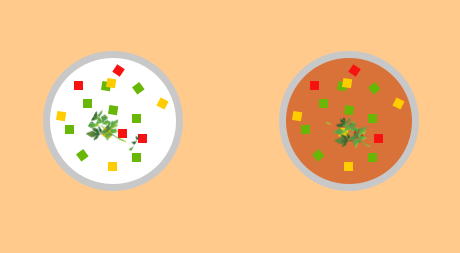
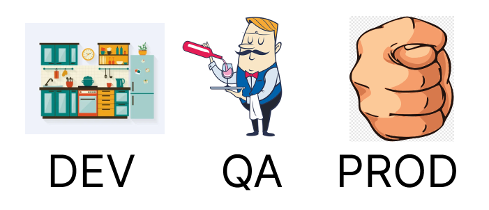
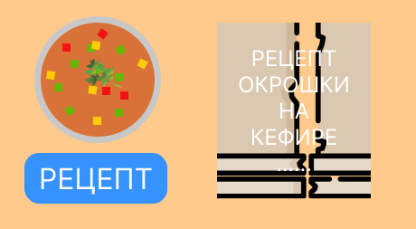
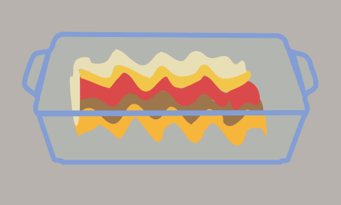
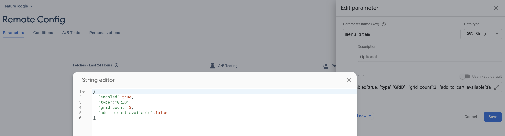
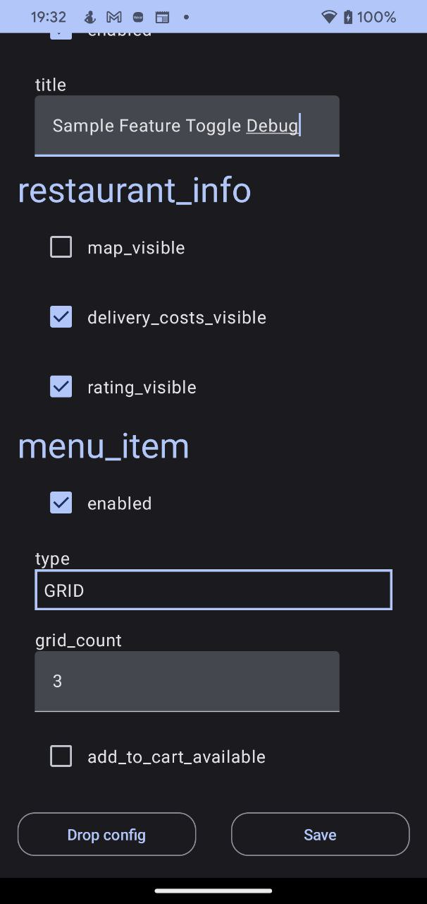

# Готовим FeatureToggle для Android

<a target="_blank" href="https://habr.com/ru/articles/709542/">

</a>

Всем привет, меня зовут Илья, я андроид инженер. Почти три года назад, мы начали свой
проект [в сфере финтех](https://play.google.com/store/apps/details?id=net.humans.fintech_uz). Срок запуска MVP был
оптимистичным. За неделю до наступления дедлайна наша команда осознала, что срок запуска переносить никто не собирается,
а одна фича вряд ли будет закончена вовремя. Рисковать не хотелось и было решено - прикрыть эту часть заглушкой.
Блокируя часть нерабочей функциональности, мы питали надежды, что скоуп MVP будет закрыт. По-этому, выключить нерабочий
код хотели так, чтобы по щелчку кнопки CI/Web экран стал доступен для пользователя.

Постепенно, штат сотрудников разрастался и далеко не все понимали что это такое. Гайд так же был необходим и для
внутренних сотрудников. Один источник данных - одна правда для всех. Пришлось добавить не только библиотеку для
форсирования, но и перестроить процесс разработки.

Откровенно говоря, разговоры внутри команды о внедрении FeatureToggling шли уже давно. Эта история стала спусковым
крючком для его внедрения.

## Что это такое?

Фиче тоглинг - это техника в разработке ПО, с помощью которой часть функциональности можно включить/выключить в
зависимости от конфигурации. Имея такой инструмент, открывается большой простор для применения.

### Применение:

- **Форсирование функциональности**
  Основа feature toggle - уметь прикрыть любой участок кода по условию. Вы можете делиться своими наработками еще до
  того, как ваша фича будет полностью готова. Для разных сборок можем выставить различные флаги и получим, что для
  разработчиков доступны все фичи, для QA то, что можно тестировать и для пользователей, что можно трогать. Кроме этого,
  вы можете рассмотреть возможность перехода
  c [GitFlow](https://www.atlassian.com/git/tutorials/comparing-workflows/gitflow-workflow)
  на [TBD](https://trunkbaseddevelopment.com/). Без форсирования функциональности, сделать это будет не так-то просто.

<p align="center">
    
</p>

- [A/Б тестирование](https://en.wikipedia.org/wiki/A/B_testing)
  Предположим, у вас есть гипотеза, что пользователи кулинарного приложения с ума сходят от окрошки на кефире. Но
  менеджер так не считает и хочет продвигать на первых страницах окрошку на квасе. Разрешить этот спор должен сам
  пользователь. Можно устроить опросник на странице открыв
  свою [маркетинговую компанию](https://firebase.google.com/docs/projects/iam/overview). Но это будет выглядеть слишком
  навязчиво и отвлекать от основного контента. С помощью A/Б тестирования есть возможность произвести это скрытно для
  пользователя. Так, что тот и не догадается какой суп варится на кухне.
  Делим раскатку нашего приложения напополам. Первой половине в выдаче будем показывать окрошку на кефире, второй на
  квасе. Клики по баннеру и его просмотры обмазываем аналитическими событиями. Заранее обговариваем с менеджером
  критерии успеха эксперимента и условия, при которых эксперимент стоит прекратить.

<p align="center">
    
</p>

- Не обязательно иметь только 2 условия для проведения эксперимента. Гипотеза может содержать множество входных данных и
  исходов.

<p align="center">
    
</p>

- Обычно, анализ данных выполняется на той стороне, которая ответственна за их выдачу. В нашем случае это будет backend,
  а разработчики клиентов красят кнопки. Здесь это только пример. Для клиентов будет более реалистичная картинка - как в
  UI это будет представлено: вертикальный список, горизонтальный скролл, табличный формат и различные вариации
  представления UI.
- **Удаленное управление**
  Вы раскатили эксперимент на процент пользователей и на одном фиче-флаге ваша система падает. Об этом будет известно из
  аналитики или крэшлитики. Необязательно экстренно прерывать раскатку на всех пользователей. Можно просто отключить
  невалидное условие с помощью удаленного управления и исправить эту проблему в штатном режиме. Необходимо заменить
  конфигурацию на сервере, с которого приложение выкачивает настройки, и он применится как только, так сразу. Бесплатно
  и без багфиксов.
  Так же, есть возможности управление фиче флагами на лету. Однако, это довольно дорогое удовольствие и встречается в
  редком количестве продуктов. Сложно в архитектурной проработке и поддержке такой функциональности.
- **Тестирование**
  Если можно прикрыть участок кода feature flag-ом, то можем отгородить часть функциональности от посторонних глаз. Одна
  и та же сборка будет содержать несколько вариации имплементации. Таким образом, при передаче билда в команду
  тестирования, пишем инструкцию по переключению флагов и даем возможность прогнать все необходимые варианты. Точно так
  же поступаем с продвижением по цепочке до релиза(внутреннее тестирование, альфа-бета тестирование, прод)

### Схема продвижения фичи по процессу

<p align="center">
    
    
</p>

## Как приготовить?

Теперь у нас есть представление что такое FeatureToggle. Перед там как начать писать код, сформируем четкое ТЗ того, что
хотим получить. Система должна иметь возможность форсировать функциональность, гибко задавать конфигурацию, перегружать
заданные настройки для различных типов сборок и иметь удаленное управление. Сверху накинем обязательную масштабируемость
и защиту от попадания ненужной конфигурации в ненужные руки.

Фиче флаги можно переключать следующими способами:

- **хардкодом**

Вбили гвоздь и он будет нерушим. Топорный, не гибкий вариант, но очень простой.

```kotlin
data class SoupFeatureToggle(
    val okroshkaType: OkroshkaType = OkroshkaType.KEFIR,
) {
    enum class OkroshkaType {
        KEFIR,
        KVASS,
				;
    }
		companion object {
				val DEFAULT = SoupFeatureToggle()
		}
}
//....
fun showSoup() {
		val featureToggle: SoupFeatureToggle = SoupFeatureToggle.DEFAULT
    when(featureToggle.okroshkaType) {
        SoupFeatureToggle.OkroshkaType.KEFIR -> showKefirOkroshka()
        SoupFeatureToggle.OkroshkaType.KVASS -> showKvassOrkoshka()
    }
}
```

Топорный вариант, но надежный и имеет строгий контракт. Мы его чуть подправим, но об этом позже.

- **конфигурационно**

На различных [флейворах](https://developer.android.com/studio/build/build-variants) мы хотим иметь уникальные настройки.
Бегать с гвоздометом и переопределять для каждого типа сборок свой конфиг - можно, но это не элегантно. Представьте, что
для каждой сборки(передача в QA, отправка в Internal/Alpha/Beta тестирование, продакшон) нужно будет выдернуть одного
разработчика, который каждый раз будет лезть в код, перебивать и валидировать конфиг... Муторно и не интересно. Ведь при
хорошем подходе, это можно отдать в руки самому менеджеру в формате JSON/XML/YAML… Да хоть Excel! Нам только нужно
научиться парсить такой файл и принимать его во внимание. Если без
Excel, [права доступа](https://docs.github.com/en/github/creating-cloning-and-archiving-repositories/creating-a-repository-on-github/about-code-owners)
можно раздать для ограничения списка лиц, которые могут быть причастны к изменениям.

- **через файловую систему**

На базе предыдущих наработок с конфигурационными файлами, нам достаточно добавить новый источник данных. Например, не
вшитый в вашу сборку `feature_toggle_config.json` который располагается в ресурсах/ассетах, а локальный или удаленный
файл. Как этот файл окажется в устройстве пользователя - не столь важная задача(CLI, файловый менеджер, удаленный
репозиторий, [3rd party service](https://firebase.google.com/docs/remote-config)).

- **в телефоне**

Такой тип переключения будет удобен для внутреннего тестирования. Вы написали инструкцию и документацию, отдали QA билд.
Ранее описанные способы переключения флагов очень удобны на рабочем месте, но сложны в использовании, например, в метро.
Пишем экран с переключателями состояний для каждого типа данных: string → EditText, boolean → checkbox/switcher, enum -
popup/radiobutton и так далее. Не забываем про то, что этот экран не должен попасть до конечного пользователя, прячем
его за dev/qa flavor и в бой.
——————————————————————————————————————————————————
Ранее описанные способы идеально ложатся на структуру, когда ваши флаги будут находится в актуальном состоянии на момент
запуска процесса вашего приложения. Итоговая конфигурация собирается ДО момента инициализации IoC(DependencyIjection,
ServiceLocator или что там у вас) фреймворка. В противном случае, нам придется решать задачу динамического разрула
зависимостей на лету. Пример возможной ситуации:

<p align="center">
    
</p>

На картинке окрошка на квасе, а получили меню окрошки на кефире

Заголовок построен на базе фиче флага который был получен ДО момента отрисовки. После отрисовки заголовка, к нам
прилетели изменения фиче флагов. Рецепт какого блюда будет отрисован после нажатия кнопки - "Показать рецепт"?

Получается, что жизненный цикл фиче флагов "на лету" нельзя будет определить на временной шкале. Они могут измениться в
любой момент, что и рождает проблемы с их применением. Это отдельная история, которая должна решаться в зависимости от
типа вашего проекта и требований. Не углубляюсь в эту тему, это про поставку зависимостей и их жизненный цикл. Просто
подчеркиваю - 2 основных типа реализации изменений feature toggles: статический и на лету.

## Состав лазаньи

<p align="center">
    
</p>

1. **FeatureToggleContainer**

*Для приготовления блюда, нам потребуется форма для запекания.*

Основная точка регистрации любого `FeatureToggle`. Все что не попадет в Registrar будет проигнорировано. Просто объявите
контейнер и перечислите все фиче флаги. Это нужно для того, чтобы правильно сконфигурировать наш IoC framework и
настроить защиту от неправильной конфигурации через тесты. В контейнер должен попадать именно инстанс объекта, а не
декларация класса - необходимое условие для дешевого решения фолбэка. В случае отсутствия настроек в дальнейших слоях,
будет принята настройка по умолчанию. По-этому, примите это во внимание, чтобы недоработанная функциональность не попала
в рабочую зону. Как правило, декларации в контейнере должны быть такими, как будто все фиче тоглы выключены.

```kotlin
private val featureToggleContainer: FeatureToggleContainer = SimpleFeatureToggleContainer(
        featureToggles = setOf(
            SampleTitleFeatureToggle(
                enabled = false,
                title = "Sample FeatureToggle",
            ),
            RestaurantInfoFeatureToggle(
                mapVisible = false,
                deliveryCostsVisible = false,
                ratingVisible = false,
            ),
            MenuItemFeatureToggle(
                enabled = false,
                gridCount = 3,
                type = MenuItemFeatureToggle.PreviewType.HORIZONTAL_LIST,
                addToCartAvailable = true,
            )
        )
    )
FeatureToggleContainerHolder.init(featureToggleContainer)
```

2. **Default config.**

*Дно формы для запекания обильно смазываем сливочным маслом и выливаем соус бешамель и выкладываем первый лист лазаньи.
Это все нужно для того, чтобы блюдо не подгорело снизу и пропиталось соусом.*

Конфигурация сборки, которую удобно поставлять через ресурсы. Может прятаться через любую директорию, которую можно
разбить по flavors/buildType - `raw`, `assets` и так далее. Либо же, создать свой compile time solution который будет
вынимать их и перегружать значение.

Забегая вперед, удаленный конфиг строится на базе `Firebase`. У него есть настройка конфигурации по умолчанию из файла
ресурсов. Так как удаленный тип может быть недоступен для dev сборки, строим `ResourcesFeatureToggleReader` на структуре
такого же файла, чтобы не переучиваться:

```kotlin
<?xml version="1.0" encoding="utf-8"?>
<defaultsMap>
    <entry>
        <key>sample_title</key>
        <value>{
            "enabled":true,
            "title":"Sample Resources config Title"
            }
        </value>
    </entry>
</defaultsMap>
```

Перегружаем тоглер с ключом `sample_title` и изменяем у него шапку.

<p align="center">
    
</p>

1. **Remote config.**

*Самая питательная часть. Обжаренный фарш с луком, чесноком и томатным соусом выкладываем на лист.*

Удаленный тип поставки флагов, предназначенный для экстренного управления на уже раскатанных билдах. Подразумевается
идея того, что к этому способу вы будете приходить только в экстренных ситуациях, когда билд раскатан и изменения
требуют траты времени инженерной команды - задействуем этот подход. Либо же в проверке гипотез - А/Б тестирование.

Готовить его можно следующими способами - 3rd party решения или свое. Из
готовых - [Firebase Remote Config](https://firebase.google.com/products/remote-config). Самый популярный пример его
использования - A/Б тестинг, который у этой библиотеки только удаленный(да, с подкапотным кэшем, но, только с ремутным
порождением флагов) с фолбэком на ресурсы. Это не эталон, А/Б тестинг должен рождаться с пропиской доли раскатки ещё в
Default Config. Но это уже детали и с этим можно начинать.

```
FirebaseFeatureToggleReader(
    fetchTimeout = 60.seconds,
    minimumFetchInterval = 12.hours,
    json = json,
    defaultConfigRes = defaultXmlConfigResource,
)
```

Задаем настройки для `FirebaseFeatureToggleReader` - таймаут и минимальный интервал для скачивания нового файла,
десериализатор и конфиг по умолчанию(см. пункт 2). И дальше играемся с Web интерфейсом и пробуем наши настройки в бою.

<p align="center">
    
</p>

1. **Debug file config**

*Все посыпаем тертым сыром пармезан.*
Первые три слоя необходимы как минимальный набор выхода в бой к пользователям. А для разработчиков и группировки
тестирования, оставим приятный backdoor для возможности форсирования на готовом билде. Спрячем за типом `flavor` способ
редактирования специального файла на устройстве, чтобы не это не могло оказаться на проде.

```kotlin
XmlFileFeatureToggleReader(
    json = json,
    xmlConfigReader = XmlFileConfigReader(),
    xmlConfigFileProvider = DefaultConfigFileProvider(
        applicationContext = context,
    ),
)
```

Необходимо это потому, что в ваших конфигурациях могут быть спрятаны уникальные/платные/неготовые фичи, ответственность
за нерушимость которых у вас прописана в [terms of conditions](https://en.wikipedia.org/wiki/Terms_of_service). Теперь,
для форсирования функциональности необходимо отредактировать файл на самом гаджете, либо же перезалить новый с
помощью `adb`. Не нужно пересобирать билд, переключать флаги на RemoteConfig и ждать пока выкачается новый скрипт.
Делаем все максимально быстро и доступно.

1. **Debug panel**

Обильно поливаем сыр соусом бешамель.

Файл это конечно хорошо. Но каждый раз ползать в утилиты на телефоне для редактирования конфига либо иметь нотбук под
рукой для загрузки - нудобно. Да и мы ж ленивые инженеры. По-этому и дописываем отдельный лаунчер/экран/меню, который
даст возможность его модификации на телефоне с GUI и без SMS.

<p align="center">
    
</p>

Добавляем еще 2 кнопки - сохранить и очистить конфиг, чтобы всегда могли вернуться к началу. Делаем ремарку того, что
вся система работает со статическим конфигом. По-этому, для его применения, потребуется перезапуск основного приложения.

```kotlin
devImplementation("io.github.ilyapavlovskii:debug.panel:X.X.X")
```

Для запуска такой дебаг панели, вам всего-лишь необходимо добавить зависимость к проекту и в вашем `flavor` добавиться
еще один `launcher`. Просто убедитесь в том, что `FeatureToggleReaderHolder` и `FeatureToggleContainerHolder` были
заданы, а остальное взведется автоматом.

## Bon appetit

На выходе получаем картинку с конфигураторами по приоритету: дебажный файлик превыше всего, удаленный репо, локальный
конфиг и дефолтная конфигурация. Оставляем возможность для вставки произвольных `FeatureToggleReader` в нашу цепочку и
получаем на выходе `ChainOfResponsibility` считывателей конфигураций.

```jsx
val
featureToggleReader = ChainFeatureToggleReader(
    featureReaders = arrayOf(
        // Debug file config reader
        XmlFileFeatureToggleReader(
            json = json,
            xmlConfigReader = XmlFileConfigReader(),
            xmlConfigFileProvider = DefaultConfigFileProvider(
                applicationContext = context,
            ),
        ),
        // Remote feature toggle reader
        FirebaseFeatureToggleReader(
            fetchTimeout = 60.
toDuration(DurationUnit.SECONDS),
    minimumFetchInterval = 12.
toDuration(DurationUnit.HOURS),
    json = json,
    defaultConfigRes = defaultXmlConfigResource,
),
// Default config reader
ResourcesFeatureToggleReader(
    json = json,
    configReader = xmlConfigReader,
),
)
)
FeatureToggleReaderHolder.init(featureToggleReader)
```

И все это безобразие со схемой подключения и примером хранится [здесь](https://github.com/IlyaPavlovskii/FeatureToggle).