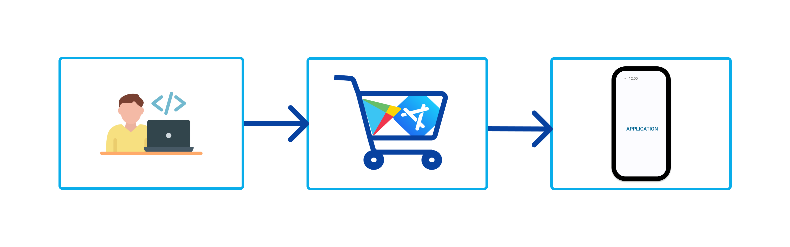
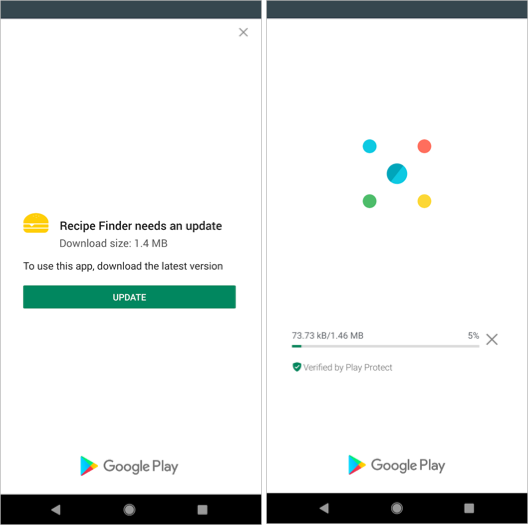
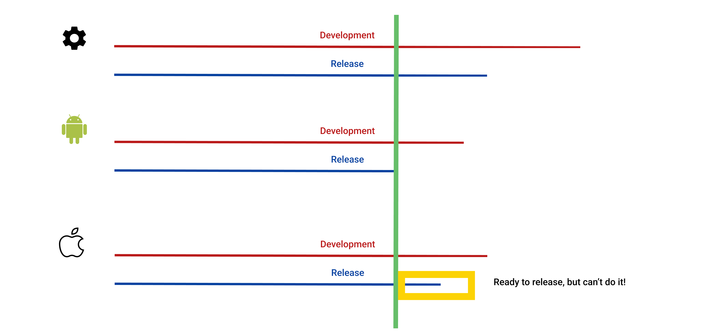
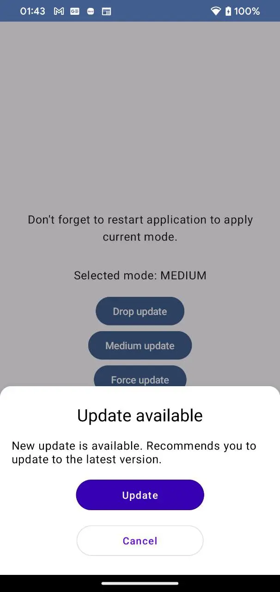
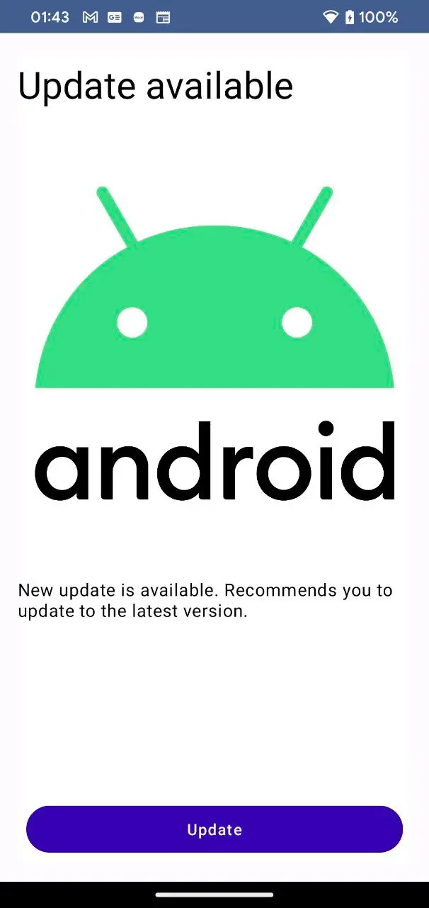

# Force update feature

Пятница. Солнечный весенний день. До конца рабочего дня остается полчаса… В комнату врывается менеджер - “СРОЧНО! Бэкэнд закончил деплой, нужно релизить мобильный билд!!! Чтобы завтра у всех пользователей все было доступно!!!” Знакомая ситуация? Я бы хотел поговорить о причинах того и есть ли от такой болезни таблетка.

## Причины

Как бы быстро не скакал прогресс, не все успевают за ним следовать. Причина появления таких “моментальных” запросов проста - менеджмент долгое время вел web проекты, где выпуск новой версии это подлитие кода на головной сервер и ваша свежая версия доступна пользователю по нажатию CMD+R. Мобильный разработке уже больше 15 лет, и нюансы поставки не всегда самая нужная и важная часть при ведении проекта. Именно по этой причине, такого рода запросы, пораждают facepalm у разработчиков.


А из новшеств, появилось только дополнительное звено в виде магазинов приложений для основных мобильных платформ iOS и Android. Алгоритм выглядит следующим образом - вы публикуете свою новую версию приложения в магазине, далее, клиентское устройство видит, что появилась новая версия и готов предложить вам ее скачать. Не делать это мгновенно он может по ряду причин: 

- обновления по умолчанию доступны только при подключении к сети WiFi
- обновления отключены полностью
- версия устройства и приложения несовместимы
- новая публикация запрещена в определенном регионе
- магазин запрещен в вашем регионе
- вы используете экстравагантный способ поставки приложения, когда операционная система не может взять на себя обязанности обновления и может сделать это только с помощью вмешательства пользователя



А что же делать, если мы выпускаем новую версию приложения с раскрытием новых полезных фич, которая привлечет продажи? Мы же не можем сидеть сложа руки и ждать, когда пользователь сам догадается обновиться до последней версии?

Вообще-то причин может быть еще больше, чем просто промоушен:

- выпуск версии без поддержки обратной совместимости(зачастую так дешевле)
- юридические обоснования
- особенности платформы
- маркетинг и т.д.

## Решение

Решить проблему поможет ForceUpdate. ForceUpdate - это такая фича, которая дает вам возможность блокировать действия пользователя в приложении, пока тот не обновиться до последней версии.



Это не обязательно должно быть блокирующее окно. Запрос на обновление можно разбить на 3 приоритета: 

- низкий - если у пользователя установлена не последняя версия из доступной, такой вид приоритета будет показывать раз в N дней GUI с запросом на обновление.
- средний - GUI с предложением на обновление будет показан каждый раз после запуска приложения.
- высокий - блокирующий экран с описанием того, что приложение не может быть использовано до обновления.

У платформ есть свои внутренние библиотеки с [решениями](https://developer.android.com/guide/playcore/in-app-updates). Попробовав внедрить Google инструмент - он вызвал у меня ряд неудобств в настройке и использовании. Основной недостаток - то что механизм вызова триггера находиться на стороне Google магазина и вызвать его можно только с помощью залития новой версии с указанием типа приоритета в сборке.

```kotlin
{
  "releases": [{
      "versionCodes": ["88"],
      "inAppUpdatePriority": 5,
      "status": "completed"
  }]
}
```

Это означает, что при залитии новой версии вы **всегда** должны указать приоритет этого релиза. Логично, строго, удобно. Вам не нужно писать GUI, библиотека это все предоставляет. Вам не нужно заморачиваться с тем, где и какой будет механизм централизованного вызова триггера обновления - свой бэк, [BAAS](https://en.wikipedia.org/wiki/Backend_as_a_service_(computing)) и так далее. 

Вроде все есть, что вам еще не нравиться? А не нравиться то, что с таким подходом мы очень жестко подсаживаемся на иглу платформы магазина. А магазинов, как мы уже упомянули ранее, может быть множество и на всех мы хотим быть опубликованы. А с такими условиями, мы обязаны менять процесс в публикации для одной из платформ…. 
Менять процесс это всегда сложно - сложно = дорого. И дорого еще потому, что учитывая такой нюансы, мы должны быть уверены, что менеджмент сверху принял это во внимание, а не просит жать на кнопку релиза снова. Помимо этого, запрос на обновления на более новую версию может быть инициирован до публикации версии. Это может быть связано все с той же проблемой поддержки обратной совместимости. 



Рассмотрим эту схему и ее варианты. На ней указан “средний” жизненный цикл проектов. Есть 2 клиентские платформы и backend. Бэк идет впереди планеты всей, клиенты, по мере возможностей, должны синхронизироваться и решить “проблему” синхронного релиза. Когда один из клиентов отстает мы не можем провести рекламу приложения для всех, потому что это затронет часть аудитории. 

Я “обзываю” это среднем случаем по ряду причин - ваша команда маркетинга готова к реакциям на платформах? у вас есть бюджет на поддержку такой команды? - если нет, идите в среднее звено и держите синхронность общую(так проще выстроить процесс). Если вы не уверены и хотите все просчитать сами - сложность схемы для 2х платформ плюс backend = 2^3 и выводите среднюю линию.

## Библиотека

Так как в своих планах я замахнулся на более чем один проект, я решил сделать из этого [library](https://github.com/IlyaPavlovskii/force-update), которую буду внедрять не простым CTRL+C/CTRL+V, а с обновлениями. Чтобы это сделать, внедрение и обновления должны быть максимально простыми и незаметными для пользователей. По-этому прячем вызов за composable функцией для корневой активити и дальше все решения отдаем за доменный слой. 

И за логикой принятия решения того, какой экран может быть показан сейчас, на уровне домена я прячу только один usecase:

```kotlin
interface GetForceUpdateEventFlowUseCase {
	val event: StateFlow<ForceUpdateType>
}

enum class ForceUpdateType {
    ABSENT,
		// LOW, not implemented yet
    MEDIUM,
    FORCE,
    ;
}
```

Все остальное гибкое и легко заменяемое. Базовая имплементация строиться на [FirebaseRemoteConfig](https://firebase.google.com/products/remote-config?gad=1&gclid=CjwKCAjw04yjBhApEiwAJcvNoeM7mwtWSI7HN4y6yi8WsmJ0EZUfKI4oxr4ab4nSUwibOZpsUSANCBoCkYYQAvD_BwE&gclsrc=aw.ds). У нее есть изъян того, что у нас нет гарантии моментального скачивания конфига на более ранних версиях и, у пользователя, может быть задержка в несколько суток. Для более безопасного варианта - свое решение. Свой backend, например. Вопрос решения проблемы упирается в ваш бюджет и внутренние условия. 

<p align="center">
    
    
</p> 

Ранее, я писал о [FeatureToggle](https://ilyapavlovskii.github.io/IlyaPavlovskii/android/russian/feature-toggle/), которые могут иметь один из узлов имплементации на том же добром Firebase. В [комментариях](https://habr.com/ru/articles/709542/#comment_25088258) я заметил, что часть людей используют ForceUpdate как составляющая множества тоглинга. Не мешайте эти фичи в одно целое. Это два независимых инструмента. А проблема может начаться с, например, выхода на новый рынок, где готовый инструмент тогглинга недоступен(хоть и может потерпеть), а обновление пользователей на новые версии терпеть не может. Вот и получиться завязка на решение менее приоритетной проблемы.

## Заключение

Этим небольшим примером, я хотел обозначить, насколько важно иметь и внедрить такой механизм на ранних стадиях, чтобы потом было меньше с чем возиться. Добавьте его как можно раньше, чтобы вы были уверены, что все пользователи получат окошки с запросом на обновление. В противном случае - вам придется ждать или же искать более экстравагантные пути, чтобы решить вашу проблему не обкладывая приложение подушками безопасности.
