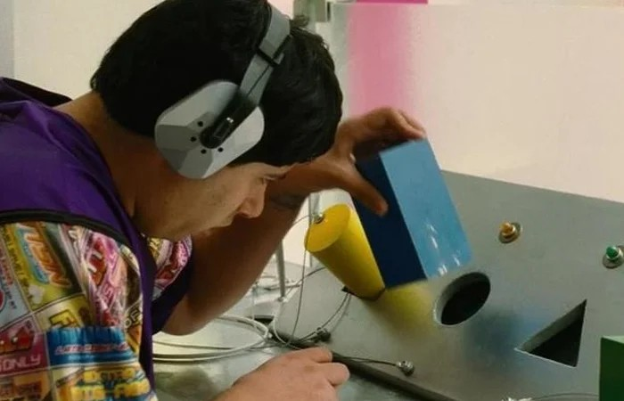
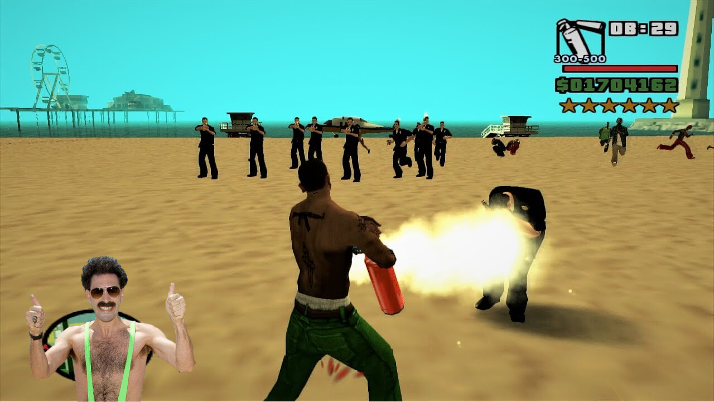
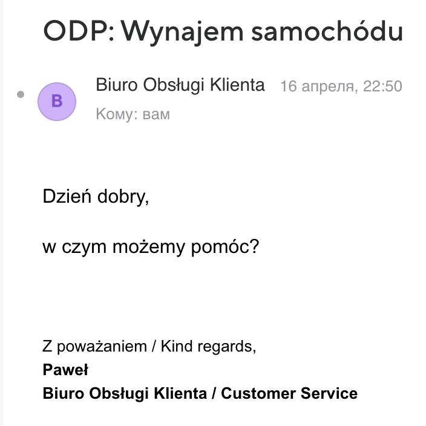

# Mobile MVP - minimum viable Features

# Primary goals

Всем привет, меня зовут Илья. Я Андроид инженер со стажем 10 лет. За этот срок, я успел принять участие в проектах разного различного рода - фриланс, большой продукт, аутсорс и стартап. И сегодня я бы хотел поделиться мыслями любимого мной типа занятости - стартап и его MVP. Конкретнее, какими фичами должен обладать ваш MVP проект перед нажатием на кнопку Publish.

**[Minimum Viable Product](https://en.wikipedia.org/wiki/Minimum_viable_product)** - говоря простым языком, это продукт, который готов к выходу на рынок с минимальной функциональностью чтобы достичь определенных целей. Это может быть и маркетинг, и привлечение новых клиентов, и обкатывание собственных [PoC](https://en.wikipedia.org/wiki/Proof_of_concept). Цели могут быть разными. Я опущу этот момент, потому что набор фичей, о которых пойдет речь дальше, закрывает 90 процентов потребностей всех целей и дает возможность на маневр. Это очень важно сделать в самом начале, чтобы не забуксовать в фазе активной разработки, дать возможность проверять свои гипотезы и не тормозить бизнес в зарабатывании денег.

Перед началом проекта, определитесь с его целью, аудиторией, платформами и какой конечный результат вы хотите видеть в идеале. Проведите [PoC](https://en.wikipedia.org/wiki/Proof_of_concept). Это очень важный вопрос, ведь идеальный код для бизнеса - его отсутствие. Писать код - всегда дорого. И в большинстве случаев решения проблем бизнеса, решаются не с помощью программ. 

Так же, я хочу опустить момент выбора языка, платформы, архитектур и прочего. Все мы бородатые и давно нашли ответ на этот вопрос, каждый сам для себя. Это слишком холиварная тема - что лучше kotlin или swift, когда есть flutter? Сегодня будем говорить только о фичах, какие и зачем они нужны. На каком языке они будут написаны, мне глубоко поебать. Мне важна ЦЕНА и ВРЕМЯ(на качество для MVP - закрываем глаза) . Погнали!

### Authorization

Как бы вы не любили это дело, это основа. Основа - сбор реальных пользователей системы, который должен быть со старта! Какой бы убогий ваш продукт не был, НО если вы имеете 100500 активных пользователей ежедневно, оттопыривайте ваши трусы, инвесторы сами набросают туда денег. 

Как результат, вы должны иметь возможность предоставить **цифрами** ваших [ActiveUsers](https://en.wikipedia.org/wiki/Active_users), из которых можно посчитать [ROI](https://en.wikipedia.org/wiki/Return_on_investment), чтобы стать привлекательным. 

Делать это можно разными путями - самописно или с помощью фреймворков. Для своих pet-projects, я нашел [FirebaseUI](https://github.com/firebase/firebaseui-web), который в пару кликов внедряет полноценную фичу авторизации и дает возможность предоставить такой результат. Что стоит помнить - email и phone auth супер минимальный набор который должен присутствовать везде. Это важно и для дальнейших рекламных рассылок, и для возможности вернуть пользователя в приложение. Дальше идет набор соц. сетей. Напомню, если вы пишете продукт для яблочной фабрики, и внедряете авторизацию через социальные сети, вы обязаны поддержать возможность входа в систему [через их проходную](https://developer.apple.com/app-store/review/guidelines/). 

Очень большое количество проверки гипотез и успешности идеи существует на [кикстартере](https://www.kickstarter.com/), где затравкой для потенциального клиента является подписка либо [лендос](https://en.wikipedia.org/wiki/Landing_page). После запуска и проверки своей идеи, вы получаете относительно вменяемые цифры того, кому ваша хуйня нужна(на лендосе добавлена только одна кнопка - прислать email, когда эта мега-идея заработает и тогда, возможно, я ее куплю).

### Feature toggle

Я уже писал ~~неудачную~~ статью про [feature toggle](https://medium.com/star-gazers/featuretoggle-recipe-for-android-dd27b2ee97f9). Коротко - это возможность вашего продукта форсировать(включать/выключать) какую-либо функциональную часть приложения. 

Таким образом, у вас на старте появляется возможность прикрытия некоторых дыр с помощью стабов. А когда какой-нибудь узел будет доступен, вы сможете его включить через BE. 

Вы сразу же можете запускать ваши гипотезы(A/B тесты).

И опять риал кейсы. В своем [pet-project](https://play.google.com/store/apps/details?id=by.bulba.ipsc.calculator) я внедрил рекламу от гугла и по неопытности работы с этим SDK словил бан, буквально через 2 недели. Бан получил потому, что со своего же аккаунта на продкашене кликнул 2 раза на рекламе. А у AdMob политика нетерпимости и мне закрыли возможность использнования монетизации на месяц. Слава богу моей паранойи и я успел внедрить feature toggles и второй framework рекламы. Как результат, я не сидел месяц без денег, а просто переключил рекламный таргетинг в продакшене через firebase remote control и ничего не делал. Время простоя - 5 минут, а не месяц или ближайшее обновление приложения.

### ForceUpdate

Вы находитесь в фазе супер-активной разработки на старте. Ваш client and backend идут в рассинхрон по скоростям, а хочется сделать продакшн уже сейчас и попросить всех старых пользователей обновиться на свежую версию чтобы начать заказывать новую шаурму. Мы обязаны поддерживать backward compatibility, потому что у нас есть горстка нищебродов, которые экономят интернет. Вы не можете выпустить новую версию приложения с гарантией того, что все пользователи будут дружны с вашем backend. 

Менеджмент выглядит следующим образом - вы выпустили минорный апдейт, вы просите пользователей раз в 2 недели обновиться на более свежую версию в виде лояльного попапа; серьезный апдейт - просите раз в день; supper-update - настаиваете на обновлении, потому что дальше с ним не будете иметь дела! Подробнее [здесь](https://ilyapavlovskii.github.io/ru/blog/forceupdate-feature/). 

### Crashlytics

Программистская тема - вы обязаны реагировать на все падения в приложении чтобы повысить возвращаемость пользователей ASAP. Никому не приятно видеть приложение, которое крешиться при инициировании какого-либо действия. В некоторых компаниях существует [ZeroBugPolicy](https://en.wikipedia.org/wiki/Zero_Defects). Чем меньше ты падаешь: тем больше пользователей у тебя останется + тем больше пользователей к тебе вернуться = тем больше денег ты заработаешь.

### Privacy policy, terms of conditions, about e.t.c

В день публикации, Google потребовал от меня web страницы с privacy policy. Естественно писать самому такие документы не комильфо. Открываем [ChatGPT](https://chat.openai.com/) и в бой. 

Итого, вместо ~4х часов составления документа через интеграцию в github pages для первого проекта, я потратил 45 минут с залитием через [notion.so](http://notion.so) и нажатием кнопки publish. 

Каждый раз, когда вы видите возможность безшовного пути использования cloud solution который вы можете мигрировать в будущем на ваше решение -  берите его и экономьте свое время. Если вам мешают политики безопасности или же внутренние сомнения - обсудите с тиммейтами. 

## В зависимости от целей или первый релиз

Как только MVP готов, мы можем жать на кнопку production чтобы собирать отзывы/крэши и хоть какую-то обратную связь от пользователей. В зависимости от первоначальных целей решаем что делать дальше. Вы даже можете не продавать основной продукт, а оставить там отметку - скоро в продаже. 

### Push notifications

И вернуть этих новых пользователей, которые не кликнули на кнопку покупки помогут [пуши](https://firebase.google.com/docs/cloud-messaging). Это пограничная фича между MVP и production. Каждому по потребности. С её помощью вы сможете привлечь внимание пользователя, который давно не заходил в него на телефоне. Важно иметь возможность послать их удаленно через ваш BE. 
Также, можно настроить показ уведомлений по календарю, это уже сугубо клиентская тема. Но не переусердствуйте, вспомните, сколько каналов в телеграм у вас стоят на вечном mute? Дабы не получить подобной истории со своим источником возвращения в приложение - держите себя в руках.

### Реклама

Я уже упоминал выше пример с рекламой. Это тоже один из важных пунктов для получения дохода. 

Если вы рассчитываете на то, что реклама будет одним из ваших основных источников дохода, подключите как минимум два провайдера. После этого, вы будете иметь возможность экстренного переключателя. Сможете проверить конверсию и выбрать подходящего вам поставщика. Альтернативы: Facebook, [Start.io](https://portal.start.io/#/signup?referredby=5960fd6a-33d4-d1ed-79a1-51998a7c78ad&preferredsite=pub&source=directURL), [Appodeal](https://appodeal.com/), [AppLovin](https://www.applovin.com/) e.t.c

P.S ни один из сервисов не поддерживает [jetpack compose](https://developer.android.com/jetpack/compose?gclid=CjwKCAjwxr2iBhBJEiwAdXECwz2eLNQyRs67nk3B-UtDnarBgpbNXc0qYx799kNQrt938if070rRXhoC6wMQAvD_BwE&gclsrc=aw.ds). Нужно писать обертку. С некоторыми SDK. Чтобы написать обертку, пришлось повозиться.

Удалить в релизе, оставить как заметка для другой статьи

- AdMob - ваш золотой ключик. В первую очередь его, а остальное по усмотрению.
- Fecebook - отложил на потом, по причине времени интеграции и желательной интеграции facebook auth, analytics. API умеренно вменяема, но помня работы с FacebookSDK - это адище. Каждый год новый мир. Исходя из мыслей выше, оставил на следующую итерацию, тк затрагивает 2-3 смежных фичи в спарке - но очень полезна в Европе и штатах.
- - дерзкая замена admob, не так популярна как головной офис. В целом, полет от API положительный. Интеграция API безшовная и без проблем. Не нашел возможность организации компаний. По деньгам капает чуть меньше чем в admob, но тоже хорошо. Чуть более релевантные цифры через год и аудиторию.
- - серебрянная пуля, но…в отечественном производителе я крайне разочарован. Разочарован в том, что пробуя их SDK я нашел некоторое количество багов и под некоторые технические критерии меня не устроили. Хотя, это может оказаться вашим выбором, так как агрегирует рекламные SDK под капотом и может помочь вам с монетизацией в разных регионах.
- размер - вроде не самое главное, но внедрив в свой апп, который по началу весил 5 мб я получил 20 для bundle сборки.
- нет поддержки [jetifier](https://developer.android.com/tools/jetifier). Хочешь укукоженную версию библиотеки - перепакуй сам, положи в свой artifactory, и будь доволен. Не хочешь - трать по N времени на своем CI/CD. 
- специфичная документация. Не смог найти на сайте latest revision, пришлось лезть в [artifactory](https://artifactory.appodeal.com/appodeal/com/appodeal/ads/sdk/), где нашел staging версию. Нету возможности ленивой встройки в ваше приложение: хотите подключить какого-то поставщика рекламы - обязаны делать сразу. 
Внедрить быстро и дешево мне не удалось. Возможно когда-нибудь еще вернусь.

### Billing

Запускаете продукт и хотите получать прибыль с продаж - запускайте биллинг. Закладывайте в ваш MVP продажу даже минимального ПРЕМИУМ или еще чего-нибудь там в будущем, чтобы начать собирать маржу уже сейчас. 

В этом пункте без подробностей по доступным сервисам. Это точно отдельная статья. Их очень много и зависит от ответа на вопросы:
- в каком регионе вы распространяетесь?
- какая валюта?
- подойдет ли inAppPurchases?
- модель продаж - подписка, донат, разовая покупка?
- фиат/крипта или обои два за раз? и так далее…

[Правила Успеха. Прибыль не нужна.](https://youtu.be/f1h76GSQtKg)

### Invite user

Если вам нужно максимально быстро захватить охват пользователей - сделайте бенефитовую компанию на старте, чтобы каждый активированный пользователь мог бы пригласить своего друга за вознаграждение. Какое вознаграждение - A/B тест вам в помощь!) 

Что делает эта фича - дает возможность войти в вашу систему по реферальной ссылке с небольшими удобствами в виде премиум акаунта на определенный срок(или кристалики). По цене продажи одного кристалика за одного пользователя. [Учитывайте это при расчете цены за привлеченного юзера](https://en.wikipedia.org/wiki/Customer_acquisition_cost).

### Analytics

И в тот самый момент, когда вы уже готовы были бы нажать на кнопку create first release - STOP! Не делайте этого без внедрения аналитики. Да, можете попасть прямо в сердечко пользователю, но зачем? Обязательно обмажьте все места флоу до кнопки купить. Так вы сможете понять, где и почему пользователь обрывается и попробовать выстроить новый флоу. Или же его сократить. 

И снова real story. В одной компании проводили гипотезу - как пользователю удобно вводить данные кредитной карты и проверки покупки, в один экран или два? Результат теста показал просадку в один мильон денег в месяц в пользу первого варианта. 

Дальше вызываем маркетолога, аналитика и астролога, которые проанализируют наши показания. Скорректируют прогноз и отдадут продукт менеджера на проработку, для улучшения этого места. Если Вы можете все это делать один - кланяюсь вам.

### Rate us

Суть фичи в том, чтобы побудить пользователя оставлять позитивный отзыв в маркете, а негативный направить во внутренний саппорт.

Рецепт прост - после каждого обновления, показываем пользователю на старте ненавязчивый попап с вопросом - оцени нас, брат. И в качестве оценок 5 звёздочек. 4 или 5 - идём в магазин. 1-3 - оставить отзыв во внутренний саппорт. Фича только гуевая, при наличии механизма поддержки.

### Поддержка

Обратная связь с пользователем. Пограничная ситуация фичи, в зависимости от типа вашего бизнеса. Критерий для ее введения простой - определитесь со временем реакции пользователя на критическое замечание и вашей ролью на рынке. 

Если Вы только впихуиваетесь на конкурентный рынок, вам нужно закрепить за собой репутацию, оставить позитивный опыт обслуживания и переманить часть клиентов - кажется вам нужно делать окно 24/7 со специально обученным чат ботом, на крайний случай, человеком.
Если вы монополист и аналогов нет - подождут)
На рынке Польши я встретил такую ситуацию в каршеринге. Здесь есть один монополист, который решил выпустить обновление. Это хорошо… Сначала, я получил блок старого приложения и обязательный переход на новый bundle. Все нормально, бизнесу так дешевле. Потом у меня было 4 поездки и я ушел от них:

1. Я снял машину, прокатился в режиме ожидания. Написал в саппорт о проблеме и…

Перевод - “И чем мы можем помочь?”

1. Я 10 минут стоял ожидал появления в приложении кнопки FinishRent с параллельным обзвоном саппорта. В конце-концов дозвонился и успешно закончил поездку.
2. 30 минут ожидания окончания поездки с обзовном/обписом/перезагрузкой приложения…. В итоге на 11 раз перезагрузки появилась кнопка и я закончил ренту.

А плевать, пипл хавает, аналогов нет, а на дачу нужно ехать. Обзывайте как хотите сервис, а бизнес я понимаю, им так выгоднее.

## Что Вы НЕ должны делать

Подозреваю, что основная часть читателей это инженеры, то хотел бы затронуть вопрос проф. дефформации. Когда вы изо дня в день пишете код в команде, то привыкли к определенному своду правил, утилит и процессам. Мы же сегодня говорим о MVP, когда гарантии выживаемости никто не дал. Вы не уверены, что проект проживет больше чем полгода. Следовательно, логичный вопрос - а стоит ли тратить это драгоценное время к подстройке к привычной среде? Думаешь бизнес - перестань быть инженером. 

### Не подключайте синтаксических анализаторов

Здесь задавайтесь вопросами на старте: какое количество разработчиков у Вас на проекте? какая их квалификация? как повлияет отсутствие общей стилистики и введения общепринятых норм на поддержание кода через год? сложно ли будет это исправить через год? 
У линтеров, как правило, есть дополнительная метрика - [технический долг](https://detekt.dev/docs/rules/complexity#complexcondition). Ради интереса, возьмите коммит Вашего текущего проекта на стадии MVP, подставьте линтер, посчитайте “тех долг” и оцените затраты, которые могли бы быть переведены в другие русла.

### CI/CD setup

Если вы работаете в более чем 1 человека на проекте, к сожалению, вам потребуется потратить время на сетап CI/CD на старте, чтобы машина синхронизировала работоспособность кода и исключала анархию. Если же вы работаете 1 - не тратьте на это время.

### Autodistribution

Сколько времени займет нажатие команды собрать билд и перетянуть его в окошечко браузера для залития в стор? Если Ваш процесс подразумевает релизную стадию цикла, даже раз в неделю, то cо временной шкалой билда 5 минут, временем залития 5 минут, получаем ⇒ (5мин+5мин) * 52(недели в год) / 60 (минут в часе) = 8.6 часов. Сможете за это время настроить автодеплой меньше чем за один день - делайте? 

### Tests

Не забывайте проверять каждый релиз кандидат руками. Но вопрос, а стоит ли тратить время на написание юнит тестов или даже UI? Определитесь, есть ли критические узлы которые будут подвержены изменению. Уточните, какую часть кода вы захотите покрывать юнит тестами(презенторы, платформенные имплементации юз кейсов, утилиты и т.д.) Добавьте условный множитель к оценке разработки фичи на покрытие тестов, примерно x1.5 - это будет означать, что на написание функциональности, вы потратите 1/3 времени на написание юнит тестов.  И после ответа на эти вопросы принимайте решение - нужно вам или нет? Вы всегда сможете догнать покрытие в динамике, после запуска MVP. Вероятно, здесь более важный вопрос - насколько дороже тестовое покрытие в сравнении с ручным при рергесии? Готовы ли Вы пожертвовать этим, не сдвигая срок выпуска. Если качество стоит на первом месте - вы должны писать тесты со старта.

### UI прелести

Учитывайте тип приложения. Если Вы публикуетесь в категории развлечений, то, вероятно Вам стоит добавить анимации и красивое оформление. В противном случае, не тратьте время на создание анимированного сплеша.

## Заключение

Вышеперечисленный набор, встречается в 95% приложений. Если Вы занимаетесь потоковой разработкой приложений, то Вам стоит взять на вооружение этот сет и сделать его переиспользуемым. Написали фичу авторизации, завернули ее в бинарь и поставляем ко всем приложениям. Заранее подготовились к тому, что в перспективе UI может быть уникальным - бьем такой пакет на 2 части: presentation + domain. 

После старта, Вы уйдете на небольшую паузу, для сбора метрики, анализа поведения и баг фикса. Вот именно в этот момент, Вы и сможете интегрировать части, на которые я не рекомендую тратить время с самого начала. 
