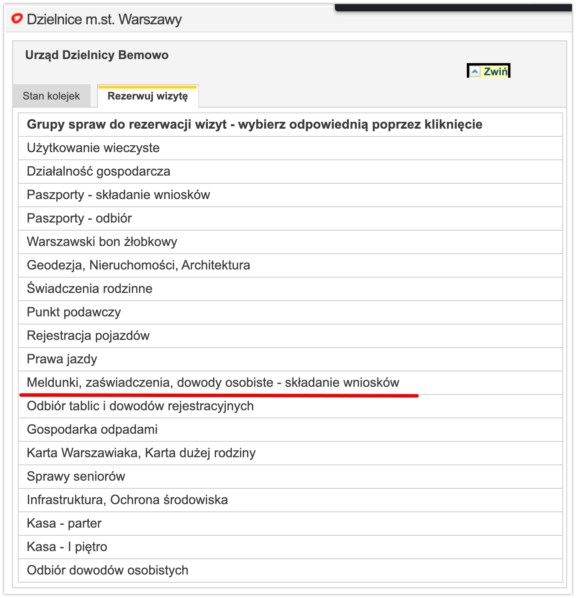
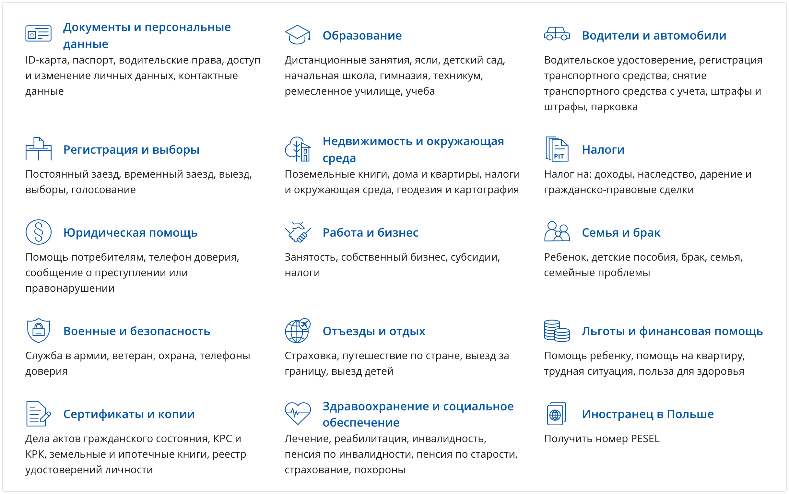
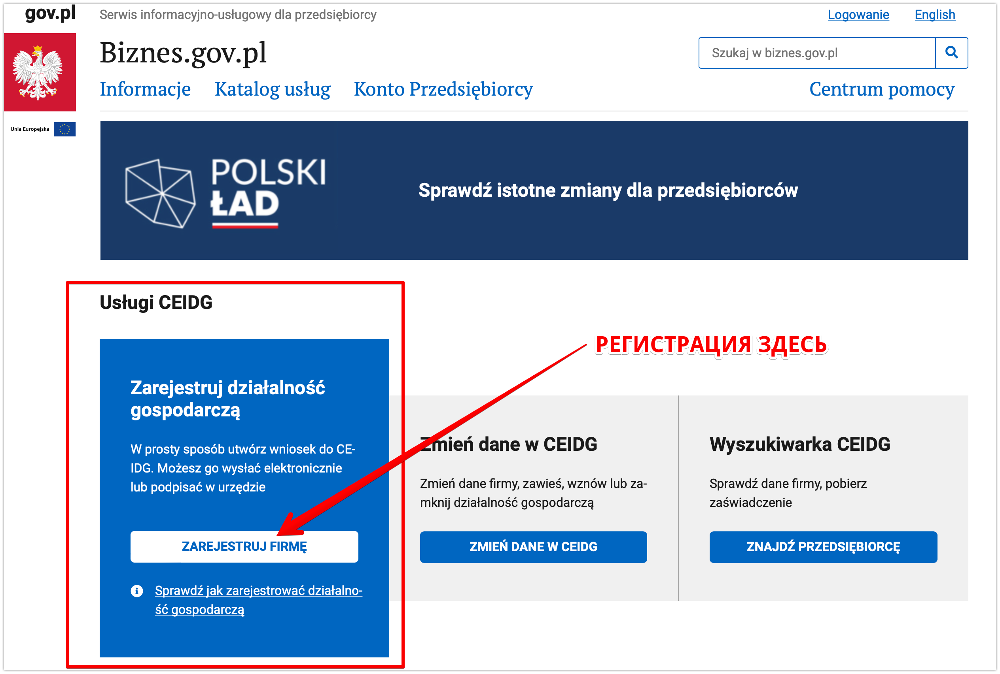
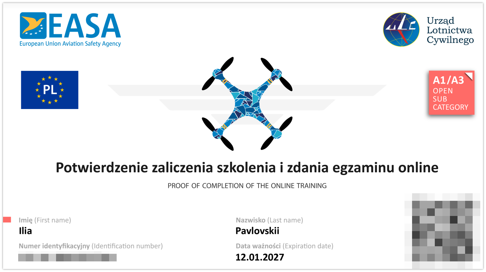

# Год в Польше по PBH

Всем привет, меня зовут Илья и я хочу поделиться своим опытом релокейта из Беларуси в Польшу.

С середины 2020 года Польша открыла возможность получения визы для сотрудников и предпринимателей в сфере IT по
специальной программе [PBH](https://www.gov.pl/web/poland-businessharbour-ru). В период европейского локдауна, это был
один из немногих прозрачных способов получения шенген
визы. Мне повезло и моя компания предложила релокацию для желающих этого сотрудников. Как итог, в декабре 2020 года я
начал путь в новой стране. В статье я постараюсь ответить на вопросы как для потенциальных релокантов, так и для тех,
кто уже начал свой путь в стране.

## Получение визы

Стоит понимать, что PBH виза относиться
к [категории D](https://www.vfsglobal.com/Poland/Russia/Moscow/long-term-visa.html).
Это не обычная туристическая виза. Она не обязывает вас к переезду, но в последующем продлении могут возникнуть вопросы.
Изначально, ни о каком последующем продлении PBH речи не
шло. Выглядело это как одноразовая акция. В середине 2021 это стало возможным, получение визы такого типа для жителей
стран СНГ(на старте получить визу могли только Белорусы, как говорилось на официально сайте, по факту было много
исключений). “Открыть” национальную визу нужно будет только через страну получения - т.е. первый въезд нужно сделать
через Польшу. В итоге, вы получаете право нахождения в стране 365 дней в году и право перемещаться через шенгенскую зону
в течение трех месяцев в каждом полугодии.

Для получения визы собираем [пакет документов](https://www.gov.pl/web/poland-businessharbour-ru/itspecialist):
паспорт, анкета, страховка на год, диплом(с IT специальностью) либо
подтверждение работы в сфере IT 1 год(копия трудовой книжки или заверенная копия трудовой) и рекомендация компании в
которой вы будете работать. Идем в визовый центр, отдаем документы, ждем 10 дней и получаем **бесплатную визу**,
оплатить нужно будет только сбор визового центра. ВАЖНО: уточняйте перечень необходимых документов на официальном сайте
либо по телефону, этот список может меняться. К примеру, не так давно, наличие компании в списке специальных предложений
носило рекомендательный характер, сейчас это стало обязательным условием. Ответы на многие вопросы, можно найти и в
[telegram канале PBH](https://t.me/PBH_BY2PLN).

Список каналов PBH разбитый по странам:
[Беларусь](https://t.me/PBH_BY2PLN), [Армения](https://t.me/PBH_AM2PLN), [Грузия](https://t.me/PBH_GE2PLN),
[Молдова](https://t.me/PBH_MD2PLN), [Россия](https://t.me/PBH_RU2PLN), [Украина](https://t.me/PBH_UA2PLN)

## Переезд

Как только виза была получена, пошли размышления - “Когда же переезжать?”. Совет - не тяните резину, все вопросы вы не
решите и со многим придется встретиться впервые. Будте к этому готовы. Ответьте на следующие вопросы:

- на какой срок вы поедете? (на срок действия визы; если совсем не получится, вернусь)
- это развлечение или полноценный переезд? (надеемся на полноценный переезд, готовимся к худшему. Год в Европе - тоже
  хороший опыт)
- сколько денег нужно? (этот вопрос индивидуальный. Я подготовил подушку из расчетов комфортной жизни на полгода не
  работая.)

Что нужно сделать перед отъездом:

- сделать генеральную доверенность на родственников. Этот документ даст право лицу представлять ваши интересы и получить
  нужную бумажку без вашего физического присутствия.
- сделать апостиль диплома и других документов(свидетельство о браке).
- сделать несколько банковских карточек в разных отделениях банка. Некоторые магазины могли спокойно отвергнуть карточку
  “Альфа-Банка” и принять карту “Приорбанка”, как и истории наоборот.
- взять все необходимые документы для дальнейшей легализации. Если не определились по какой схеме будете получать “karta
  pobytu” - берите все документы с собой.

В зависимости от эпидемиологической обстановки в стране, отели могут быть закрыты. Бронируем квартиру на Airbnb.
Определяемся с видом транспорта до конечного пункта. Изучаем правила пересечения границы как для страны из которой
выезжаем([ГПК Беларуси](https://gpk.gov.by/covid-19/), так
и [правила страны следования](https://www.gov.pl/web/coronavirus/travel).
В любой непонятной ситуации открываем gov.pl и ищем ответы там.

Основаниями для выезда из РБ по земле являются: работа, учеба либо вид на жительство. Выезд из страны возможен для
граждан Беларуси один раз в три месяца. Например, гражданин 1 августа выехал на учебу, а 2 августа вернулся в Беларусь (
следующий раз на учебу - только через три месяца после 1 августа). 3 августа этот же гражданин может выехать на работу (
следующий раз на работу - только через 3 месяца после 3 августа). Документы подтверждающие работу либо учебу, должны
быть переведены на русский или белорусский языки и заверены нотариусом в случае, если оригинал документа не имеет
перевода на указанные языки. Например, если вы имеете оригинал контракта на русском/белорусском и польском языке -
ничего делать не надо. Если вы имеет контракт на НЕ русском/белорусском и/или польском языках - нужно сделать
нотариальный перевод. Правда, нотариус может потребовать наличия печати на документе оригинала, а учитывая факт того,
что в Польше печать не обязательна в организации, тут могут быть проблемы при планировании возврата землей. Вид на
жительство переводить не нужно. Так же, можно оформить командировку, подробности этого случая не могу рассказать, знаю,
что этот вариант рабочий. В любой непонятной ситуации звоните на горячую линию ГПК, там сидят очень вежливые ребята,
которые разжуют любую ситуацию. Если нет времени и желания со всем этим возиться - самолет трансфером через
Россию/Турцию и пр. - ваш выбор.

Если у вас нету вакцины одобренной ВОЗ, скорее всего вам придется сидеть карантин. Для этого, на границе у вас попросят
номер телефона по которому вам будет необходимо
зарегестрироваться [в приложении](https://play.google.com/store/apps/details?id=pl.nask.droid.kwarantannadomowa&hl=en&gl=US)
и раз в день выполнять селфи. Штраф за нарушение
карантина [может достигать до 30000 zl](https://bip.brpo.gov.pl/pl/content/koronawirus-kara-administracyjna-sanepid-mandat-policja-faq-od.,-23)
. Вас может навестить полиция и проверить соблюдение мер
самоизоляции. Карантин начинается на следующие сутки после пересечения границы Польши.
Если вы прибыли в страну в 23:00, у вас есть целый час, чтобы съездить в магазин.

Если вы не хотите первые 7-14 дней сидеть дома:

- можете сделать справку о том, что вы болели COVID с переводом на польский/английский язык и предоставить ее
  таможенному
  лицу при пересечении границы.
- пройти курс вакцинации препаратом одобренным ВОЗ с получением [QR кода](https://www.gov.pl/web/certificate)
- можете сократить курс изоляции сдав ПЦР тест через N дней карантина

Итого, наличие визы разрешающей вам въезд в страну не является достаточным набором документов для пересечения границы. В
конце 2020 для поездки в Польшу мне потребовалось получить результат ПЦР теста за 48 часов до пересечения границы, сесть
на самолет и прилететь в Варшаву из Минска. Начальный план на декабрь 2021 съездить на Новый год на Родину, с возвратом
автобусом 1го января без сдачи всяких тестов, был разрушен 15го декабря с введением обязательного теста(можно было и
антиген) результат которого не должен был превышать 24 часа. А сдать 1го января даже антиген по предварительной записи
было крайне сложно. ПЦР по времени никак не успевал состыковать с автобусом. По-этому и пришлось брать трансферный
вариант со сдачей 2х тестов в аэропорту - один для полета в Москву, второй для приезда в Варшаву. Тест из приложения
[“Путешествуем без COVID”](https://play.google.com/store/apps/details?id=com.nocovid19.su&hl=en&gl=US) не имеет перевода
на польский или английский, по-этому не может являться документом для
пересечения Польской границы. Ох, сколько таких негодовавших людей было в аэропорту, которых разворачивали. Благо, можно
было сдать тест по прилете в самом терминале. А тем кто поехал землей без теста - очень сильно не повезло. Изучайте
правила заранее, чтобы не попасть в неприятную ситуацию.

## Первые шаги в стране

После благополучного пересечения границы, начинаем решать вопросы первой необходимости: мобильная связь, PESEL, счет в
банке, аренда жилья, регистрация, гос. услуги, язык, открытие ИП или оформление BlueCard.

### Мобильная связь

Здесь есть [4 мобильных оператора](https://en.wikipedia.org/wiki/List_of_mobile_network_operators_of_Europe#Poland),
выбирайте удобный для вас. Я взял самый попсовый [Orange](https://flexapp.pl/qFUx1B2DrGsaW4NaA),
качеством сети и интернет покрытием доволен. Особенно радуют тарифы роуминга. Не переживайте, если не успели зайти в
торговый центр и купить себе физическую сим карту. В Польше есть возможность использования eSIM(главное, чтобы ваш
телефон поддерживал эту функцию).
Скачиваем мобильное приложение [по ссылке](https://flexapp.pl/qFUx1B2DrGsaW4NaA), проходим регистрацию, отсылаем фото
паспорта, ждем 10 минут и устанавливаем
высланную через приложение eSIM карту на телефон. И все это сидя на диване!

### PESEL

[PESEL](https://www.gov.pl/web/gov/czym-jest-numer-pesel) - это числовой символ из одиннадцати цифр, который
идентифицирует физическое лицо. Он включает дату рождения,
серийный номер, обозначение пола и контрольную цифру. Аналога PESEL в Беларуси нет. Мне было сложно понять, что это
такое и с чем его едят. PESEL - это идентификационный номер человека который сопоставляет вас в гос. системе учета. Он
необходим для открытия счета в банке, походе в больницу, устройстве на работу, получении сертификата вакцинации,
регистрации в каршеринге и, даже, для покупки абонемента в спорт зал(не везде, но надо).

Это первый документ, для получения которого нужно идти ножками в местный гор.
исполком([urząd - ужонд](https://pl.wikipedia.org/wiki/Urz%C4%85d).
И это первое место, где вам придется разговаривать на польском. Для получения PESEL нужно какое-нибудь основание:

- прописка. Для этого потребуется арендовать жилье на длительный срок и на основании прописки сделать себе номер PESEL.
  Но
  чтобы сделать регистрацию, тоже нужен PESEL, по-этому при наличии контракта аренды жилья, эти 2 документа делают
  одновременно.
- profil zaufany - он же профиль гос. услуг. В 2021 году появилось еще одно основание для получения номера PESEL -
  регистрация на портале гос. услуг. Для этого потребуется выучить одну фразу на польском - Dzień dobry. Potrzebuję
  PESEL
  do profilu Zaufana.

Ищем свободные места для подачи в вашем районе, для Варшавы шагаем на
этот [сайт](https://rezerwacje.um.warszawa.pl/#biura_anchor)
выбираем дельницу(район) и ваш ужондгорисполком(можно выбрать любой):

  

Регистрируем визит и идем за первым документом.

Вы спокойно можете нагуглить агента, который может за вас оформить эти бумаги. Правда цена вопроса возрастет ~150zl. Или
возьмите с собой друга, который уже знает польский и поможет вам оформить идентификационный номер.

### Счет в банке

Еще в конце декабря 2020 можно было зайти во многие отделения банка и открыть счет имея при себе всего-лишь паспорт. Но
с 1го января 2021 года, все банки Польши обязаны регистрировать новых клиентов у которых есть PESEL. Разные банки могут
требовать еще и дополнительные документы: например в Millenium меня попросили карту побыту либо рабочий контракт +
регистрация, в Santander только
PESEL. [Здесь](https://docs.google.com/spreadsheets/d/1kurqi18ONvt9xWohW6Xi62zmvWnlUHqu1cTeDyobbwI/edit?usp=sharing)
вы можете посмотреть на сравнительную таблицу банков и выбрать подходящий
для себя. Это второе задание, для выполнения которого потребуется пеший поход. Могу обрадовать, в большинстве банков
сотрудники свободно разговаривают по английски(либо там найдется специально обученный сотрудник). Карту каждого банка
можно привязать к ApplePay или GooglePay. Пластик сразу не ждите, он придет к вам в почтовый ящик.

Есть здесь такое понятие как BLIK. Он позволяет совершать транзакции без использования платежной карты, только с
6-значным кодом, который генерируется на телефоне, в мобильном приложении банка. Если вы не хотите светить свою карту в
местечковых онлайн склепах, просто выберите оплату BLIK-ом, введите шестизначный код из мобильного приложения -
сесурити. Также, можно привязать свой телефон к BLIK и вам можно будет перевести деньги через приложение по номеру
телефона.

Лично мне, не нравится ни один банк. Ни приложения, ни веб страницы. Уровень банковских сервисов в странах СНГ убежал
далеко вперед. По общему набору функциональности, все более или менее похожи. По-этому решил взять банк с русской
поддержкой.

Если лень куда-то ходить, просто заводите [Revolut](https://revolut.com/referral/ilia50jt4!JUL2-22-AR-H1) сидя на
диване. Вливайте виртуальную карту себе в телефон(
GooglePay/ApplePay) или закажите пластик. Правда пополнить счет можно через Apple/Google pay, картой европейского банка
или SWIFT переводом. Так что карта Польского банка вам пригодится. Для ежедневного использования, я предпочитаю Revolut,
так как их сервис на несколько голов выше любого из местных банков.

Пополнить карту вы можете способами который предоставляет ваш банк из Беларуси либо SWIFT переводом, если он доступен. В
Польше не требуется подтверждения о происхождении денег при внесении денег наличными, если сумма не превышает 200 000 zl
по курсу(~50 000$).

### Аренда жилья

Обычно квартиры сдаются на долгий срок, минимально на год. Здесь очень популярны услуги агентов, так что готовьтесь, что
большая часть объявлений будет от самих агентов. Очень радует то, что в каждом районе Варшавы можно найти квартиру
подходящую под ваши требования. После Минска, где абсолютом комфорта есть замкадовская Новая боровая...здесь таких
каждом районе хватает.

Где искать? [Olx](https://www.olx.pl/nieruchomosci/),
[Otodom](https://www.otodom.pl/pl/oferty/wynajem/mieszkanie/cala-polska?fromNoEstate=true),
[Gumtree](https://www.gumtree.pl/s-mieszkania-i-domy-do-wynajecia/warszawa/v1c9008l3200008p1).

Платежи. Стоимость аренды жилья не равно финальной месячной стоимости.

**Кауция** - это залог за последний месяц аренды жилья. Служит страховкой для арендодателя, в случае, если вы сильно
навредите его собственности. Кауция может составлять от одной месячной ренты до трех, тут как Пан захочет.

**Чынж** - коммуналка. Только это не совсем обычная коммуналка. Дело в том, что земля здесь частная и каждый владелец
вправе
сам выстраивать свою инфраструктуру. Здесь и рождается рыночная конкуренция. Вы можете жить на одной улице, только у
соседа через дорогу в доме будет сидеть консьерж, а у вас нет. Но и чынж у соседа больше, чем у вас. Как правило в эту
стоимость входит: вывоз мусора, отопление, уборка подъезда, оплата электричества на площадке, лифт и так далее. Может
входить определённая квота использования воды и электричества, превышение которой, будет входить в стоимость медиа.

**Медиа** - коммуналка по счётчикам. Это электроэнергия и вода.

**Вознаграждение агенту** - плата за услуги агента. Варьируется от половины месячной стоимости ренты жилья, до 2х. В
среднем
по больнице, месячная стоимость - это норма.

**Паркинг** - оплачивается отдельно, хозяева не дадут этому делу простаиваться.

**Интернет** - проводиться и оплачивается арендатором отдельно, так как все будет оформлено на его счет. Стоимость в
месяц
50-100zl.

  

Расчет стоимости для заселения на примере случайной двухкомнатной квартиры на otodom:

- Платеж для заселения: первый месяц + кауцыя + агентские(возьмем среднюю за 1 месяц) = 2200zl + 2500zl + 2200zl =
  6900zl
  = ~1725$
- Ежемесячная стоимость: месячная стоимость + чынж + медия(будем считать как половина от стоимости медиа)+ интернет =
  2200zl + 300zl + 150zl + 75zl = 2725zl = ~682$

Стоимость увеличена в разы. После Беларуси очень неприятно видеть такой чек ежемесячно. Зато, вы защищены контрактом
аренды. Хозяин не сможет прийти(да и вообще без вашего ведома не имеет права зайти в квартиру) и сказать, чтобы вы
съезжали через 2 недели, потому что ему так захотелось, здесь с этим все строго.

Выбор квартир очень большой. Заранее составьте список важных вещей: зелёная зона, закрытая территория, посудомойка,
метро. Найти квартиру с изолированной кухней, будет не просто.

Если вам не нужна регистрация и вы не планируете жить в одном месте, то поиск квартиры на долгий срок может и не
пригодится.

### Регистрация

Следующий важный документ - meldunek(мельдунек - регистрация). Польское законодательство обязывает регистрироваться всех
иностранных граждан в определенный срок. Однако, если вы этого не сделаете ничего вам за это не будет. Здесь вопрос
другой - где вам обязательно пригодится регистрация? На сегодняшний день ответ такой - регистрация является обязательным
документом для того, чтобы сменить водительское удостоверение. В остальных случаях, контракта на жилье будет достаточно.

Процесс получений мельдунка точно такой же как и PESEL
- [заходим на портал](https://rezerwacje.um.warszawa.pl/#biura_anchor),
регистрируем себе визит(либо идем без регистрации визита),
на входе берем бланк, заполняем, в окошко, оплачиваем, приносим квитанцию - мельдунек готов.

  

Для лиц не имеющих статус ПМЖ, мельдунек выдается только временный на максимальный допустимый срок пребывания в стране
или контракту. Т.е. если ваш контракт до декабря, а виза истекает в сентябре, то и регистрацию вы получите только до
сентября. Хотя на официальном сайте и говориться, что продление мельдунка возможна онлайн, для обладателей паспорта не
из Евросоюза эта лавочка прикрыта.

### Портал гос услуг

Для того чтобы попасть на портал гос услуг, вам нужно обзавестись электронной цифровой подписью которая позволит
подтвердить вашу личность. Здесь есть 2 варианта чтобы такую подпись получить:

- [profile zaufany](https://pz.gov.pl/pz/register) - заходим на портал и регистрируемся. После регистрации, нужно будет
  выбрать место в котором ваша
  личность будет подтверждена. Место подтверждения личности может быть как и почта, так и ужонд. Берем паспорт, топаем в
  точку и получаем подтверждение.

- банк. Если вы уже завели счет в банке, то вход в profil zaufany можно осуществить через аккаунт банка. Сидим на диване
  и
  снова ничего не делаем.

Открываем сервис гос. услуг и радуемся. Внизу краткий спойлер того, что там можно делать:

  

## Легализация

Если вы уже наконец определились что хотите остаться в стране на длительный период, то стоит позаботиться о вопросе
легальности дальнейшего пребывания - получения вида на жительство.

[Karta pobytu(карта побыту)](https://www.gov.pl/web/uw-mazowiecki/wymiana-wydanie-rus) - вид на жительство. Делиться на
2 вида - czasowy(временное) и staly(постоянный). Отличается
сроком пребывания и дальнейшими плюшками. С ПМЖ у вас те же права что и у гражданина Польши, кроме права голосования.
ПМЖ выдается на более длительный срок 5-10 лет, временный до 3х лет.

Кто может ходатайствовать:

- вы находитесь в Польше и хотите продолжить свое пребывание и получить карту пребывания в связи с работой, бизнесом,
  учебой или другими обстоятельствами
- вы хотите получить разрешение на пребывание для члена семьи или разрешение на постоянное пребывание долгосрочного
  резидента ЕС
- вы имеете карту поляка

Есть учеба/работа/бизнес и хочу здесь жить - велкам. Разберем случаи по-отдельности чтобы не было путаницы.

### Карта поляка

Это самый быстрый вариант получения Польского ПМЖ. Если у вас
есть [карта поляка](https://www.migrant.info.pl/karta-poljaka-1686.html)
(документ подтверждающий принадлежность иностранца к польскому народу) вы имеете право податься на karta stalego pobytu
и получить ее в максимально сжатый срок.
Если карты поляка у вас нет, но есть документы доказывающие принадлежность к польскому народу - проходите процесс
доказательства, сдаете собеседование на польском на уровне не ниже B1 и подаете документы на ПМЖ.

Срок полной легализации(ПМЖ) ~1год.

### Работа

Если вы нашли работу в Польше и ваш работодатель исправно платит налоги, ZUS(страховые отчисления) - вы тоже имеет право
подать документы на получение карты пребывания. Ингредиенты:

- ксерокопии всех страниц паспорта на которых есть печати/визы/штампы
- анкета с данными для заявки на ВНЖ
- трудовой договор
- справка из налоговой
- зарплата не меньше минимальной ~4000zl

Подать можете сами или через агенство. Первый раз советую [через агентов](https://justay.pl/en/) - они всегда в курсе
последних изменений
законодательства, посоветуют лучший вариант для вас и расскажут про нюансы. Вам не придется следить за статусом вашей
карты, доносить упущенные или дополнительные бумаги. Плюс, работник ужонда будет видеть, что человек прошел через
компанию которая его проверила в целях своей репутации(количество отказов для агентов - самый важный показатель).

Как было сказано выше, вы имеете право на подачу документов для воссоединения с семьей. Как это трактуется - если
супруга получила ВНЖ, муж, имеет право подать заявку для воссоединения с возлюбленной(и наоборот). Как это работает на
практике - бумаги подаются одновременно. В случае, если супруг не указан в ZUS под жену, нужна польская страховка на
сумме не менее 30 000 евро в год.

Сроки легализации:

- получение временного вида на жительство 2месяца -1.5года, в зависимости от местности
- право ходатайства на ПМЖ - 4 года

### Blue card

[Blue card](https://www.apply.eu/?gclid=Cj0KCQiA9OiPBhCOARIsAI0y71Bp_-Nii1bG2neEQATS3ZReTxOvKgQLF65dxcNdo8Pc8R-FQ-qhRsYaArVLEALw_wcB)
- это разрешение на работу и пребывание для иностранцев не из стран европейского союза. Выдается
высококвалифицированным специалистам с востребованными на рынке профессиями.

Кто может получить:

- высококвалифицированный специалист - диплом о высшем образовании по специальности или подтверждение стажа работы не
  менее чем 3х лет.
- высокооплачиваемый специалист - ваша зарплата брутто в месяц должна быть не меньше средней Польской умноженной на
  1.5 (
  5.779zl * 1.5 = 8669zl = ~2167$)
- ваша специальность должна быть в списке редких

Что для этого требуется:

- список документов как и по подаче на оснавании работы
- переведенный и апостилизированный диплом либо переведенная и заверенная нотариусом трудовая где указан стаж работы по
  специальности не менее 3х лет(хотя год назад требования BlueCard были 5 лет)
- декларация о количестве лиц на иждивении(муж/жена и дети)

Отличия от “обычной” karta pobytu(
тянет [на отдельную статью](https://medium.com/@visaPoland/%D1%81%D1%80%D0%B0%D0%B2%D0%BD%D0%B5%D0%BD%D0%B8%D0%B5-%D0%BA%D0%B0%D1%80%D1%82%D1%8B-%D0%BF%D0%BE%D0%B1%D1%8B%D1%82%D1%83-%D0%B8-blue-card-19e9f4a87372):

- Это тот же вид на жительство. После 2х лет проживания на территории страны в которой она была выдана, вы можете
  пролонгировать ее на территории другой страны европейского союза. Грубо говоря: вы прожили 2 года в Польше, нашли
  работу
  в Германии, провели там 3 года, суммарно 2+3=5 лет в ЕС - можете претендовать на ПМЖ последней страны - постоянный
  резидент ЕС (это очень грубо, но суть именно такая)
- Физическое отличие. Это все та же карта побыту, только с отметкой на обратной стороне - niebeska karta UE.
- не нужно замены карты при смене места жительства в пределах гмины. Те если вы получили карту в Мазовецкой области,
  менять карту не нужно, достаточно уведомить ужонд о смене места жительства.
- не нужно менять карту при смене работодателя в пределах страны. Просто уведомляете ужонд о смене работодателя в
  течении
  15 дней.

### Бизнес

Еще одно основание для оформления вида на жительство - бизнес. Самое простое - открыть ИП. Кто имеет право:

- обладатели постоянного вида на жительство
- обладатели временного вида на жительство, выданного только на определенных основаниях: обучение, воссоединение с
  семьей,
  брак с гражданином Польши, гуманитарные цели. Работа исключена. Что логично - уход от налогообложения.
- обладатели визы PBH - наш варик)

Как открыть?

1. Заходим [на сайт](https://www.biznes.gov.pl/pl) через profil zaufany, проходим регистрацию. Советую оставить свой
   email и телефон для связи, если
   каких-то документов не будет хватать. Правда, это чревато тем, что вам начнет сыпаться спам, но ускорит процесс
   регистрации в случае отказа.

  

2. Идем в свой банк и открываем счет для ИП
3. Оформляемся в ZUS
4. Определяемся с типом налогообложения
5. Работаем

Детали ведения ИП в Польше тянут на отдельную статью. Я просто набросаю полезных ссылок:

- [изменения в связи с новым ладом](https://www.rp.pl/podatki/art19243771-prowadzacy-jednoosobowa-dzialalnosc-szacuja-ile-straca-na-polskim-ladzie)
- [телеграм канал для обладателей ИП по PBH визе](https://t.me/JDG_PBH)
- [survival kit PBHашника с гайдом по открытию ИП](https://gist.github.com/mguzelevich/cb6d869c6dc21e0d5549934b2c99cffd)
- [гайд по ведению ИП](https://sobolevbel.github.io/jdg/)
- [Различные tips/tricks по решению юридических проблем и легализации](https://mguzelevich.github.io/deus-lex/)

Плохие новости для тех, кто идет по программе получения вида на жительство по работе/blue card - на момент рассмотрения
заявки в ужонде, вы не имеете права иметь ИП(даже приостановленное). Если срок вашей визы позволяет открыть ИП после
получение положительного результата - заводите и приостанавливайте. Но это все на ваш страх и риск, любые движения по
счетам при наличии рабочего контракта могут трактоваться как уход от налогообложения - все на ваш страх и риск.

Хорошие новости - при ведении бизнеса, часть расходов можно пустить через ИП минуя уплату VAT, а это 23%. Но
ознакомьтесь с изменениями по новому ладу, не все так просто.

И снова же, все сидя на диване, никуда ходить не нужно. Как открытие, так и закрытие.

### Нюансы

Сейчас есть затруднения в некоторых регионах Польши с записью на подачу документов в ужонд и сроком рассмотрения. В
Варшаве ближайшая запись была доступна за 2 недели, в Гданьске за полгода. И точно так же с выдачей документа о принятии
децизии и пластиковой карты. После получения уведомления о положительном рассмотрении вашей заявки до выдачи пластика
может пройти несколько месяцев. В случае отрицательного результата рассмотрения заявки, не переживайте, у вас есть время
на подачу апелляции.

Право на пребывание и путешествие. Как было сказано выше, заявки могут рассматриваться очень долгое время. Ваш документ
на право легального пребывания может протухнуть. Не переживайте, как только вы сдали бумаги для получения вида на
жительство, в ваш паспорт поставят печать - что ваш документ на рассмотрении и вы имеете право пребывать в стране
легально. Это означает, что если ваша виза истекает раньше чем предполагаемая дата выдачи постановления - вы спокойно
можете находится в стране. Однако, это не дает вам право путешествовать по странам ЕС без надлежащего на то документа -
виза/karta pobytu. Чем это чревато - депортацией.

## Иностранные языки

Вопрос очень сильно зависит от локации которую вы выберете. Если это областной центр, то со знанием русского/английского
проблем(как минимум в сфере услуг) не будет. Помню случай, как вернулся из Беларуси в сентябре 2021 года, пошел
встретиться с коллегой и сразу же предложил попрактиковаться в Польском:

-Poproszę Panie piwk...

-Ребята, даже не старайтесь...

Вы без проблем сможете купить что-то в магазине, объясниться в банке, но... Меня Польша заставила решать вопрос с языком
с первых дней, когда супруга не была поставлена на карантинный учет в санэпидемстанции. Дальше началась карусель звонков
до: кварантанна домова → погранкоммитета → аэропорта → мед службы при аэропорте → санэпида с возвратом на погранкомитет.
Где каждый 2ой не разговаривал по английски/русски и пришлось объясняться по телефону на пальцах. Так стало ясно, что
учить Польский нужно. Дальше были посещения ужондов, где более старшее поколение, которое(в основной массе) знает
чуть-чуть лучше русский чем английский... Да и с полицией на дороге объяснится нужно.

Совсем не напрягаясь, за год с репетитором два раза в неделю у меня есть твердый А2. Этого уровня спокойно хватает для
решения бытовых и несложных юридических вопросов, общения с коллегами в коворкинге и общения в больнице.

Как учить язык - [репетитор/школа/курсы](https://t.me/BelarusPoland),
[тик-токи](https://www.tiktok.com/@dushavensetto/video/7006634657601031425?is_from_webapp=1&sender_device=pc&web_id6985137494796256774)
,
[мемасы](https://www.instagram.com/tygodniknie/), общение на работе и в жабке.

## Другие документы

Когда основные вопросы утрясены, можно
начинать [жить](https://www.youtube.com/watch?v=C5F2UEqD_NQ&ab_channel=HARDCOREWORLDWIDE))
Дальше разберем юридические вопросы рекомендательного характера, которые пригодятся многим.

### Замена водительского удостоверения

Если вы захотите поменять права в Германии - хочу вас
огорчить, [вам придется сдавать все заново](https://vas3k.ru/notes/got_a_loicense/).
У Немцов свой уникальный опыт. В Испании, похожая
беда, [придется сдавать заново](https://www.instagram.com/p/CY61BeWIG14/).
Если не поменяешь, спустя полгода, будь готов к штрафу в 6к евро(200 в прошлом году).
Обрадуйтесь!!! В Польше можно их обменять! А зачем? А надо!

Если вы прибываете в Польше больше 185 дней в году, вам необходимо заменить такое удостоверение на польское. Не нужно
этого делать, если права выданы членом ЕС.

Пока у вас нету карты побыту, отсчет старта этих 185 дней вопрос тонкий, юридически он нигде не прописан - от въезда в
страну, от получения визы, от выдачи карты побыть и пр. По факту, полицейские вам вряд ли смогут что-то предъявить. Но
страховая, в случае ДТП, легко может сослаться на этот пункт и отказать в выплате.

Здесь все на ваш страх и риск. Для себя я решил, что иметь права резидента ЕС - точно хорошая идея и задался целью
заменить их.

Я по натуре параноик. В предыдущих пунктах которые описывал, все союзы “ИЛИ” я читал как “И”. Первый раз когда решил
пренебречь этим - замена прав. Я взял неполный набор документов, отправился в ужонд, где был послан далеко и подальше с
полным список документов:

- [заполненное заявление на смену прав](https://warszawa19115.pl/documents/20184/360868/Wniosek+-+prawo+jazdy/831ee34e-6004-47f8-838c-7bb17d255855)
  (возьмите образец этого года на рецепции ужонда и заполните его на месте)
- переведенная и заверенная на польский язык копия водительского удостоверения
- гуглите присяжный перевод документов. Оправляете документы онлайн, оплачиваете, получаете результат почтой через 2-3
  дня. Это все я делал в такси по дороге на работу.
- вид на жительство/виза
- паспорт
- регистрация. Для того чтобы доказать, что вы действительно проживаете в Польше. Хотя, в моем случае, от меня
  потребовали документ, который
  доказывает, что я уже пробыл в Польше 185 дней(это была виза), а регистрация, была как подкрепляющий этот факт
  документ.

Хитрость какая. Вы не имеет права управлять транспортным средством с иностранными правами по истечении срока пребывания
в стране 185 дней. Но и обменять раньше 185 дней права вы не можете.

Процедура выглядит следующим образом - ужонд берет вашу пачку документов, отправляет в Беларусь запрос о валидности
водительского удостоверения, печатает документ европейского образца и вручает вам. Длительность процедуры 1-2 месяца в
среднем. Я отдал документы в декабре 2021, перед праздниками, мне сказали ждать до 4х месяцев(получил в день публикации
-
2 месяца). [С января 2022 года](https://t.me/BelarusPoland/1798), документ валидности прав должен делать их обладатель с
переводом на польский язык.
Стоимость услуги замены водительского ~100zl.

## Паспорт ПП

Определившись, что назад я точно в ближайшие несколько лет не вернусь, я решил сделать еще и дополнительный документ -
паспорт серии ПП. Это паспорт гражданина Республики Беларусь, с пометкой того, что он не проживает на территории
Республики Беларусь.

Плюсы:

- если вы военнообязанный, военкомат не имеет права вас призвать даже на сборы, так как вы проживаете в другом
  государстве.
- освобождение от платы налогов в Беларуси и отсутствие необходимости отчитываться перед налоговой(как-минимум про это
  много где пишут, как это работает - я не понимаю)
- возможность встать на консульский учет и все вопросы решать через посольство или консульство, не приезжая в Беларусь(
  запрос на смену водительского удостоверения)

Минусы:

- необходимость выписаться со своего места жительства в Беларуси. Чревато повышенным рейтом на коммунальные услуги. Не
  переживайте, если вы прописаны один в квартире и нигде не трудоустроены в стране, ожидайте через полгода признания
  тунеядцом и оплату по такому же рейту)
- невозможность вести индивидуальную предпринимательскую деятельность. “ООО” и прочее можно, ИП нельзя
- невозможно претендовать на выплату пенсий

Учитывая тот факт, что с января 2021 мне уже 2 раза звонил военкомат и на белорусскую пенсию не очень то рассчитываю, то
игра точно стоит свеч и я пошел делать паспорт. В интернетах прочитал кучу статьей о том как это “невозможно и сложно”.
В итоге - [собрал перечень документов и отдал их](https://forum.onliner.by/viewtopic.php?t=7277065).
“Проблем” было 2 - нужна была печать из места текущей работы(в тот момент я был трудоустроен и в Минск и в Варшаве,
поставил печать из Беларуси) и отчитаться перед налоговой(решалось по
телефону из Варшавы, долго, но решалось). ИП было закрыто еще в 2020. Отдал документы в августе, забирал в декабре. Из
обязательного пункта паспорта ПП - стать на консульский учет, сроки не ограничены.

Если в старом паспорте есть действующая виза(либо другая причина, по которой он вам нежн), вам его могут оставить. Вы
имеете право иметь 2 паспорта, 3ий вам точно не дадут, без отчетного документа уничтожения самого старого. Валидными
будет последний полученный.

### Прививка от COVID

С середины 2021 года в Польше есть бесплатная возможность получить прививку против COVID всем гражданам, находящимся на
территории Польши. Вам не нужно иметь PESEL, паспорта достаточно. Однако, для того, чтобы записаться на эту процедуру,
необходимо иметь profil zaufany, для регистрации к врачу. Предварительная запись была очень актуальна в период бума
первых доз, сейчас бума нет, можно придти в пункт щэпеня(szczepenia) и получить любимую прививку. Пройдя полный курс
вакцинации, вам открывается возможность путешествия по странам ЕС, как в былые времена.

Мне нравится Польша тем, что здесь нет архи-дурдома по волне вакцинации, как это было в Немеции или странах 
[прибалтики](https://vm.tiktok.com/ZM82PH5Kd/). Люди сами делают свой выбор и за год вакцинации, количество привитых доросло до уровня [~50%](https://www.google.com/search?q=covid+19+vaccinated+stats&rlz=1C5CHFA_enBY886BY886&ei=us_xYYr8KvKEwPAPhOSO-A8&ved=0ahUKEwiKwcr_v9D1AhVyAhAIHQSyA_8Q4dUDCA8&uact=5&oq=covid+19+vaccinated+stats&gs_lcp=Cgdnd3Mtd2l6EAMyBQgAEIAEOgcIABBHELADOgcIABCwAxBDOgQIABANOgYIABAHEB46BggAEA0QCjoICAAQBxAKEB46CAgAEAgQDRAeSgQIQRgASgQIRhgAULwfWMEzYJ41aAFwAngAgAHAAYgB_geSAQQxMC4xmAEAoAEByAEKwAEB&sclient=gws-wiz).
Конечно же, при свободе выбора есть лица несогласные. Но это и не полное отрицание болезни и не ужесточённые меры. От того и честные 50%.

Как выглядит процедура. [Регистрируемся](https://www.gov.pl/web/szczepimysie/szczepienie-przeciwko-covid-19)(или нет) → идем в назначенное место и время → заполняем бланк(в некоторых пунктах
дают даже на русском) → получаем дозу → идем отдыхать 15 минут под присмотром специально обученных людей → если это
последняя доза, в момент отдыха заходим в [приложение](https://play.google.com/store/apps/details?id=pl.gov.cez.mojeikp&gl=PL) и находим там свой сертификат о прохождении полного курса
вакцинации.

Качаем сертификат, печатаем, и кладем по-ближе к паспорту, т.к. там он рядом и пригодится. Правда, я не знаю, можно ли
скачать сертификат людям без PESEL и Profil Zaufany, в пунктах вакцинации никаких бумаг не предоставляют.

### Права на управление дроном

Владельцам воздушного судна внимание! Для того чтобы легально летать в ЕС на своем квадрокоптере - вам нужно сдать [на
права](https://habr.com/ru/company/wrike/blog/563492/). Не переживайте, это бесплатно и быстро.

А зачем это надо? С течением прогресса, в странах ЕС осознали, что таких устройств стало очень много. Есть и шумовое
загрязнение, так и помехи в радиоканалах, а летать везде, да и всем - не комильфо. Вот и было принято правило ~~[запретить
всем](https://www.youtube.com/watch?v=C5F2UEqD_NQ)~~ использование незарегестрированной техники для полетов.

Почему это здесь? Важно, при полете в зоне DRA-P **вам может сулить тюремный срок до 5 лет**. Не поленитесь, сдайте на права
и соблюдайте правила.

Процедура. Регистрируемся [на сайте](https://drony.ulc.gov.pl/) → ждем срок подтверждения статуса оператора(я ждал в январский праздники неделю) →
после подтверждения статуса оператора, открывается возможность сдать на права пилота. Проходим обучение → сдаем тест →
получаем права(~2-4 часа времени за 0zl).

  

## Другое полезное

Путешествия в период локдауна

Как и говорилось ранее, получив визу PBH вам открывается возможность путешествия в страны Европейского союза. В период
COVID локдауна, полеты возможны, но с ограничениями.

Первый опыт обзора открытого окна был начат с Испании. Возможность получить прививку не была доступна, по-этому в мае
2021 мы были подопытными кроликами на изведывание полетов в теплые края. Скажу сразу, было стремено, так как информации
не было никакой. Правила полетов менялись каждые 2 недели - то можно лететь, то нельзя. Так уже получилось, что вылет
был 4 мая, а 3 числа, была дата изменения правил. Благо, все прошло хорошо, ничего не изменилось - нужно было сдать
PCR/Antigen тест за 48 часов до прибытия и лететь. Особенно радует возможность воспользоваться lowcost авиалиниями.
Моментами доходит до абсурда, что 2 человека летят дешевле чем докупной чемодан или такси до аэропорта(основной лоукост
аэропорт находится за 40 километров от Варшавы и такси до него может обойтись в ~75$, а билет в 15$).

В период эпидемии, всегда читайте правила стран прибытия. Польша сильно расслабляет, так как здесь бытуют самые
либеральные условия локдауна во всей Европе - например, здесь нет никакого лимита на количество людей в ресторанах и
обязательного наличия COVID сертификата.

Последние разы я путешествовал с COVID сертификатом и в ЕС эта бумажка помогала преодолевать любой барьер.

Итого, если вам очень хочется скататься куда-нибудь отдохнуть и у вас нет COVID сертификата - не проблема. Прочитайте
правила въезда в страну, сдавайте PCR/Antigen, соблюдайте правила и wszystko będę w porządku!

## Итоги

Статья больше вышла громоздкой и больше похожа на гайд. Общие впечатления после года пребывания в Польше - мне здесь
нравится. Путь, однозначно, не простой, но интересный. Новые вызовы, доступные финансовые рынки на которых можно себе
что-либо позволить с долгосрочной перспективой и умеренной процентной ставкой. Есть уверенность в завтрашнем дне.

Выражаю огромную благодарность в подготовке материала: [wildman](https://habr.com/ru/users/wildman/)

