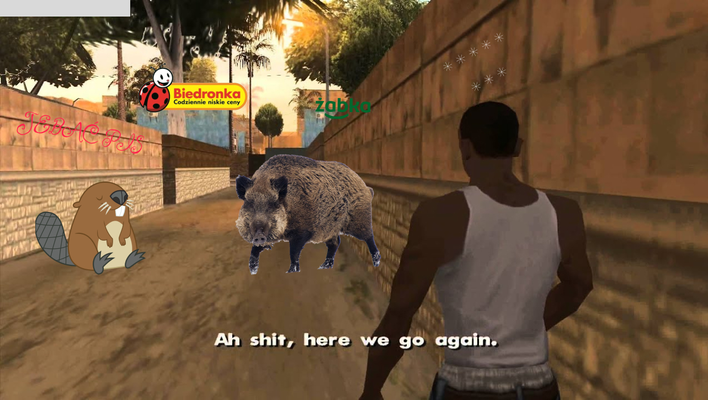
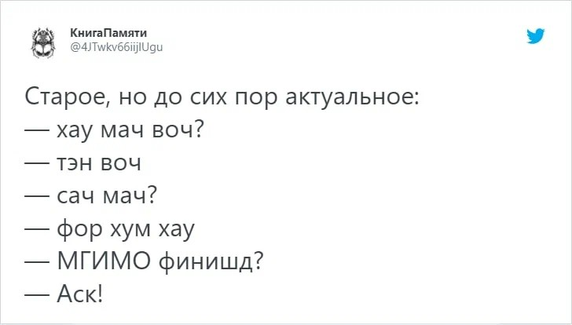
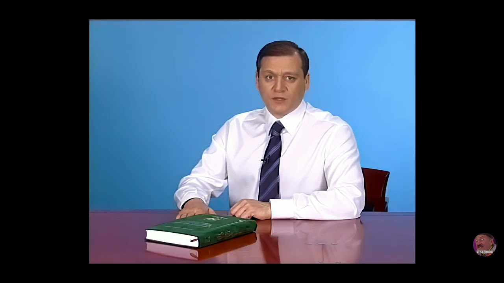

# Акклимадоптация по Польски!

Последнее время стал популярен маневр движения в сторону запада среди русскоязычного населения и в этой статье я бы
хотел задеть моменты **адаптации** в новой стране с максимальным бустом на основе своего опыта. Именно адаптации в
стране, а не жития в кругу своих друзей/коллег/родственников…Доп мотиватором для этой статьи, мне стали коллеги, которые
уже живут тут 2 года, в надежде вернуться домой, но… нет ничего более постоянного чем временное. (лично мне, больше
нравиться фраза - к любому временному, относись как к постоянному)
Дисклеймер - я не являюсь лингвистом и не преподаю. Все мои суждения - взгляд со стороны. Ко всем советам относитесь со
стороны и учитывайте свой бэкграунд.

# Введение

Я сильно завидую Вам, если вы переехали в страну, хотя бы с базовыми знаниями нативного языка. Я же начну рассказ с
себя - с нуля.

В декабре 2020 я переехал в Польшу. До переезда, у меня был уровень владения Д3 - Дзень добры, дзенькуе, довидзення… С
самого старта меня заставили учить язык - то был COVID, я должен был отсидеть карантин, на который, местная бюрократия,
меня не поставили. Звонки в органы сразу поставили в тупик - никто не говорит по аглицки - pzeprzszam, mowimy tylko po
Polsku… Тут я словил первый мотиватор.

### 1. Учить язык

Начните учить язык страны, в которую вы переехали. Я понимаю, что куча стран ЕС в которые Вы могли переехать знают
английский. Но это не есть ИХНИЙ родной язык. Окей, где-то это принято за “почтинациональный”, отъедте от столицы на
100км и попробуйте без него… Без национолизма, простой прагматизм; национальный язык - это доступ к мышлению, культуре и
пониманию коренных жителей. В 90% стран, вам не дадут ПМЖ без базовых знаний языка - учите сразу, оно вам Надо? Плюс,
то, что вы разговариваете на языке его носителя даёт вам плюсик в карму в плане отношения. Просто поставьте себя на
место носителя - Вам явно будет приятно услышать то, что человек заморочился и хоть как-то пытается разговаривать с Вами
по русски?
По английски - sh - Ш, по Польски будет - sz; ch - Ч, по Польски будет - cz → ****Szczuczynszczyna****!
[https://youtu.be/4zPhZWeli4U](https://youtu.be/4zPhZWeli4U)
Неправильно влетать в другой монастырь со своим кораном! По-этому, вы должны хоть на уровне туриста объясниться в любом
месте и попросить помощи начать разговаривать на понятном вам языке.

### 2. Как его учить?

Все индивидуально - от бюджета и целей.
а) Оффлайн сервисы - точно стоит начать с них. Вокобуляр - всегда стоит на первом месте любого языка. Вы сможете на
пальцах и словах пояснить что вам надо, без всякой грамматики - “Я! Где? Аптека!”. Тот кто хочет и может вас понять -
вас поймет, кто не хочет - да будь ты 100500 граммотей - он не поможет тебе.
б) Языковые группы - идите, для поднятия вокобуляра и стартовой грамматики. Вы погрузитесь в группу людей, которые
заинтересованы в изучении языка и начнете его практиковать. Проблема таких групп в том, что это балаган и все не
нейтивы.

У вас будет группа Иванов, которые будут рассказывать о том как вы работаете
[https://youtu.be/DXv0x6h3mO0](https://youtu.be/DXv0x6h3mO0)
в1) Репетитор - поделим их на 2 фазы - не нейтив и нейтив. Это самый эффективный подход - он индивидуален и вы не
тратите время на других людей. Проблема не нейтив лишь в том, что они могут по привычке пропустить момент того, что вы
сказали какое-то слово, которое знакомо им. Из-за этого, буст правильного нативного языка может быть затороможен.
С собой я замечал такое, что начинал разгоняться в языке и… мой репетитор начала меня поправлять - прости, я все поняла,
но ты разговариваешь на языке-рудименте который умер в 17 веке, давай по-новой…

в2) Я рад встретить своего репетитора, которая заставила меня говорить. Тактика очень простая - я нейтив, ни пердолю в
твоем языке - рассказывай так, чтобы я поняла. (хотя она знает мой родной, просто подыгрывает, может, где-то помочь).
Убираем за скобки что я Беларус, что мой вокобуляр очень схож с Польским, но!… 3 месяца буста - тру стори.
[https://www.tiktok.com/@pl_igorek/video/7186287754341256453?is_from_webapp=1&sender_device=pc](https://www.tiktok.com/@pl_igorek/video/7186287754341256453?is_from_webapp=1&sender_device=pc)

### 3. Ja wiem język - nu i chui?

Знаете/не знаете, тут вопрос простой - а могут ли вас местные понять?
Если ваша цель только сдать экзамен - не ко мне. А как вас поймут местные?
У меня была история - я чувствовал себя уверенно в языке и местному поляку, на фразу - “Как дела?”, ответил, на
сленге, - “Zajebiste!”(отлично)… и я не знал, что в Кракове этой фразы тупо нет! Оказывается, тут и регион важен….
Но, разница не столь большая, по наитию все поймете, но потом)
(ohhh…. obcekrajowiec jebany)

Учить язык не так уж страшно, как хотелось бы. Есть нюансы, но… нужна практика… А это следеющий этап.
Будьте аккуратны с использованием родного языка, поляки очень хорошо понимают и, иногда, разговаривают по русски. Но,
только когда слишком надо, либо слишком пьяны.

### 4. Учим историю

Привет “самой лучшей советсткой школе” образования, в которой не приучали к критическому мышлению и аналитики событий с
разных сторон. ТОЛЬКО ТАК, КАК ПО УЧЕБНИКУ!
Ходим по музеям, смотрим фильмы, читаем статьи(только в оригинале, переводы епрст как искажают). Делаем выводы для себя,
обогощаем свой свет. Смотрим фильм [Волынь](https://www.imdb.com/title/tt6068960/), один раз, исключительно в оригинале,
там все понятно. Экранизируем на то, как историю преподавали для нас. Повторяем(учим)
историю [Хатыни](https://ru.wikipedia.org/wiki/%D0%A5%D0%B0%D1%82%D1%8B%D0%BD%D1%8C), читаем подробно и без “прекрасс об
УПА” . Анализируем, думаем, и ведем себя аккуратно в изречениях с местными.
Таких моментов, которые могли бы трактоваться к “необразованным” местным достаточно много, просто заранее подготовьтесь
к ним. Я долгое время был уверен в однозначности позиции со стороны Наполеона, а оказалось…

### 5. Дополнительные советы

[Система номер 2](https://ru.wikipedia.org/wiki/%D0%94%D1%83%D0%BC%D0%B0%D0%B9_%D0%BC%D0%B5%D0%B4%D0%BB%D0%B5%D0%BD%D0%BD%D0%BE%E2%80%A6_%D1%80%D0%B5%D1%88%D0%B0%D0%B9_%D0%B1%D1%8B%D1%81%D1%82%D1%80%D0%BE)
не может работать очень долго, Вы будете измотаны через 3 часа. Чтобы совмещать приятное с полезным, добавьте
переферийного зрения - 25 кадр. Добавьте в подписки instagram пару каналов с мемасами, которые вы будете видеть каждый
день. В tiktok - обозначьте, что вы владеете “новым” языком. Пытайтесь читать новости и пр., так вы быстрее словите
фишку. Не отнекивайтесь тем, что Вы не знаете языка и его не понимаете - лингвисты говорят, что большая часть восприятия
языка идет не через грамматику и вокобуляр, а через жесты и интонацию. Так что пробуйте:
[https://www.tiktok.com/@taktak786/video/7249977491153030402?is_from_webapp=1&sender_device=pc](https://www.tiktok.com/@taktak786/video/7249977491153030402?is_from_webapp=1&sender_device=pc)

[https://www.youtube.com/watch?v=bXsanPJgh6U&ab_channel=fajnykot](https://www.youtube.com/watch?v=bXsanPJgh6U&ab_channel=fajnykot)

## Boost

Ускоряем владение языком.
Допустим, вы прошли все 4 фазы дзен, что дальше? А дальше я буду советовать практики только с местными.

### Работа!

Если вы каждый день обязаны использовать язык в работе - вам крупно повезло! Ваше ускорение будет в разы быстрее в
отличии от других людей. Ни в коем случае не ограничивайтесь только в проф. знаниях, расширяйте кругозор в small talk.
Если вы работаете с клиентами - спросите у него как проходит его день, что он скажет о погоде или почему такой хмурый?
Кто-то обязательно ответит и вы изучите что-то новое.
Да, здесь есть опасность ловли синдрома самозванца.
Это нормально, смотреть могут не только лишь все, мало кто может это делать.

### Учеба

Это еще круче чем работа, потому что, помимо рабочих связей, вы сразу же будете в социуме со студентами, которые будут с
Вами по одну сторону баррикад - СДАТЬ СЕССИЮ! Там будет и кооперация, и работа вместе за идею, и быстроэффективное
преодоление языкового барьера. Не проводите много времени со студентами, которые говорят только на вашем родном языке.

### Легализация

В этом пункте уделю очень мало времени. Тут все упирается в бюджет. В любой стране есть разный уровень сервиса помагаек,
которые возьмут от вас нужные документы и, в зависимости от уплаченной квоты, вы получите ВНЖ… либо кредит. Если Вы
хотите разбираться сами - окей, это еще дополнительный порог вхождения. Я для себя выбрал уровень - разобраться, но
делать руками помогаек.

### Хобби

Понятно дело, что вы не все время будете тратить на работу. Отдых - необходимая составляющая для кожаных мешков. “Сложно
найти клуб по интересам, где можно попрактиковаться с Поляками…” - “А ты пробовал?”…

Борите свой страх и пробуйте, например:

- tinder/badoo - why not? Переезжать одному сложнее и искать вторую половину в новой стране из-за языкового барьера
  тоже. Но, тварь Вы дрожащая или право имеешь? Пробуйте! Да, получишь отказ, 2-10-500 - поднимешь письменный и общий
  уровень общения.
  Ну а если вы мастер своего дела и сможете познакомиться с парнем/девушкой - то вам будет и репетитор нейтив, и гид по
  культуре, и Польски паспорт в перспективе < чем ждать ПМЖ…
- [locals](https://locals.org/) - только не ходите на встречи, где 100% будут носители Вашего языка. От грусти,
  депресии - да ок. С целью адаптации - нет. Большинство больших городов Европы интернациональны и вы точно сможете
  найти братишку по интересам, который является нейтивом.

Ну шо там, Микола!

- соседи - тут как повезет, если у Вас есть клуб пересекающихся интересов с соседями - Вам повезло(выгул собак, поход на
  рынок, дети в одной школе, заказываете кристаллы у одного драг-диллера…).
- кампуктерные игры - для интровертов. Тут я сильно не дам советов, просто не играю в них. Но в
  мире [метаверса](https://vas3k.club/post/19832/) какой только дичи не встретишь.
  [https://i.vas3k.club/db04ad4a68c5c5ee5bb137d3b2f4311cfed2d21e6c632b066a5151f77281b638.mp4](https://i.vas3k.club/db04ad4a68c5c5ee5bb137d3b2f4311cfed2d21e6c632b066a5151f77281b638.mp4)
- спорт - открываем facebook, ищем группу со спортом который вас интересует, записываемся на ближайшее занятие и, в
  процессе, познаем что-то новое. Если любите коллективный вид спорта - Вам жутко повезло, там лояльно относятся к
  новичкам(правда, если Вы облажаетесь, вас знатно обхуесосят…но Вы этого не поймете) И научитесь без акцента говорить
  слово - КУРВА!
- клуб/бар/паб - а если Вы не обремены ЗОЖ, то время провести с друзьями хорошо можно и под пивко. А если друзей нет,
  идите один, там их и заведете! В любом пабе, есть человек за баром, который говорит на понятном Вам языке, чтобы
  что-то пропить. Там и разговоритесь и с кем-то познакомитесь…
  [https://youtu.be/gxEPV4kolz0](https://youtu.be/gxEPV4kolz0)
  Собственно, мой опыт был успешен в последнем пункте. Там я нашел хороших приятелей и друзей, среди местного бомонда.
  Постарайтесь найти место недалеко от дома, в который Вы сможете заходить частенько и хорошо проводить время. Там где
  Вас начнут узнавать и принимать за своего. Уравновесьте походы с побочными эффектами. Мешанка нейтивов и иностранцев в
  таких местах - норма.
  Для меня местный паб оказался очень дивным, потому что туда приходишь, как в большую семью. С каждым можешь потрещать,
  хорошо провести время, найти поддержку и планы на выходные.

Мой клуб знакомств разделен на 2 части - русскоговорящие и поляки/англики. И вот же парадокс, оказалось, что есть точка
соприкосновения 2х клубов. Коллега из русскоговорящего сообщества, работает вместе с поляком… Мир тесен! Пердолена Пивна
Бэчка!)

## Заключение

Не бойтесь завести друзей в новой стране. Да, это не просто из-за языкового и культурного отличия. Не бойтесь этих
трудностей. Если Вы имеете друга, который преодолел эти проблемы, проводите больше времени с ним, он поможет со своего
плеча это преодолеть. Если Вы решились на переезд, то о топорности мышления мне не стоит заикаться - Вы были готовы на
такой шаг, можете двигаться и справляться с такими проблемами. Если же нет, Вы прожили ~2 года и чувствуете дискомфорт -
возвращайтесь или меняйте себя.