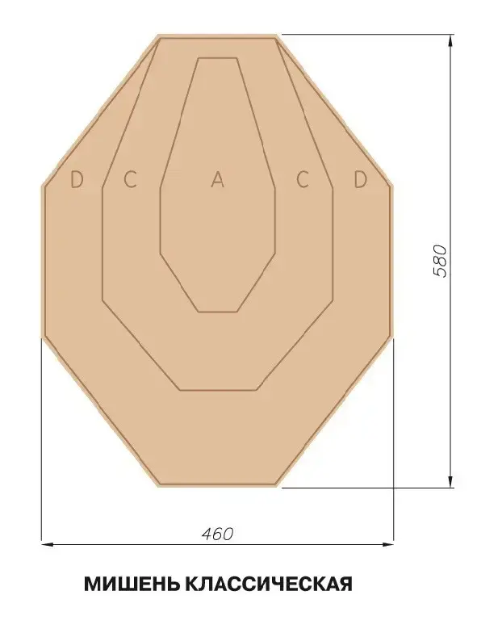
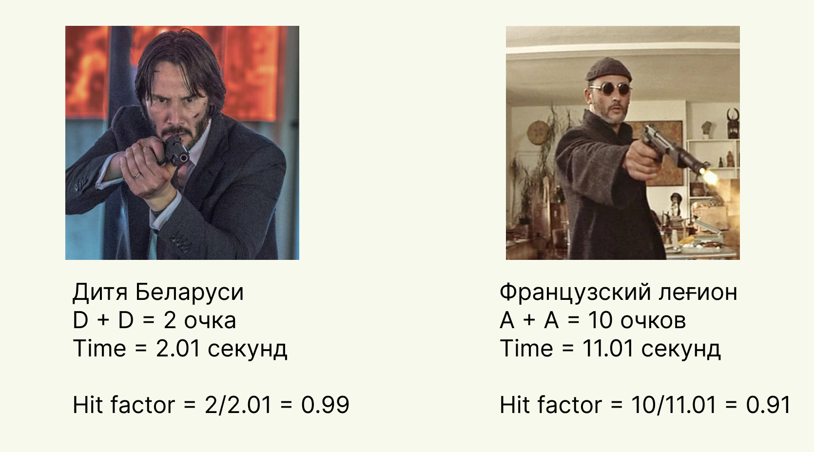
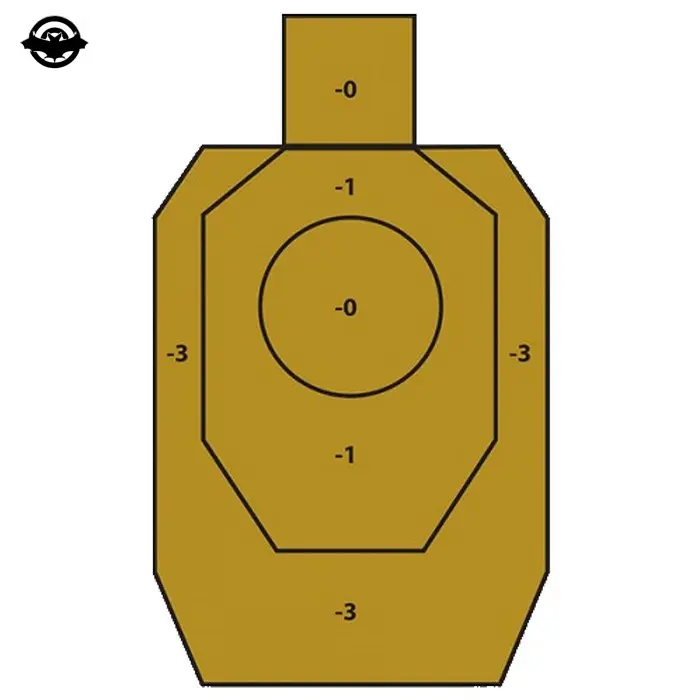

# Стрелковый спорт или новое хобби

Всем привет, меня зовут Илья, я хочу рассказать о своем новом интересном увлечении - спортивная стрельба. 

Аппетит приходит во время еды, ровно так произошло и с этим увлечением. Познакомился я с ним довольно неожиданно. Как-то раз, я предложил сходить в тир и пострелять. Мы разобщались с тренером, и он предложил сходить на динамическую стрельбу и…. тут Остапа понесло...

## Начало

Знакомство с этим спортом у меня произошло в Польше. До этого у меня было представление, что владением нарезным оружием возможно только в Омерике. Что пострелять с пистолета, карабина, СВД можно только профессионалам(либо людям, которые получили корочку). Но я очень сильно заблуждался… Оказывается, можно абсолютно легально стрелять НАСТОЯЩИМИ БОЕВЫМИ(нет не холостые, нет не тренировочные, настоящие убийственные патроны) патронами в тире. Да, именно теми, которыми можно убить.

На самом деле… все что не запрещено - то разрешено. Но есть свой перечень ограничений. Для того чтобы попасть в тир нужен документ(паспорт, ВНЖ, водительское удостоверение) и умение читать. Дальше вас встречает инструктор и внимательно следит. Перед тем как войти в стрелковую зону вы всегда подписываете документ о том, что вы ознакомлены с правилами техники безопасности и не будете заниматься хуйней в зоне повышенной опасности. В противном случае - вы в праве получить пулю в лоб(на самом деле в грудь, об этом позже) от инструктора без предупреждения. 

Оружие на выбор… да практически во всех тирах Польши доступны пистолеты всех попсовых марок, те же карабины, очень популярны снаряжения второй мировой войны, дробовик и пулемет. Я проходил военную кафедру, мы разбирали/собирали АКМ-74/ПМ раз 100,но стреляли один раз 9 патронов из калаша… Я хотел закрыть гештальт и ощутить разницу между хваленым АК-74 и AR-15. 

Тир - это все есть статическая полоса. То есть вы стоите в статическом положении, рядом с вами суровый инструктор и вы стреляете на глубину от 10 до 25 метров. Прикол в том, что у вас ограниченное количество патронов из каждого оружия, дальше вы проверяете свою точность. Попал все патроны в мишень - молодец, нет - лох. 

Если не стало скучно и горите попробовать - берите [пакет в тирах](https://www.pmshooter.pl/index.php/pl/oferta). Они не просто так созданы - это как одноразовый абонемент в спортзал. Все по-нарастающей, если не идет, вы поймете об этом в середине, нет - на завтрашний день. Если остались под сомнением в следующий день - вам однозначно нужно сходить на динамическую полосу. 

## Динамическая полоса

Второй уровень познания оружия, однако… тут вы будете стрелять только с пистолета, но из кобуры, как настоящий ковбой! 

Суть такая, на вас вешают пояс с кобурой(в которой будет заряженный пистолет), и 1-N пасекув(склад для магазинов). Вы двигаетесь по тиру стреляя по статической/движущиеся мишени.

Перенос оружия с одной мишени на другую - это и есть элемент динамической стрельбы, которую нужно изучать/практиковать отдельно.

Дисциплин по динамической стрельбе много- пистолеты, карабины, дробовики… Я упомянул другие, но держать концентрацию буду только на пистолетах - это азы, это основа техники безопасности для всех, на них все учатся, на них все сдают экзамены.

### Техника безопасности

`1. Я буду всегда обращаться с оружием, как с заряженным.`

`2. Я никогда не направляю оружие туда, куда я не хочу стрелять.`

`3. Перед тем как выстрелить я всегда проверяю, что перед мишенью и за ней.`

`4. Я никогда не коснусь пальцем спускового крючка, пока оружие не будет направлено на мишень` 

Заучите это наизусть, повторяйте эти 4 правила перед каждым входом на полосу.

Никогда не наводите(~~не заряженное~~) оружие на человека/в его сторону. Никогда не проверяйте что в стволе. Никогда не проводите конечностями перед дулом оружия.

Звучит как тупизм, но поверьте, эти ошибки допускает каждый. Учитесь сразу же их устранять. В динамике, на скорости, их допускает каждый на начальном этапе. Всегда держите их в голове, а тренер вам подскажет, что вы сделали не так. 

В центре [scutum](http://scutum.life) мы дошли до кондиции:

-что пошло не так?

-дёрнул спуск, потом скривил стойку и ещё один раз клюнул.

-устраняй, повторим
(вот именно за это мне и нравится индивидуальный спорт, где ты можешь найти косяки только в себе и сразу же их устранить)

## IPSC vs IDPA

Это 2 популярных категории сдачи на практикал шутинг. Сдав сертификат, вы имеете право принимать участие в турнирах, сходках, тусах, скидках под эгидой этой организации. Круто, прикольно, интересно но… я для себя не нашёл выгоды сдавать или получать такую карту,… пока что. Для меня это фан спорт. Турниры проводятся и без IPSC/IDPA, но, когда вы дошли до уровня, когда местячкового турнира вам стало мало - пора. Экзамен не супер сложный - вы должны доказать свои теоретические знания и практические. Из лайвхаков - ходите в тот клуб, где будут сидеть ваши экзаминаторы. По сути, та же сдача на водительское удостоверение.

Честно говоря, я не хочу углубляться в этой теме, т.к. до IDPA я не дороc, и не могу в полной компетенции отвечать за эту квалификацию. Но, это не дает мне права не рассказать об этом, ведь что-то это больше чем ничего. 

Это две основные категории спортивного стрелкового спорта. Разница лишь в том, что в IPSC вы соревнуетесь на меткость(ковбойскость)/скорость с любыми навесами и приблудами, в IDPA без приблуд на меткость/скорость НО из укрытия. На то он и D - defence. 

### IPSC

Я зашел на [википедию](https://ru.wikipedia.org/wiki/%D0%9F%D1%80%D0%B0%D0%BA%D1%82%D0%B8%D1%87%D0%B5%D1%81%D0%BA%D0%B0%D1%8F_%D1%81%D1%82%D1%80%D0%B5%D0%BB%D1%8C%D0%B1%D0%B0) почитать на это тему и…. Кароч - стреляем БЕЗОПАСНО, быстро и метко. Все!  (там даже нету поинта про калькуляцию очков при стрельбе и хит фактор)

Мишень делиться на 3 основные зоны:

**А**  - Alpha -  5 очков

**C** - Charley - 3 очков

**D** - Delta - 1 очок
Промах - карается штрафом в 5 очков. 

При прохождении каждого рубежа фиксируется время. Дальше суммируем все очки и делим на время - получаем хит фактор. У кого он выше - тот и победил. 

Здесь сразу же появляется элемент соревнования, где можно самому калибровать свою тактику. Как правило, на прохождение рубежа дается 2 попытки, т.е. вы можете спокойно опробовать различные способы ведения огня. 

Пример: 

Как видно из примера - господин Джон Уик поразил мишень максимально быстро, но с плохой точностью, а месье Леон, долго выцеливал мишень, получил максимальное количество баллов, но проиграл из-за того, что на это потратил слишком много времени.

### IDPA

Все в целом похоже, но есть нюанс… Тут нету поощрительных баллов - есть карательные балы. Отличие в чем - в IPSC - ты стреляешь как хотишь, в IDPA - из укрытия. 

Очки здесь считаются чуть проще. К итоговому времени прибавляются штрафные баллы - у кого меньше итоговый результат тот и победил. Это коротко, но на самом деле, там тоже есть большое количество разновидностей, вот [здесь](http://www.pmrpcidpa.com/documents/IDPA_Scoring.pdf) есть хорошая короткая книжечка с подробностями.

Разница между этими дисциплинами довольно большая - в IDPA есть укрытия(вы не имеете права вылезти перед мишенью более чем на 50% покрытия тела, из положения стоя ваши ноги обязательно должны быть в укрытии); штрафные планки(планки на полу, на которые нельзя наступать) и так далее. За каждое нарушение - штрафные баллы. Нельзя модифицировать оружие - никаких обвесов, дульных тормоз компенсаторов и так далее.

Почему не дорос до IDPA - я не так метко/быстро стреляю из основного оружия - как только изучу тонкость стрельбы из пистолета(считаю что уже дорос), гладкого(пару тренингов и буду готов), карабин(считаю себя полным нулем - осмысленной точности 0, хотя, считается самым простым оружием). 

### Холощение

Не питайте иллюзий, что вы сразу же придете и начнете стрелять, и сразу же метко. Все, как и в любом спорте, строится на упражнениях. А, дабы не тратить не дешевое снаряжения по чем зря, есть ряд упражнений без использования маслин - холощение.

Это ряд упражнений, на освоение правильной стойки, выравнивание спины, положение рук, выхвата оружия, прицеливание, правильного спуска, выстрела, контрольного спуска и возвращением пистолета в кобуру. Ниже я добавил серию роликов, в которых подробно описано что такое холощение и для чего оно нужно.

Далее, есть помесь упражнений, на повышение концентрации - стрельба холостыми патронами(они не производят выстрел, но для продолжения стрельбы, вам нужно перезарядить патрон в патронник, при этом сделав вынос, прицеливание, выстрел), мешаный магазин(в магазин в случайном порядке добавляются холостые и боевые патроны и вы не знаете в какой момент произойдет выстрел, а в какой осечка) и т.д. 

### Упражнения

Их довольно много, напомню, что мы концентрируемся только на пистолете, а есть еще гладкий ствол и карабин. Вся полезная информация собрана в этом плейлисте, часть из них вы будете выполнять с тренером на занятиях, остальное, можете запросить для себя.

## Амуниция и стоимость

### Покупка оружия

Вангую, самый “важный” вопрос. Ответ - в каждых странах по-разному.  А нахуя вам это? 

У меня, например, отпало всякое желание иметь у себя дома оружие - т.к. это очень большая ответственность, угроза жизни и пр. Если вы хотите защитить себя на улице - бегите - этой самый лучший вариант. Драка - 2ое. Газовый балон - 3ое. Дубинки - 4ое. Нож - 5ое. Пистолет(похуй - огнестрел, газ, травмат…) - 6ое.  

Я поднимаю этот вопрос, потому что я сам им интересовался, но когда понял, что он мне нахуй не нужОн - забил. Если для спорта - да! Он вам возможно и нужен, но не сразу, а потом. Для обороны…. Боже упаси Вас его применить. Это настолько самая последняя инстанция, что: 

- Во всех странах вас сильно задрочат по судам
- Вы можете убить человека(это тУрма)
- А нахера он вам нужен на улице?

Лично для меня это спорт, не более. Да, там есть присутствие военного дела, но между убийствой людей и начислением очком сходство… 0. 
Стрелять в человека и по бумажной мишени  - абсолютно разные вещи. Запомните, спорт и военное дело - это две вещи, которые стоят по 2 стороны экватора! Схожее в них - инструмент - т.е. оружие. Точно так же, как и наличие дома гаечного ключа не делает из вас слесаря или порнозвезду.

По-этому, (я хочу верить, что для многих людей), свобода оружия это хорошо(как и любая свобода), вы понимаете ответственность. Техника безопасности - на полигоне/тире, инструктор, запросто, может кикнуть вас в землю, если вы начнете баловаться с оружием.  Да, ему не нужно будет делать предупредительный выстрел, т.к. вы подписали документ о технике безопасности, и он может смело устранить нарушителя выстрелом в живот(как я упоминал выше, скорость - меткость, он не будет тратить время на поиск руки/ноги/мизинца - он будет стрелять быстро в самую крупную часть тела - пузико)

Но если вы решились его купить, то в Польше это могут сделать обладатели паспорта или карты постоянного вида на жительство. Проходите медосмотр, если у вас есть проблемы с алкоголем или наркотиками, вам его не выдадут. Получаете разрешение в полиции. Покупаете в оружейном магазине. Естественно, хранится дома в сейфе с ограниченным доступом, можно даже в пристройке возле дома, если на ней стоит сигнализация. Дальше вас будут ожидать проверки(раз в квартал). Есть еще различные вариации при оформлении на фирму, но это уже лирика - возможность есть, остальное бюрократия.

### Цены в тирах

Как я говорил в самом начале, если хотите просто попробовать - идите в тир и покупайте [пакет](https://www.pmshooter.pl/index.php/pl/oferta). В цену пакета входит аренда оружия, сами патроны, аренда помещения и работа инструктора.  По ценам пакетов - от 40 баксов до бесконечности(берете пулемет и спускаете по 10 баксов в секунду). 

Так же, вы можете арендовать линию в тире и приходить туда со своим оружием и патронами. Имея сертификат IPSC/IDPA некоторые магазины могут предоставить скидку на покупку амуниции. Имея карточку постоянного клиента или друзей - точно так же) Стоимость патронов(говорим про 9x19) от 1 zł(0.2 бакса) до 6-10 zł. Цены меняются, инфляция бьет по всем, все может быть не актуально на следующий месяц. 

Поход в динамическую зону включает в себя стоимость аренды динамической полосы, плата инструктору, аренда оружия и патроны. Цены динамической полосы смотрим [здесь](https://scutum.life/ru/#services).

### Амуниция

Всю необходимую амуницию вам предоставят в тире. Если хотите иметь свое - [закупайтесь ремнем, кобурами, пасками и пр](https://m-tac.pl/produkty/odziez,2,9). Так же, вам пригодятся наушники и тактические очки. Здесь как душе угодно. Если устает пальчик заряжать магазины пистолетов - есть заряжкалки для пистолетов.

## Мифы

Чем больше я стал заниматься, смотреть боевики для меня стало отдельным удовольствием. Когда женщина на каблуках хватает пистолет и стреляет прямо в бошку - каеф))) 

Могу предположить, что у большинства аудитории знакомство с оружием было только в рамках боевиков. Так вот… это настолько все красиво, что я начал обращать внимание на сцены и… “Да ты же сам себя подстрелишь!”)

Вот например, здесь все правдиво

Ребята стреляют в бронированную дверь и ждут рикошета. Все так. Когда я первый раз стрелял по тарелкам с 10 метров, в меня прилетали осколки, я очень благодарен своему тренеру, что он является жестким фетешистом техники безопасности, и мы не рисковали стрелять с более близкого расстояния. Очень не приятно получить увечье на такой ерунде. 

А вот тут, например, [Джованни Йованович](https://youtu.be/Niaw3Ez0YLU) выполняет смешанный норматив IPSC + IDPA: 

Только уберите возможность обратного боя - идеальный кандидат на получение сертификата. Обратите внимание на элемент перезарядки - он выполняется безукоризненно. Есть вопросы - почему его адамантиево-вибраниумный трико, прошибает нож(мб. он из криптонита?). Никакого ернечения, это кино, и элементы хореографии выполнены очень эффектно!

А здесь, собственно, пример того, как Киану Ривз превратился в Джона Уика.

## Выводы

Стрелковый спорт - очень специфичное хобби, которое может понравится далеко не всем. Если зацепит, вряд ли вы сможете его забросить просто так. Он потрясен тем, что он сугубо индивидуален. Слушая своих тренеров, это совсем не похоже на армию, где есть только одно правильное движение по ГОСТу и никак иначе, я получаю кучу советов и в конце самый важный - “Пробуй все что рассказали, но то как тебе будет удобно - то и делай”. Он очень сложный, нюансов и элементов очень много, так что каждое занятие это еще и лекция. Заниматься может практически каждый и, даже, ребенок. Приходят даже девушки ростом в 40 килограмм и весом в 150 сантиметров, хватают гладкое и справляются попаданием в яблочко. Да, он не дешевый, но после тяжелой рабочей недели, заменить посиделкой в баре досугом в тире - кайфа он принесет больше. 

И в конце немного видео из вылазок, как мотиватор.

