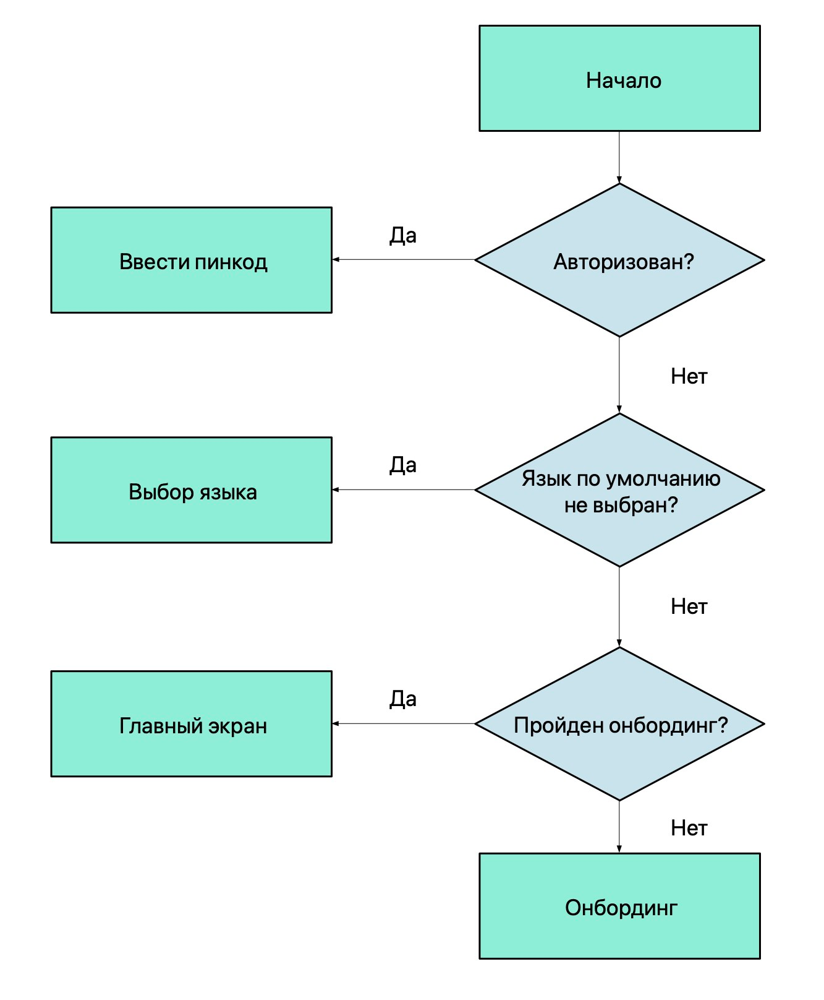

# Стоп рефакторинг. Kotlin. Android

<a target="_blank" href="https://habr.com/ru/articles/543830/">

</a>

### Введение

<p align="center">
  
</p>
Работая над одним проектом продолжительное время, я заметил как приходится переписывать код, который еще три месяца
назад казался хорошим. Инженерам поступают новые требования, когда они не пересекаются с предыдущими - все отлично,
добавили пару новых классов и побежали дальше. Иногда они касаются уже выпущенной части - взмах синей изолентой и все
работает. Но наступает тот самый момент, когда цена внесения изменений катастрофически дорога и единственное
рациональное решение - переписать все... А можно ли писать код, не переписывая его в будущем или хотя бы отложить этот
момент на более долгий срок?

Я хочу рассказать про практики, которые не один раз уже выручали нас в проекте. Подборка примеров получилась не на
пустом месте, все реальные примеры PullRequest-ов.Все примеры НЕ выдуманные и тестировались на живых людях. В процессе
сбора данных несколько людей пострадало.

### Заменяйте if-else на when где это необходимо

Долгое время Java был предпочтительным языком программирования для платформы Android. Затем на арену пришел Kotlin, да
вот привычки остались старые.

```kotlin
fun getNumberSign(num: Int): String = if (num < 0) {
    "negative"
} else if (num > 0) {
    "positive"
} else {
    "zero"
}
```

Красиво - 7 строк и получаем результат. Можно проще:

```kotlin
fun getNumberSign(num: Int): String = when {
    num < 0 -> "negative"
    num > 0 -> "positive"
    else -> "zero"
}
```

Тот же код, а строк 5.

Не забываем и про каскадное использование `if-else` и его нечитабильность при разрастании кодобазы.
Если в вашем проекте нет необходимости поддерживать 2 ЯП(Kotlin + Java), настоятельно рекомендую взять его себе на
вооружение. Одна из самых популярных причин его игнорирования - "Не привычно…"

<p align="center">
  
</p>

Дело не в предпочтениях стилистики писания: семистопный дактиль или пятистопный хорей. Дело в том, что в Kotlin
отсутствует оператор`else-if`. Упуская этот момент можно выстрелить себе в ногу. А вот и сам пазлер №9 от
[Антона Кекса](https://habr.com/ru/company/jugru/blog/338924/).

Я не рекомендую использовать`when`везде, где только можно. В Kotlin нет
([и не будет](https://discuss.kotlinlang.org/t/announcement-about-closing-two-topics-and-a-code-of-conduct-reminder/9160))
тернарного оператора, и стандартные булевы условия стоит использовать по классике. Когда условий больше двух,
присмотритесь и сделайте код элегантнее.

### Отряд булевых флажков

Рассмотрим следующее на примере поступающего ТЗ в динамике:

> 1. Пользователь должен иметь возможность видеть доставлено сообщение или нет

```kotlin
data class Message(
  // ...
  val isDelivered: Boolean
)
```

Все ли здесь хорошо? Будет ли модель устойчива к изменениям? Есть ли гипотетическая возможность того, что в модели
типа`Message`не будут добавлены новые условия в будущем? Имеем ли мы право считать, что исходные условия ТЗ есть
оконченный постулат, который нельзя нарушить?

<p align="center">
  
</p>

> 2. Пользователь должен иметь возможность видеть прочитано сообщение или нет

```kotlin
data class Message(
  // ...
  val isDelivered: Boolean,
  val isRead: Boolean
) 
```

Не успели мы моргнуть глазом, как ProductOwner передумал и внес изменения в первоначальные условия. Неожиданно? Самое
простое решение - добавить новое поле и "решить" проблему. Огорчу, не решить - отложить неизбежное. Избавление от
проблемы здесь и сейчас - must have каждого IT инженера. Предсказание изменений и делать устойчивую систему - опыт,
паттерны, а иногда, искусство.

Под "отложить неизбежное" я подразумеваю факт того, что рано или поздно система станет неустойчива и придет время
рефакторинга. Рефакторинг -> дополнительное время на разработку -> затраты не по смете бюджета -> неудовлетворенность
заказчика -> увольнение -> депрессия -> невозможность решить финансовый вопрос -> голод -> смерть. Все из-за Boolean
флага?!!! COVID-19 не так уж страшен.

Что не так? Сам факт появления изменений не есть глупость PO, который не мог сразу сформулировать свою мысль. Не все то,
что очевидно сейчас, было очевидно ранее. Чем меньше время на маневр, тем вы ценнее и конкурентнее. Далее включим
фантазию и попробуем предугадать, что же еще может придумать менеджер?

> 3. Пользователь должен иметь возможность видеть отправлено ли сообщение
> 4. Пользователь должен иметь возможность видеть появилось ли сообщение в нотификациях e.t.c.

Если мы сложим воедино все новые требования, будет видно, что объект`Message`может находиться только в одном состоянии:
отправлено, доставлено, появилось ли сообщение в нотификациях, прочитано… Набор состояний`детерминирован. Опишем их и
заложим в наш объект:

```kotlin
data class Message(
  // ...
  val state: State
) {
    enum class State {
        SENT,
        DELIVERED,
        SHOWN_IN_NOTIFICATION,
        READ
    }
}
```

Набор определен. Мы однозначно можем считать, что если сообщение прочитано, то оно отправлено и доставлено… Для этого мы
можем полагаться на приоритет состояний, забегу вперед, лучше всего переопредлить компаратор, где приоритет будет указан
явно. Но можем ли мы утверждать, что оно отображалось в нотификациях? Ведь пользователь может отключить системный показ
нотификаций. В случае, когда это будет действительно важно, однозначное состояние не подойдет. В таком случае, мы можем
воспользоваться бинарными флагами:
```kotlin
data class Message(
  // ...
  val states: Set<State>
) {
  fun hasState(state: State): Boolean = states.contains(state)
}
// либо 
data class Message(
    // ...
    val states: States
) {
    enum class State(internal val flag: Int) {
        SENT(1),
        DELIVERED(1 shl 1),
        READ(1 shl 2),
        SHOWN_IN_NOTIFICATION(1 shl 3)
    }

    data class States internal constructor(internal val flags: Int) {
        init {
          check(flags and (flags+1)) { "Expected value: flags=2^n-1" }
        }
        constructor(vararg states: State): this(
            states.map(State::flag).reduce { acc, flag -> acc or flag }
        )

        fun hasState(state: State): Boolean = (flags and state.flag) == state.flag
    }
}
```
Выводы: перед тем как начать проектировать систему, задайте необходимые вопросы, которые помогут вам найти подходящее
решение. *Можно ли считать набор условий конечным? Не изменится ли он в будущем?* Если ответы на эти вопросы ДА-ДА - смело
вставляйте булево состояние. Если же хоть на один вопрос ответ НЕТ - заложите детерменированный набор состояний. Если
объект в один момент времени может находиться в нескольких состояниях - закладывайте множество.

А теперь посмотрим на решение с булевыми флагами:
```kotlin
data class Message(
  //..
  val isSent: Boolean,
  val isDelivered: Boolean
  val isRead: Boolean,
  val isShownInNotification: Boolean
) 
//...
fun drawStatusIcon(message: Message) {
  when {
    message.isSent && message.isDelivered && message.isRead && message.isShownInNotification -> 
    	drawNotificationStatusIcon()
    message.isSent && message.isDelivered && message.isRead -> drawReadStatusIcon()
    message.isSent && message.isDelivered -> drawDeliviredStatusIcon()
    else -> drawSentStatus() 
  }
}
```

Попробуйте добавить еще одно состояние(ошибку) в конец и в середину списка приоритетов. Без чтения документации и без
ознакомления работы с флагами это сделать будет проблематично.

### Одно состояние

Одно состояние описывается несколькими независимыми переменными. Редкая проблема, которая открывается при потере фокуса
над контекстом разрабатываемого компонента.

```kotlin
data class User(
    val username: String?
    val hasUsername: Boolean
)
```

По условию контракта есть возможность не заполнить имя пользователя. На GUIне такое состояние должно подсветиться
предложением. За состояние предложения, логично считать, переменную`hasUsername. По объявленным соглашениям, легко
допустить простую ошибку.

```kotlin
// OK
val user1 = User(username = null, hasUsername = false) 
// Ошибка, имя пользователя есть
val user2 = User(username = "user", hasUsername = false) 
// OK
val user3 = User(username = "user", hasUsername = true) 
// Ошибка, имя пользователя не задано, а флаг говорит об обратном
val user4 = User(username = null, hasUsername = true) 
// Ошибка, имя пользователя пустое, а флаг говорит об обратном
val user5 = User(username = "", hasUsername = true) 
// Ошибка, имя пользователя пустое, а флаг говорит об обратном
val user6 = User(username = " ", hasUsername = true) 
```

Узкие места в контракте открывают двери для совершения ошибки. Источником ответственности за наличие имени является
только одно поле -`username`.

```kotlin
data class User(
    val username: String?
) {
    fun hasUsername(): Boolean = !username.isNullOrBlank()
}
```

Когда состояние может быть калькулируемым - вычисляйте его по требованию. Не стоит дублировать понятия, очень просто
выстрелить себе в ногу на ровном месте. Исключением могут быть случаи, когда операция вычисления занимает длительное
время либо требует кэширование состояния. В таких ситуациях можно воспользоваться иными практиками для определения
статуса:

 - вычислить сразу либо заленивить состояние
```kotlin
data class User(
    val username: String?
) {
    val hasUsername: Boolean = !username.isNullOrBlank()
    val hasUsernameLazy: Boolean by lazy { !username.isNullOrBlank() }
}
```

 - вынести вычисление в утилитарный класс. Используйте только в случае тяжеловесности операции

```kotlin
class UsernameHelper {
    private val cache: MutableMap<User, Boolean> = WeakHashMap()
    
    fun hasUsername(user: User): Boolean = cache.getOrPut(user) { 
      !user.username.isNullOrBlank() 
    }
}
```

### Абстракции - не лишнее

Я часто наблюдаю, как разработчики отказываются от абстракций. К нам поступает описание задачи, инженер приходит к
выводу, что его решение будет оптимально и… прибивает гвоздями решение к компоненту. Спустя время приходим к выводу, что
решение стоит заменить, и не остается ничего, кроме как влезать в каждый компонент и решать проблему индивидуально.

> Ключи для 3rd party services получаем из backend. Клиент должен`сохранить`эти ключи для дальнейшего использования в
приложении.

```kotlin
// ...
val result = remoteService.getConfig()
if (result is Result.Success) {
  val remoteConfig = result.value.clientConfig?.keys
  for (localConfigKey: ConfigKey in configKeyProvider.getConfigKeys()) {
  	  sharedPreferences.edit { putString(localConfigKey.key, remoteConfig[localConfigKey.key]) }  
  }
}
//...
enum class ConfigKey(val key) {
  FACEBOOK("facebook"),
  MAPBOX("mapbox"),
  THIRD_PARTY("some_service")
}
```

Спустя N недель получаем предупреждение от службы безопасности, что ключи сервиса`THIRD_PARTY`ни в коем случае нельзя
хранить на диске устройства. Не страшно, можем спокойно хранить ключи хранить InMemory. И по такой же стратегии нужно
затронуть еще 20 компонентов приложения. Хм, и как поможет абстракция?

<p align="center">
  
</p>

Завернем под абстракцию хранлище ключей и создадим имплементацию: InMemory / SharedPreferences / Database /
WeakInMemory… А дальше с помощью внедрения зависимостей. Таким образом мы не нарушим **SO**LID - в нашем примере актором
будет являться алгоритм сбора данных, но не способ хранения; open-closed principle достигается тем, что мы "прикрываем"
необходимость модификации алгоритма за счет абстракции.
```kotlin
// ...
val result = remoteService.getConfig()
if (result is Result.Success) {
  val remoteConfig = result.value.clientConfig?.keys
  for(localConfigKey: ConfigKey in configKeyProvider.getConfigKeys()) {
    	configurationStorage.put(
        configKey = localConfigKey, 
        keyValue = remoteConfig[localConfigKey.key]
      )
  }
}
//....
interface ConfigKeyStorage {
   fun put(configKey: ConfigKey, keyValue: String?)
   fun get(configKey: ConfigKey): String
   fun getOrNull(configKey: ConfigKey): String?
}

internal class InMemoryConfigKeyStorage : ConfigKeyStorage {
	private val storageMap: MutableMap<ConfigKey, String?> = mutableMapOf()
	
  override fun put(configKey: ConfigKey, keyValue: String?) {
    storageMap[configKey] = keyValue
	}
  
	override fun get(configKey: ConfigKey): String = 
      requireNotNull(storageMap[configKey])
	override fun getOrNull(configKey: ConfigKey): String? = 
      storageMap[configKey]
}
```

Если помните, в изначальной постановке задачи не стояло уточнение о типе хранилища данных. Подготавливаем систему к
изменениям, где имплементация может быть различной и никак не влияет на детали алгоритма сбора данных. Даже если в
изначальных требованиях и были бы уточнения по типу хранилища - это повод для того, чтобы усомниться и перестраховаться.
Вместо того, чтобы влезать в N компонентов для модификации типа хранилища, можно добиться этого с помощью замены
источника данных через DI/IoC и быть уверенным, что все работает исправно. Так же, такой код проще тестировать.

### Описывайте состояния явно

Программисты ленивые люди. Я нахожу в этом свои плюсы, что такая профессиональная деформация позволяет делать
расслабленные решения которые будут понятны каждому(в любом состоянии). Часто, самое простое и быстрое решение задачи -
правильное решение. Но вот воспринимать это слишком буквально не стоит. Не смотреть в завтрашний день чревато тем, что
через неделю ты будешь стахановцем без привычного смузи.

<p align="center">
  
</p>

В очередной раз возьмем пример технического задания:

> Подготовить репозиторий для вывода имени пользователя на экран

Создадим репозиторий, который будет возвращать имя пользователя. Выведем`null`в случае, если не смогли получить имя. Так
как в первоначальном задании не шло речи о том, откуда нам нужно брать данные - оставим дело за абстракцией и заодно
создадим наивное решение для получения из remote.

```kotlin
interface UsernameRepository {
    suspend fun getUsername(): String?
}
class RemoteUsernameRepository(
    private val remoteAPI: RemoteAPI
) : UsernameRepository {
    override suspend fun getUsername(): String? = try {
        remoteAPI.getUsername()
    } catch (throwable: Throwable) {
        null
    }
}
```

Мы создали контракт получения имени пользователя, где в качестве успeшного результата приходит состояние`String?`и в
случае провала
получения`String?`. При чтении кода, нет ничего подозрительного. Мы можем определить состояние ошибки простым условием`
getUsername() == null`и все будут счастливы. По факту, мы не имеем состояния провала. По контракту `SuccessState ===
FailState`.

> Подготовить репозиторий для вывода имени пользователя на экран. В случае ошибки получения данных из удаленного узла,
вывести последнее известное.

После уточнения тех задания, мы должны сделать развилку. Распишем развилку абстрактно и подсветим проблемное место:

```kotlin
interface UsernameRepository {
    suspend fun getUsername(): String?
}
class CommonUsernameRepository(
  private val remoteRepository: UsernameRepository,
  private val localRepository: UsernameRepository
) : UsernameRepository {
    suspend fun getUsername(): String? {
        return remoteRepository.getUsername() ?: localRepository.getUsername()
    }
}
```

И вот наступает грустный момент. Теперь по нашему контракту 3 различных состояния при одном и том же результате.
Попробуйте ответить на следующие утверждения:

 - верно ли утверждать, что результат `null` - имя пользователя? Обязательных условий мы не имеем. Все легально.

 - верно ли утверждать, что результат `null` - состояние из кэша?

 - верно ли утверждать, что результат `null` - состояние ошибки удаленного узла при пустом кэше?

Однозначного ответа нет, так как наш контракт не подразумевает этого. Да и по требованиям от нас этого не требуют. А
зачем нужно явно декларировать состояния для системы, если важен результат? Смежные состояния при одинаковых
результатах - русло неустойчивости узла к изменениям. Избегайте неоднозначности. Новые требования, которые затронут хотя бы один
смежный статус, потребуют рефакторинга корневой модели. Изменения в начальной абстракции - это очень страшно. 
Это чревато тем, что вам придется переписать все известные имплементации.

> В случае получения ошибки - изменить цвет имени на экране.

Используйте`enum/sealed classes/interfaces/abstract classes`. Техника выведения абстракций зависит от изначальных 
условий проекта. Если вам важна строгость в контрактах и вы хотите закрыть возможность произвольного
расширения -`enum/sealed classes`. В противном случае -`interface/abstract classes`.

```kotlin
sealed class UsernameState {
	data class Success(val username: CharSequence?) : UsernameState()
  object Failed : UsernameState()
}
```

### When может не хватить

Рассмотрим следующий пример - старт приложения, где в зависимости от состояния приложения необходимо выполнить переход
на следующий экран.

<p align="center">
  
</p>

```kotlin
enum class NavigationFlow {
  PIN_CODE,
  MAIN_SCREEN,
  ONBOARDING,
  CHOOSE_LANGUAGE
}
fun detectNavigationFlow(): NavigationFlow {
    return when {
        authRepo.isAuthorized() -> NavigationFlow.PIN_CODE
        languageRepo.defaultLanguage != null -> NavigationFlow.CHOOSE_LANGUAGE
        onboardingStorage.isCompleted() -> NavigationFlow.MAIN_SCREEN
        else -> NavigationFlow.ONBOARDING
    }
}
```

Мы определили возможные состояния навигации. Так проще будет реализовать навигатор. Но вот `detectNavigationFlow` стал
слишком много знать. Разломать функцию могут следующие события: добавить новое состояние, изменить приоритет или когда
используемый репозиторий станет устаревшим… Постараемся создать такую функцию, в которой основной участок будет
неизменен, а шаги можно будет легко заменить.

```kotlin
enum class NavigationFlow {
    PIN_CODE,
    MAIN_SCREEN,
    ONBOARDING,
    CHOOSE_LANGUAGE
}

// Описываем возможные состояния явно
sealed class State {
    data class Found(val flow: NavigationFlow) : State()
    object NotFound : State()
}

interface NavigationFlowProvider {
    // Возвращаем не null NavigationFlow чтобы гарантировать проход на следующий экран
    fun getNavigation(): NavigationFlow
}

// Абстракция для поиска подходящего флоу для навигации
interface NavigationFlowResolver {
    fun resolveNavigation(): State
}

internal class SplashScreenNavigationFlowProvider(
    // Sequence - для того чтобы прервать итерации при нахождении первого подходящего условия.
    // Обратите внимание на очередность экземляров класса в последовательности.
    private val resolvers: Sequence<NavigationFlowResolver>
) : NavigationFlowProvider {

    override fun getNavigation(): NavigationFlow = resolvers
        .map(NavigationFlowResolver::resolveNavigation)
        .filterIsInstance<State.Found>()
        .firstOrNull()?.flow
        // Если ничего не нашли - проход в состояние неизвестности
        ?: NavigationFlow.MAIN_SCREEN
}
```

Заменяем N-условный `when` на [ChainOfResponsibililty](https://en.wikipedia.org/wiki/Chain-of-responsibility_pattern).
На первый взгляд выглядит сложным: кода стало больше и алгоритм чуть сложнее. Перечислим плюсы подхода:

> 1. Знакомый паттерн из ООП
> 2. Соответствует правилам SOLID
> 3. Прост в масштабировании
> 4. Прост в тестировании
> 5. Компоненты резолвера независимы, что никак не повлияет на структуру разработки

Главное в таком подходе - масштабируемость и независимость компонентов. Нам позволено сколь угодно наращивать систему не
боясь за общую обработку. Каждый элемент резолвера заменим в любой момент. Новый компонент легко вставить в
последовательность, нужно только следить за очередностью вызова. Независимые компоненты упрощают жизнь в динамике. С
помощью [DIP](https://en.wikipedia.org/wiki/Dependency_inversion_principle) каждому компоненту системы доступно быть 
сколь угодно сложным, что никак не скажется на общем алгоритме.

### Наследование или композиция

Вопрос по этой теме поднимался ни один миллион`раз. Я не буду останавливаться на подробностях, детали о проблемах можете
почитать на просторах google. Хочу затронуть тему платформы, когда причина избыточного использования наследования - "
платформа". Разберем на примерах компонентов Android.

**BaseActivity**. Заглядывая в старые прокты, с ужасом наблюдаю, какую же ошибку мы допускали. Под маской повторного
использования смело добавляли частные случаи в базовую активити. Шли недели, активити обрастали общими прогрессбарами,
обработчиками и пр. Проходят месяцы, поступают требования - на экране N прогрессбар должен отличаться от того, что на
всех других… От общей активити отказаться уже не можем, слишком много она знает и выполняет. Добавить новый прогрессбар
как частный случай - выход, но в базовом будет оставаться рудимент и это будет нечестное наследование. Добавить вариацию
в`BaseActivity`- обидеть других наследников и… Через время вы получаете монстра в > 1000 строк, цена внесения изменений
в который слишком велика. Да и не по SOLID это все.

> Агаок, но мне нужно использовать компоненту, которая точно будет на всех экранах кроме 2х. Что делать?

Не проблема, Android SDK еще с 14 версии 
[предоставили такую возможность](https://developer.android.com/reference/android/app/Application#registerActivityLifecycleCallbacks(android.app.Application.ActivityLifecycleCallbacks)). 
`Application.ActivityLifecycleCallbacks` открывает нам простор на то, чтобы переопределять элементы жизненного цикла любой
`Activity`. Теперь общие случаи можно вынести в обработчик и разгрузить базовый класс.

```kotlin
class App : Application(), KoinComponent {
    override fun onCreate() {
        super.onCreate()
        // ... 
        registerActivityLifecycleCallbacks(SetupKoinFragmentFactoryCallbacks())
    }
    // Подключаем Koin FragmentFactory для инициализации фрагментов с помощью Koin
    private class SetupKoinFragmentFactoryCallbacks : EmptyActivityLifecycleCallbacks {
        override fun onActivityCreated(activity: Activity, savedInstanceState: Bundle?) {
            if (activity is FragmentActivity) {
                activity.setupKoinFragmentFactory()
            }
        }
    }
}
```

К сожалению, не всегда возможно отказаться от базовой активити. Но можно сделать ее простой и лаконичной:

```kotlin
abstract class BaseActivity(@LayoutRes contentLayoutId: Int = 0) : AppCompatActivity(contentLayoutId) {
    // attachBaseContext по умолчанию protected
    override fun attachBaseContext(newBase: Context) {
        // добавляем extension для изменения языка на лету
        super.attachBaseContext(newBase.applySelectedAppLanguage())
    }
}
```

**BaseFragment**. С фрагментами все тоже самое. Изучаем [FragmentManager](https://developer.android.com/reference/androidx/fragment/app/FragmentManager), 
добавляем [registerFragmentLifecycleCallbacks](https://developer.android.com/reference/androidx/fragment/app/FragmentManager.FragmentLifecycleCallbacks) - 
профит. Чтобы пробросить `FragmentLifecycleCallbacks` для каждого фрагмента - используйте наработки из предыдущих 
примеров с `Activty`. Пример на базе Koin - [здесь](https://github.com/InsertKoinIO/koin/search?q=KoinFragmentFactory).

Композиция и фрагменты. Для передачи объектов можем использовать инъекции DIP фреймворков - Dagger, Koin, свое и т.д. А
можем отвязаться от фрейморков и передать их в конструктор. ЧТОООО? Типичный вопрос с собеседования - Почему нельзя
передавать аргументы в конструктор фрагмента? До [5 ноября 2018 года было именно так, теперь же есть](https://developer.android.com/jetpack/androidx/releases/fragment#1.1.0-alpha01) 
`FragmentFactory`и это стало легально.

**BaseApplication**. Здесь чуть сложнее. Для разных `Flavors` и `BuildType` необходимо использовать базовый 
`Application` для возможности переопределения компонентов для других сборок. Как правило, `Application`становится 
большим, потому что на старте приложения, необходимо проинициализировать большое количество 3rd party библиотек. 
Добавим к этому и список своих инициализаций и вот мы на пороге того момента, когда нам нужно разгрузить стартовую 
точку.

```kotlin
interface Bootstrapper {
    // KoinComponent - entry point DIP для возможности вызвать инъекции зависимостей в метод 
    fun init(component: KoinComponent)
}
interface BootstrapperProvider {
    fun provide(): Set<Bootstrapper>
}
class BootstrapperLauncher(val provider: BootstrapperProvider) {
    fun launch(component: KoinComponent) {
        provider.provide().onEach { it.init(component) }
    }
}
class App : Application() {
  override fun onCreate() {
        super.onCreate()
        // Вызываем бутстраппер после инициализации Koin
        this.get<BootstrapperLauncher>().launch(component = this)
    }
}
```

Разгружаем килотонны методов в разные`Bootstrapper`инстансы и делаем наш код чище. Либо можем воспользоваться нативным
решением от [зеленого робота](https://developer.android.com/topic/libraries/app-startup).

### Уменьшение области видимости

Инкапсуляция - один из немаловажных моментов в ООП парадигме. Современные языки программирования не просто так содержат
в себе модификаторы доступа, которые ограничивают скоуп видимости сигнатур. Уменьшение простора на использование строк
кода поддержано на уровне компилятора. Это отличная защита от (~~дурака~~)того, что код изначально написан так, чтобы его
нельзя было модифицировать. В противном случае, он не скомпилируется. На практике встречаются случаи, когда ограничения
касаются только внутренних состояний и поведений объекта - приватные функции, а что насчет самого объекта?

Выделим отдельный модуль, который будет содержать в себе объекты валидации входящих состояний.

```kotlin
interface Validator {
    fun validate(contact: CharSequence): ValidationResult
}

sealed class ValidationResult {
    object Valid : ValidationResult()

    data class Invalid(@StringRes val errorRes: Int) : ValidationResult()
}

class PhoneNumberValidator : Validator {
    override fun validate(contact: CharSequence): ValidationResult =
        if (REGEX.matches(contact)) ValidationResult.Valid 
        else ValidationResult.Invalid(R.string.error)

    companion object {
        private val REGEX = "[0-9]{16}".toRegex()
    }
}
```

А разве плохо иметь публичный класс, который будет доступен всем? Но избыточное использование публичных сущностей по
умолчанию означает, что объект данного класса может использоваться каждым. Возникает желание внести изменения для личных
нужд не задумываясь о последствиях. Если вы не обезопасились методами, которые не пропустят "сломанный" код в рабочую
среду, ждите бага.

Пришло обновление задачи, когда на экране N вместо [MSISDN](https://ru.wikipedia.org/wiki/MSISDN) необходимо 
использовать [E.164](https://ru.wikipedia.org/wiki/E.164):
<p align="center">
  
</p>

```kotlin
class PhoneNumberValidator : Validator {
    override fun validate(contact: CharSequence): ValidationResult =
        if (REGEX.matches(contact)) ValidationResult.Valid 
        else ValidationResult.Invalid(R.string.error)

    companion object {
        private val REGEX = "+[0-9]{16}".toRegex()
    }
}
```
Да вот беда, такое наглое вмешательство в дела валидации разломало наше старое поведение на других экранах ввода, так
репозитории не были готовы принять знак плюса в начале строки. Можно было бы обойтись документацией, которая бы
описывала поведение и последствия изменения. Однако, документацию читают не всегда. Она не дает строгости использования.

С одной стороны, проблема надуманная и обойти ее можно было:

 - создать новый валидатор
 - создать валидатор с регексом по умолчанию и передать аргумент для частного случая
 - наследование и переопределение
 - другой подход

А теперь, давайте посмотрим на код, если бы мы изначально забетонировали MSISDN валидатор и вынесли бы его в бинарь.

```kotlin
interface Validator {
    fun validate(contact: CharSequence): ValidationResult
}

sealed class ValidationResult {
    object Valid : ValidationResult()

    data class Invalid(@StringRes val errorRes: Int) : ValidationResult()
}
internal class MSISDNNumberValidator : Validator {
	//... код выше
}
internal class E164NumberValidator : Validator {
	//... код выше
}
```

Как видите, при таком подходе разработчику будет сложно вносить изменения в уже существующий код потому, что он закрыт.
Осталось решить проблему создания валидаторов и возможность их расширения:

```kotlin
interface ValidatorFactory {
    fun create(type: ValidatorType): Validator?

    interface ValidatorType

    companion object {
        fun create() : ValidatorFactory {
            return DefaultValidatorFactory()
        }
    }
}
object MSISDN : ValidatorFactory.ValidatorType
object E164 : ValidatorFactory.ValidatorType
private class DefaultValidatorFactory : ValidatorFactory {
    override fun create(type: ValidatorFactory.ValidatorType): Validator? = when(type) {
        is MSISDN -> MSISDNValidator()
        is E164 -> E164Validator()
        else -> null
    }
}
```

Собираем кубик, пакуем в бинарь и отдаем в использование. По мере необходимости код открыт для расширения, но закрыт для
модификации. Если вы захотите добавить свою валидацию - смело можете создать`ValidatorFactory` с фолбэком на 
`DefaultValidatorFactory`. Или выпустить новый патч.

### Заключение

В общем случае, при проектировании систем, я руководствуюсь правилам SOLID. Про эти принципы говорят не первый десяток
лет из каждого утюга, но они все еще актуальны. Местами система выглядит избыточной. Стоит ли заморачиваться насчет
сложности и стабильности дизайна кода? Решать вам. Однозначного ответа нет. Определиться вы можете в любой момент.
Желательно - на зачаточном этапе. Если вам стало понятно, что ваш проект может жить более чем полгода и он будет расти -
пишите гибкий код. Не обманывайте себя, что это все оверинженерия. Мобильных приложений с 2-3 экранами уже давно нет.
Разработка под мобильные устройства уже давно вошла в разряд enterprise. Быть маневренным - золотой навык. Ваш бизнес не
забуксует на месте и поток запланнированных задач реже станет оставать от графика.

